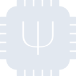
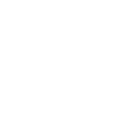

# qmk

[← Back to main README](../../README.md)

<table><tr>
  <td></td>
  <td></td>
  <td></td>
</tr></table>

## 16 px

### black
```
https://georgegach.github.io/compatible-icons/simple-icons/compat/qmk/16/black.png
```

### slate
```
https://georgegach.github.io/compatible-icons/simple-icons/compat/qmk/16/slate.png
```

### white
```
https://georgegach.github.io/compatible-icons/simple-icons/compat/qmk/16/white.png
```

## 64 px

### black
```
https://georgegach.github.io/compatible-icons/simple-icons/compat/qmk/64/black.png
```

### slate
```
https://georgegach.github.io/compatible-icons/simple-icons/compat/qmk/64/slate.png
```

### white
```
https://georgegach.github.io/compatible-icons/simple-icons/compat/qmk/64/white.png
```

## 128 px

### black
```
https://georgegach.github.io/compatible-icons/simple-icons/compat/qmk/128/black.png
```

### slate
```
https://georgegach.github.io/compatible-icons/simple-icons/compat/qmk/128/slate.png
```

### white
```
https://georgegach.github.io/compatible-icons/simple-icons/compat/qmk/128/white.png
```

## 512 px

### black
```
https://georgegach.github.io/compatible-icons/simple-icons/compat/qmk/512/black.png
```

### slate
```
https://georgegach.github.io/compatible-icons/simple-icons/compat/qmk/512/slate.png
```

### white
```
https://georgegach.github.io/compatible-icons/simple-icons/compat/qmk/512/white.png
```

## 1024 px

### black
```
https://georgegach.github.io/compatible-icons/simple-icons/compat/qmk/1024/black.png
```

### slate
```
https://georgegach.github.io/compatible-icons/simple-icons/compat/qmk/1024/slate.png
```

### white
```
https://georgegach.github.io/compatible-icons/simple-icons/compat/qmk/1024/white.png
```

## 16 px in base64

### black
```
data:image/png;base64,iVBORw0KGgoAAAANSUhEUgAAABAAAAAQCAYAAAAf8/9hAAAABmJLR0QA/wD/AP+gvaeTAAABNklEQVQ4jZXTy0pcQRAG4O8cNWJQTBAkg5CVO1FXgk/kwoj6EBLwCcTHESWLIKgb3XsZUYmRiQ4i0XHRNdpzOIL+UHTX7e/qrmp6sYZbbKGJfezhFNvhW1ODAqs4Rhv/cI0/Iddhu4uY5ch5wQpa6LxTWliCPvzEAsbrSnsDg5jCWBFlwedYm1FeA2dhm8B57BuxttEpsYOHjP0U97H/GyJsJ1ncA36VmPlA6VXMlrjEY2bsq+hdPIYv1y9KlXbgq3T3p8z2hCuMVWI7BS7wCV/C+B9H0h2vpLY1pEeeRBlxN7jvxwHmMtZ+TEvDMxwE37IDchwW0ngWXtuY4yQIvtf42qRHGYrS6k4YDanDGTa6ypKPj/KPnK0Ikvd+psXI6enrb6lN89jFiDS+LQzgUOrGJta7Sc96M2jQt0sNSAAAAABJRU5ErkJggg==
```

### slate
```
data:image/png;base64,iVBORw0KGgoAAAANSUhEUgAAABAAAAAQCAYAAAAf8/9hAAAABmJLR0QA/wD/AP+gvaeTAAABrklEQVQ4jY2TQWsTURSFv/MSN0UxTbVpqBnduFRx4Z/xLyhUXAiKO6W4KChYdV//irir4sZt6cQmMUEnUhtKdd5xMZNmsBZzN4937zv3nnO4T1QiHYyfgu8htjFXQUODJS4StUOIN7FeJCuNx1OMAGwr7Y/XgnQ/4guScsQvLANgBD6DCDLfkDcutRovJVkA3UG2hvTE5hxzhPA+Do867fObSnvjdQVuGy7/D+gp5eLcNflbpf3sAAlgoaioh6NAbWCvhK0i9zGUeYAJ4ID0DnE0G+MvoMOiF5mkrJx5COpWdBwB74Ph+jy6T5F0IwiGmLzSuQaV+0xzXtam6FzwNVR8mRYWwXuIWMnGaEbYS3+TqBtaErXCIBAkoAPDR0dGBCz8G4clBRJ7xtRmuS74BNyq6KoD14h8d+BssGxYQW4cg2fxWelg/LOUsXDSJXcl2ZCctJAJNgHy54LRPx6A1DkFDDA0bBSr3P9xF+K6pblW2fa+8MOk3Xx1/Jl2e9mdWggP5vlMDvFZZ3nxjSSHgql8ZbW5abElsGAbmBin4C7yhOAPxSi2klbztVQ0/wNSZse1dWMkEQAAAABJRU5ErkJggg==
```

### white
```
data:image/png;base64,iVBORw0KGgoAAAANSUhEUgAAABAAAAAQCAYAAAAf8/9hAAAABmJLR0QA/wD/AP+gvaeTAAABNElEQVQ4jZ2TzS5DURSFv3t11BgQiZ+IegKMvIxHoMFDNEYSD+FFCDEtE3NaBFEJ2ojQz+BuctyWYCUn55y1917Z++QsSKA21Cd1X71Uj9Wm2lYPItagDDVTN9Vztac+qh31LlYnuG7krKtZKrChPvh7PKh1gEzdAlaA+YHWfsYZsJup3SCqsV8CGTADXAQ3C1zFeSb2HmAOHAIviXIbeI7zfSyCayV5L8BRDiz+sfUUSzlwA7wl5Ejp/oG3iKX365xi3hTjFLP3E64P3AITpVwrwFRJuQZ0gWYUCbxGca3U6WQFOAGWk0AFWAA6wGgITANjQ8Y6zdSnGKM6JKEVArUhsR5ADuxEq8Mw900xFI+/DYBa/8dXXvuUCjPV/2Cm1S9mSoQakbQXFm5aWLptYfEBO78D5hNWwOEeYv0AAAAASUVORK5CYII=
```

