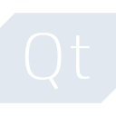
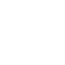

# qt

[← Back to main README](../../README.md)





## 16 px

### black
```
https://georgegach.github.io/compatible-icons/simple-icons/qt/16/black.png
```

### slate
```
https://georgegach.github.io/compatible-icons/simple-icons/qt/16/slate.png
```

### white
```
https://georgegach.github.io/compatible-icons/simple-icons/qt/16/white.png
```

## 64 px

### black
```
https://georgegach.github.io/compatible-icons/simple-icons/qt/64/black.png
```

### slate
```
https://georgegach.github.io/compatible-icons/simple-icons/qt/64/slate.png
```

### white
```
https://georgegach.github.io/compatible-icons/simple-icons/qt/64/white.png
```

## 128 px

### black
```
https://georgegach.github.io/compatible-icons/simple-icons/qt/128/black.png
```

### slate
```
https://georgegach.github.io/compatible-icons/simple-icons/qt/128/slate.png
```

### white
```
https://georgegach.github.io/compatible-icons/simple-icons/qt/128/white.png
```

## 512 px

### black
```
https://georgegach.github.io/compatible-icons/simple-icons/qt/512/black.png
```

### slate
```
https://georgegach.github.io/compatible-icons/simple-icons/qt/512/slate.png
```

### white
```
https://georgegach.github.io/compatible-icons/simple-icons/qt/512/white.png
```

## 1024 px

### black
```
https://georgegach.github.io/compatible-icons/simple-icons/qt/1024/black.png
```

### slate
```
https://georgegach.github.io/compatible-icons/simple-icons/qt/1024/slate.png
```

### white
```
https://georgegach.github.io/compatible-icons/simple-icons/qt/1024/white.png
```

## 16 px in base64

### black
```
data:image/png;base64,iVBORw0KGgoAAAANSUhEUgAAABAAAAAQCAYAAAAf8/9hAAAABmJLR0QA/wD/AP+gvaeTAAAA+klEQVQ4jaXRvUpDQRCG4ecElQOCIFYKoliYThEb8RZsxEvyYqwlIAqihYXY2VpZ+EMiNqIkAVFjcSawWY1I8sJhmbOz33wzw5gUcdawMapADYfYTgT/yxQ00EZvlK9AF2UofuIWjxEvYiWcNSNvNrVQSx7DHY5RxyoOcB9351FggIksvsEO5iPei8rTuMICNjGTOkh56A8mKNHCHLawnj7+TaBUDafPV+ayk7eQC9TxksTPWPoj/8ePZRzhAie4VPUNazjFay6S77atmkUT++Gohw884S3J7RYGe85pYVI1xJwOzopQfB8iMKxAL9rbLVR7HYVr1ZbG4xt3z0TkzZsE4wAAAABJRU5ErkJggg==
```

### slate
```
data:image/png;base64,iVBORw0KGgoAAAANSUhEUgAAABAAAAAQCAYAAAAf8/9hAAAABmJLR0QA/wD/AP+gvaeTAAABUUlEQVQ4jaWSMWuUQRRFz53dxEVhIQQSEoiKhQELJdiIlSBWNuIf8V9ZiyAKooVFECxsrSw2hl0R4iZIECFzLIJm9ksCmrzyzdzDvZcH55wAqGU03t04E0AtW1/3noF38RD4H+r5jCa7z4P3hYtncdAHHwgDAOSAwufItkqSNck1MOCYZIAstIDCHzEgjJK8rGTdcN34FOsWQChvkYMTHDSRCp+sPgysQMA8Thwrl4D3CavibciwddB0whdg/mjjQJwQFgl3lFut+BiAZBCw2dRQWpf73QizAFwXpked+E28AlCpmHT+dwC1chV4QXwX8yq6iawCBG5ifQ3stZrZEsMS+AT5buyR3ge1d3iuuUFYDpQm48+MJtM282wgMonOERa7b4F9yZs++APz6yRAihcQkZ2OWsnm2vLwUd+ae6c5OH42f61xeWX4MUk9Vfuv8xvAn4yL2MMggQAAAABJRU5ErkJggg==
```

### white
```
data:image/png;base64,iVBORw0KGgoAAAANSUhEUgAAABAAAAAQCAYAAAAf8/9hAAAABmJLR0QA/wD/AP+gvaeTAAABA0lEQVQ4jaXQSyvEURzG8c9xa0opKaJEFqYsSDbyFmzkjXhX1lKixMJCysLWysIlUxZELil+FnPk+DNTxndzes45z/O78E8SREQX5jsKyOYNLH0G/oE+EbEZEY/RISkinlHLiW84w1XW45jKnV3nf4NlC12FGc6xjTqmsY6L/LafC3yjp6JPsYzRrFdz5X4cYQwLGCg7KLlEX6FraGAIi5grzb8F1BCFfq90+VQdoRpQx12hbzDR5v+Pi0ls4QA7ONScG2axi/vSUF3iMNZwi24c5xNmMFIp+pIiIrSmgV7NJVZ5wl6KiAe8tghIvi/1k9AcbyVFxEKbDtpxklJ679D7xQcGcnsvqug6TgAAAABJRU5ErkJggg==
```

