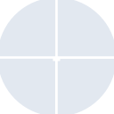
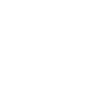

# quarto

[← Back to main README](../../README.md)





## 16 px

### black
```
https://georgegach.github.io/compatible-icons/simple-icons/quarto/16/black.png
```

### slate
```
https://georgegach.github.io/compatible-icons/simple-icons/quarto/16/slate.png
```

### white
```
https://georgegach.github.io/compatible-icons/simple-icons/quarto/16/white.png
```

## 64 px

### black
```
https://georgegach.github.io/compatible-icons/simple-icons/quarto/64/black.png
```

### slate
```
https://georgegach.github.io/compatible-icons/simple-icons/quarto/64/slate.png
```

### white
```
https://georgegach.github.io/compatible-icons/simple-icons/quarto/64/white.png
```

## 128 px

### black
```
https://georgegach.github.io/compatible-icons/simple-icons/quarto/128/black.png
```

### slate
```
https://georgegach.github.io/compatible-icons/simple-icons/quarto/128/slate.png
```

### white
```
https://georgegach.github.io/compatible-icons/simple-icons/quarto/128/white.png
```

## 512 px

### black
```
https://georgegach.github.io/compatible-icons/simple-icons/quarto/512/black.png
```

### slate
```
https://georgegach.github.io/compatible-icons/simple-icons/quarto/512/slate.png
```

### white
```
https://georgegach.github.io/compatible-icons/simple-icons/quarto/512/white.png
```

## 1024 px

### black
```
https://georgegach.github.io/compatible-icons/simple-icons/quarto/1024/black.png
```

### slate
```
https://georgegach.github.io/compatible-icons/simple-icons/quarto/1024/slate.png
```

### white
```
https://georgegach.github.io/compatible-icons/simple-icons/quarto/1024/white.png
```

## 16 px in base64

### black
```
data:image/png;base64,iVBORw0KGgoAAAANSUhEUgAAABAAAAAQCAYAAAAf8/9hAAAABmJLR0QA/wD/AP+gvaeTAAAA9klEQVQ4jZ3Tu0pDQRDG8V/WYCMpjBcQbS18BrFTK99C8J0sRBB8Em0VxU4Qb00uYqGkTGKxmxDlTIz+YYtzZubbmXO+4TvLOMcj3nCHV3TxgDMsCTjACwYYlnON+4nnPp6xV1XcnkiMBEanNSmyUm7+mTRNYFg6ac7hGNuoVYzVwnwwdwNrqRSn6MNMIWEnFaX/0qjJM/aChBZWxR0u1EtxP0i4xTq2gnivjg3ZQFXU5BE3g3g34SMIzsJnwoXsvr8ywCU0ZVNUmeXKL0ZKeMehbOVZ6eCo1I7ZxZP8R6IORsu0Hykv4kRe3TZu5HXulHenZeQxX3xwXOupx45SAAAAAElFTkSuQmCC
```

### slate
```
data:image/png;base64,iVBORw0KGgoAAAANSUhEUgAAABAAAAAQCAYAAAAf8/9hAAAABmJLR0QA/wD/AP+gvaeTAAABaElEQVQ4jZ2RvW4TQRRGz3fXSpASYyOCIuHdpKJISQtCSkPHI0AFSh94DRSJhi5VngKRip8SAY+wkYkJCBPZSuPY86UwKxlpbUhONZp7z/2ZETMcHw/WJuFXyb4naCL3kNoy14wGdvqYTbLdPL/+q3JUHcrv/UdCr0F5dS/x2WYVuPMnLYG7nujZZqf9FiAqOZztg4rZojUEaIOMg/Lb6UMA9XrDW2ONP3kq/0XNBDP4SOdxN0ZKe5Y6C7rOQbmX2Avh+3i6yiUJ7AcBNK8gVzQbEr+Bbm04cWLsCH2ZU2ClkcyZxKQu6khfg6xjvFUbN2cN2TlorS5BCtluUvsLEPAzUAzmjPdPjIZhpfdAuoKfcPoQMYrn2PWPuADhrsaxG0XR6mehp4aT/5VtfjjFTlG0+gHQWW8fNsRjQwlasI4S+Ejmycbt1pvpJDOU5emNWOalYduwGtCzuCm0bHuI9E4jXhRFq185F5Gbjs+noKgjAAAAAElFTkSuQmCC
```

### white
```
data:image/png;base64,iVBORw0KGgoAAAANSUhEUgAAABAAAAAQCAYAAAAf8/9hAAAABmJLR0QA/wD/AP+gvaeTAAAA/0lEQVQ4jZ2TPU7DQBBGn1fpUApMoIGWgjMgOqDiFkgcJzdASEicBNogEF0kxF8TJ4gClDJ+FGuDBV5+/Lrdme/b2dEMNFAH6pl6pz6rN+qTOlNv1VN1hTbUA/VRLf3kUh03zgv1Qd1rExd+56tBzeTDRF2tXm4jZWBVSR6AIbDe+q+f2QCGAdgGQgeDAOwEoN9BXNPP1DEwTyRMgDXSFS71KvEikXBN7M9WIj7vEZsxSCRkxC9uJuKzALwmgn/hLQDnQNlBXAIXqHk1FG2Mfh2kLMtegEOg+MfrU+Co0kbUXfXeuDCpCupl2m+1VZfVY+PqFuqVcZ2n1d2Jmjc176vZbEV91oFbAAAAAElFTkSuQmCC
```

