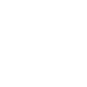

# quickbooks

[← Back to main README](../../README.md)

<table><tr>
  <td></td>
  <td></td>
  <td></td>
</tr></table>

## 16 px

### black
```
https://georgegach.github.io/compatible-icons/simple-icons/compat/quickbooks/16/black.png
```

### slate
```
https://georgegach.github.io/compatible-icons/simple-icons/compat/quickbooks/16/slate.png
```

### white
```
https://georgegach.github.io/compatible-icons/simple-icons/compat/quickbooks/16/white.png
```

## 64 px

### black
```
https://georgegach.github.io/compatible-icons/simple-icons/compat/quickbooks/64/black.png
```

### slate
```
https://georgegach.github.io/compatible-icons/simple-icons/compat/quickbooks/64/slate.png
```

### white
```
https://georgegach.github.io/compatible-icons/simple-icons/compat/quickbooks/64/white.png
```

## 128 px

### black
```
https://georgegach.github.io/compatible-icons/simple-icons/compat/quickbooks/128/black.png
```

### slate
```
https://georgegach.github.io/compatible-icons/simple-icons/compat/quickbooks/128/slate.png
```

### white
```
https://georgegach.github.io/compatible-icons/simple-icons/compat/quickbooks/128/white.png
```

## 512 px

### black
```
https://georgegach.github.io/compatible-icons/simple-icons/compat/quickbooks/512/black.png
```

### slate
```
https://georgegach.github.io/compatible-icons/simple-icons/compat/quickbooks/512/slate.png
```

### white
```
https://georgegach.github.io/compatible-icons/simple-icons/compat/quickbooks/512/white.png
```

## 1024 px

### black
```
https://georgegach.github.io/compatible-icons/simple-icons/compat/quickbooks/1024/black.png
```

### slate
```
https://georgegach.github.io/compatible-icons/simple-icons/compat/quickbooks/1024/slate.png
```

### white
```
https://georgegach.github.io/compatible-icons/simple-icons/compat/quickbooks/1024/white.png
```

## 16 px in base64

### black
```
data:image/png;base64,iVBORw0KGgoAAAANSUhEUgAAABAAAAAQCAYAAAAf8/9hAAAABmJLR0QA/wD/AP+gvaeTAAABPElEQVQ4jaXTu0qDQRAF4M94AW9BRRstvDyIErG0tBQfwsrGh7Cw8ApiJ76BryAqNoJ4iaiQCCISlYAkWvwTSMwfERxYdpndc2bmcJbGGMIurvGEcqynyG1jUIuYwx0q+GqxKshjNg1caAF6RfVHroBcfdt3v1S9wFVKPo+BdqxjGm1BWKv6EZWLsfegq67rLEbaQpypSN7gAG8BXA4R+4LwCAuYiPfXJAp/xRireAyCY5zhBOdB8IAV3AemmEF/sN1iEaPojbZr8YlujGEpikE245+RQSnOk9iPEcroqHvXjve428N45EtpIh5iPkaooBNrGJa4sEnEHY3uq0ZXpxIR3/CMF42GqmBTsOY1G+VSYqJWBstjoDbjrGYrVyWGSgMXMPNT0Jy/f6YmcC0GsSXxflHjd77CRn3b8A077pQ8Izl29QAAAABJRU5ErkJggg==
```

### slate
```
data:image/png;base64,iVBORw0KGgoAAAANSUhEUgAAABAAAAAQCAYAAAAf8/9hAAAABmJLR0QA/wD/AP+gvaeTAAAB9ElEQVQ4jY2TT0uUYRTFf+fxHcaoUd9QIpschyRa+g1EcNmyTRBZroR2QfQdyk3QVjCqTV9BSvoEboX+vg5DzWrGGSXNmee08J1JY4Tu6oF7z733nHMfcSpqtb3LLsQ10AKmBIwBINqgDsQtH+lJpTLR7GPUf9QbraWevS5C2TgwPKJxzV2tzJYnPgwa1Butpa55I7jyL8LQDlDyqWFAI9p3Z6+mW8rX3gbNDBtpsyOpAL5xtrGzWGQ+cSGu5WvnpGQT9xQVCRSD+AXu2t4HXfrLXdeTI54noIVTnL/afie0L9GQeWyBTVHwxY6bSHdAs0AwWkyAUi7Gbs/ekFhFGndkh8DvPHdodJOgSYuX6vkRUllQCrld2P4W0D2hacxFiTjgK46BC5hr9LhPCFmOGTvPrv+OgOicaKcq8mvkOnCISQaCmRHEAaLOCK8UYyVPdRKgA0wZZiQ9jJG3yLeBglAv2kWkFzKTOKaSVi2V86Ft7f5sroMeACH3x8CBzecgZDOHOSIQMOPkB2WIAdaVZa2UUbZl+muRd/+E3TPcGsbddhZHmQ+VykTTx6wYGmcLmLOYPke7RkyS5Wqatgb3/f1HczHABif8hrpjiOBaHEmWq1Olj3D2g5BlrTQUeQZaBErRHs+L2kht4ffdop9W07TVx/wBi2rg3FZwNrgAAAAASUVORK5CYII=
```

### white
```
data:image/png;base64,iVBORw0KGgoAAAANSUhEUgAAABAAAAAQCAYAAAAf8/9hAAAABmJLR0QA/wD/AP+gvaeTAAABWUlEQVQ4jaXTzWpTcRAF8F9iRERrG3HlB34gvoa0uHTpUsSl4M7X0I3gRrSiuBPfwAdRJNFUENLuSq3Gj+S4yCg3MRHBAxfuPTPznzNzz58GkhxP8iRJP8lOklE9O8U9TtK1CEmuJNlKMs5yjJMMkmwsKh4uKdpNMpnjhknWm7K3/tL1dZLeAn6QZK2DezjdFIRdTHAIX/ADn3C0kXcGd1tJ+rhQ5Du8qORt3MGoCj/jFa7hXOX3O1ipjw94iltYxRt8q9gIl3ACD3C7VK+0Gwe8x3WcxJEa4Re+4zBO4Qa2ij/W9p9oY6/ez+M5PpbkTiPvAPYr9gxni99btMSXuFojjHEQ903n75pbYivJJm6WGqa/cR89tHARXyu+WpxqsClJt0wxj7dlomUYJFmbtkw28qeVJ2XjRRgmuTyzzSTr+ffLNFvcOKSb5FGm3t/O7HXuJXn4W3bhJ4NBxT6OaMpgAAAAAElFTkSuQmCC
```

