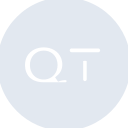
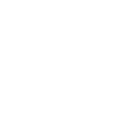

# quicktype

[← Back to main README](../../README.md)





## 16 px

### black
```
https://georgegach.github.io/compatible-icons/simple-icons/quicktype/16/black.png
```

### slate
```
https://georgegach.github.io/compatible-icons/simple-icons/quicktype/16/slate.png
```

### white
```
https://georgegach.github.io/compatible-icons/simple-icons/quicktype/16/white.png
```

## 64 px

### black
```
https://georgegach.github.io/compatible-icons/simple-icons/quicktype/64/black.png
```

### slate
```
https://georgegach.github.io/compatible-icons/simple-icons/quicktype/64/slate.png
```

### white
```
https://georgegach.github.io/compatible-icons/simple-icons/quicktype/64/white.png
```

## 128 px

### black
```
https://georgegach.github.io/compatible-icons/simple-icons/quicktype/128/black.png
```

### slate
```
https://georgegach.github.io/compatible-icons/simple-icons/quicktype/128/slate.png
```

### white
```
https://georgegach.github.io/compatible-icons/simple-icons/quicktype/128/white.png
```

## 512 px

### black
```
https://georgegach.github.io/compatible-icons/simple-icons/quicktype/512/black.png
```

### slate
```
https://georgegach.github.io/compatible-icons/simple-icons/quicktype/512/slate.png
```

### white
```
https://georgegach.github.io/compatible-icons/simple-icons/quicktype/512/white.png
```

## 1024 px

### black
```
https://georgegach.github.io/compatible-icons/simple-icons/quicktype/1024/black.png
```

### slate
```
https://georgegach.github.io/compatible-icons/simple-icons/quicktype/1024/slate.png
```

### white
```
https://georgegach.github.io/compatible-icons/simple-icons/quicktype/1024/white.png
```

## 16 px in base64

### black
```
data:image/png;base64,iVBORw0KGgoAAAANSUhEUgAAABAAAAAQCAYAAAAf8/9hAAAABmJLR0QA/wD/AP+gvaeTAAABGElEQVQ4jZ3TvUpDQRAF4C8/KoLRJASsbHwPlQRLX8DeytpXsVBIL1iIYOWDiEUCCQrGNKIxRMSgxd3A5pobjAMDOzt7DmcOs0xHFU200cdHyH64a6IiI/bRxRjfGTlGB41Z4N4cYDp7qMeyuwuAJ9lBpYBT7CKXNVtGrKOWk5izHTV6EuNWsYlXvEf9FdTCuV1EKWre4RI7uMUR1nATvWlEBCUYhZlecIinUD/gGJ9RPTTtwygfMY+D7GKoC8jjK9RXqVEIDwbhXMUBrnGPC5wEhcw2eZA2cRhGeAsSy1jGFh4lpi5FBG2S9Zy3ffO28oxktzv/IOhgYyKlYfFV3ksbUg+sf/lMv8CTKOMcLTyb/s6t0CvHgB/L9o8IMwAc8QAAAABJRU5ErkJggg==
```

### slate
```
data:image/png;base64,iVBORw0KGgoAAAANSUhEUgAAABAAAAAQCAYAAAAf8/9hAAAABmJLR0QA/wD/AP+gvaeTAAABzUlEQVQ4jZWSz2qTURDFf+cmaawaTYJShdSk6l58AFFLl+6lK6G4cl18BaGK+ALuXAguRHAlWOsTdCduiqRJabPKl0Rpq+k9LvLva7Viz2ru3DlzzgwjUmg0OmVyfmq4gykA5wAQXVAP4pr3tVytFtsjjkbBVitZOIh+KYWKceDviBYN/2KpVimujhtstZKFvnklmDmGeBStaC/WLpc+qdHolJ2L66Ar/0kGwFBnn5vBufhMhMpJyEPrsyHPShZ0+/DM2gHvAdMMRuqAv6f+88AFIBjdzQKFiS1/QXoTYrhFJn5w5KHhrND7lPK8Bw0QFLS5newiTiESrEeI59iXEM2Ingi/kMkhmkTKiNOpReyF1OMA4rTs7DCRyUSCovsAjn5rSI0yQED0ACTKQvcIvBN8jQ6vkZeRdod2NbmaMXra3Ek2gKtD1R+g7cHlYUxRMGWYxW4SNIPJpRa6kQWvgWpAAJ0BruNJyTiUKkfyMeCPqteTEnmvC1X/MPgPGNf7U74RqtVi230tGVon4LdiJvvgWrncCQC1SnHV9qKhDsTjVYm26weZzP25i4XPwOG9fmu3i9mfWsGaBwrRPj8s6iJ1hVf7eT+eK5WSEec3F3i+1uYgX0IAAAAASUVORK5CYII=
```

### white
```
data:image/png;base64,iVBORw0KGgoAAAANSUhEUgAAABAAAAAQCAYAAAAf8/9hAAAABmJLR0QA/wD/AP+gvaeTAAABM0lEQVQ4jZWTwUqCQRSFP8uKKEklaFMQ0WuEKC17gfatWvc0ha2DFhG0CoKeIlooKAWamygTJfr7WjTB+PNbeWBgztw5d869zIUIalmtq021p47C6oWzuloiC+qu2lYTJyNRW2otS9z9RZhGV63GtttTiH/QUkuop3/YnoREPcmpTWArqqgLjIBFYA14Ad6i+AKwGvbNPFCIgnfAObADXAMHwDJwFd2pRQkKqMNg6VndVzuBP6iH6nvEB6kyhjNR5iTYzgc+C8wAH4FfpEqBcKEf9mVgD7gE7oEz4AgYhnguLQb66SYOgA7wCggUgXlgA3jku6lzUYJmHrgFNoObJWA74yWA9RT/BG5QS+FTTIuWugKAWnP6r1wZ86NWQ9b/DFOFLKhF9VhtqE+Oj3MjxIqx5gv/VC1+fZshQgAAAABJRU5ErkJggg==
```

