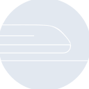
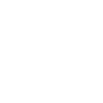

# railway

[← Back to main README](../../README.md)

<table><tr>
  <td></td>
  <td></td>
  <td></td>
</tr></table>

## 16 px

### black
```
https://georgegach.github.io/compatible-icons/simple-icons/compat/railway/16/black.png
```

### slate
```
https://georgegach.github.io/compatible-icons/simple-icons/compat/railway/16/slate.png
```

### white
```
https://georgegach.github.io/compatible-icons/simple-icons/compat/railway/16/white.png
```

## 64 px

### black
```
https://georgegach.github.io/compatible-icons/simple-icons/compat/railway/64/black.png
```

### slate
```
https://georgegach.github.io/compatible-icons/simple-icons/compat/railway/64/slate.png
```

### white
```
https://georgegach.github.io/compatible-icons/simple-icons/compat/railway/64/white.png
```

## 128 px

### black
```
https://georgegach.github.io/compatible-icons/simple-icons/compat/railway/128/black.png
```

### slate
```
https://georgegach.github.io/compatible-icons/simple-icons/compat/railway/128/slate.png
```

### white
```
https://georgegach.github.io/compatible-icons/simple-icons/compat/railway/128/white.png
```

## 512 px

### black
```
https://georgegach.github.io/compatible-icons/simple-icons/compat/railway/512/black.png
```

### slate
```
https://georgegach.github.io/compatible-icons/simple-icons/compat/railway/512/slate.png
```

### white
```
https://georgegach.github.io/compatible-icons/simple-icons/compat/railway/512/white.png
```

## 1024 px

### black
```
https://georgegach.github.io/compatible-icons/simple-icons/compat/railway/1024/black.png
```

### slate
```
https://georgegach.github.io/compatible-icons/simple-icons/compat/railway/1024/slate.png
```

### white
```
https://georgegach.github.io/compatible-icons/simple-icons/compat/railway/1024/white.png
```

## 16 px in base64

### black
```
data:image/png;base64,iVBORw0KGgoAAAANSUhEUgAAABAAAAAQCAYAAAAf8/9hAAAABmJLR0QA/wD/AP+gvaeTAAABCElEQVQ4jZ3Tz0pCURAG8N9Ni6A/aBTRCwTRohfIRX8eq6dobW/Qm7RuZylEpElERmV6rRb3CLeDV7OBbzFzmG9mvjPDb9vEOW7QxQB9PIZYHVUFVkMTI3wXYIQWjuLkQ7SnJMZo50nW5kweo4VKCWc4wGuEFzwjRQdDrOS6Xg+azaye4h5XuIveGkkIJhNEXcJWzv9AI1TdCbFuIvumdAJBGkbJWxU9bGMB/TLeCzqA1cgf4joQLSMp420KQWxD7IVk6CWyDdv4I8EIT/ga+yXsYl82ymAGUizKBK7gkkzVpn8u0ri1mvm28QEn8XyngXXWMTVxXCRSBReyhekEXT5l53xrwjn/AOvXjptSZYz2AAAAAElFTkSuQmCC
```

### slate
```
data:image/png;base64,iVBORw0KGgoAAAANSUhEUgAAABAAAAAQCAYAAAAf8/9hAAAABmJLR0QA/wD/AP+gvaeTAAABoElEQVQ4jY2Tz2pTQRyFvzP3WkttYq60tQm1je7c+QCKD+ALKIogPkO3PoDgMwiu3bvSLFy6FgQVjdqQNErqrba0yZ3jIk3/xFRzVsPMfOd3DsyIY2q18oUi+JHhFriMOE8kInJgG9zwntbX1iq9EaPR4stmfsOxeBYIq8aByYqGr7Yf1KtZ49CguZlfV4zPgYungCdk6Ni+U69mDXW73dJOcea9poSPTNyMZ7mW7saZdREHwMbJG4oWRUDzkbgNOidYOuquS+k+j9Vsb7X/NV2iMOpgtxDLmJVjpx9TmT7yxgR0Bli0ScA1cIb5ACSg6jCly6lhUTCYMHoA8dtYrStIOY4RFIBSqsAOSH8ZYEDzY5t97LcQMvAsoJTo34gJBhPVB64Cs8OU5ClB+8CFqXBTYH5IeneQsUiJeoF8G3n3vwYCxJwxsuawn6rVyhf6oXgjVJ+yxkGY4UMKtVr5u0JyH+hMD9NO0MPLWbYVAFaXyq8Tcc+4CYqnN1C0+JzA3ZXlystRq0N96vUq6Z6eGN20XZJcMkoEP4Ff4Ffj3/kPd1awrrf270IAAAAASUVORK5CYII=
```

### white
```
data:image/png;base64,iVBORw0KGgoAAAANSUhEUgAAABAAAAAQCAYAAAAf8/9hAAAABmJLR0QA/wD/AP+gvaeTAAABH0lEQVQ4jZ2TS04CURBFT5uOMX4SMPhLdAHuQQd+FuFG3IRDxxqX4UqcgZAYFSROMGIrtMdBP0jbaRA8k5dXL/emql4V5FBr6qXaULvql5qoLyF2pVYpQz1Um2rqZFK1pR4VxQdqe4qwSHtsoq7NKR7RUisxcA4MgcdCVd9ACqwCb8AKsJl73wMuIrUNbJU2JiMFOsATsA3s5t4akfoARCXCRWAjd/8A6kAN2AmxbqQmoYQiw5B6nirQCxkvAEkM9CdkAFn9eQbAXTBaAqIYeJ9iUGQA7AcxQC9SG8D6jAYp8Er2QwBpDNwCZ2RNmoXl3Hkzmv/mfwcJGO/BPNP4rJ78yks9Da5/LVNTPS4tTq2o12pd7ah99dNsne8tWecfc3K7j2Q2nXEAAAAASUVORK5CYII=
```

