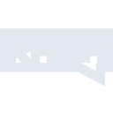
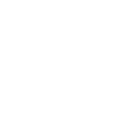

# rasa

[← Back to main README](../../README.md)





## 16 px

### black
```
https://georgegach.github.io/compatible-icons/simple-icons/rasa/16/black.png
```

### slate
```
https://georgegach.github.io/compatible-icons/simple-icons/rasa/16/slate.png
```

### white
```
https://georgegach.github.io/compatible-icons/simple-icons/rasa/16/white.png
```

## 64 px

### black
```
https://georgegach.github.io/compatible-icons/simple-icons/rasa/64/black.png
```

### slate
```
https://georgegach.github.io/compatible-icons/simple-icons/rasa/64/slate.png
```

### white
```
https://georgegach.github.io/compatible-icons/simple-icons/rasa/64/white.png
```

## 128 px

### black
```
https://georgegach.github.io/compatible-icons/simple-icons/rasa/128/black.png
```

### slate
```
https://georgegach.github.io/compatible-icons/simple-icons/rasa/128/slate.png
```

### white
```
https://georgegach.github.io/compatible-icons/simple-icons/rasa/128/white.png
```

## 512 px

### black
```
https://georgegach.github.io/compatible-icons/simple-icons/rasa/512/black.png
```

### slate
```
https://georgegach.github.io/compatible-icons/simple-icons/rasa/512/slate.png
```

### white
```
https://georgegach.github.io/compatible-icons/simple-icons/rasa/512/white.png
```

## 1024 px

### black
```
https://georgegach.github.io/compatible-icons/simple-icons/rasa/1024/black.png
```

### slate
```
https://georgegach.github.io/compatible-icons/simple-icons/rasa/1024/slate.png
```

### white
```
https://georgegach.github.io/compatible-icons/simple-icons/rasa/1024/white.png
```

## 16 px in base64

### black
```
data:image/png;base64,iVBORw0KGgoAAAANSUhEUgAAABAAAAAQCAYAAAAf8/9hAAAABmJLR0QA/wD/AP+gvaeTAAAAgUlEQVQ4je3PsQkCQRQE0LdmajkWYHSJLWluYg8WYBNiG2cTCmLg4ZrsHYuisG5i4MDwYf6fYT5/BMSagFFtgzygtMn9OSDgimNadm+MEbfEQYjYpXnGActs1/OEPRaZ9nL0iR222PRawKzg7wYrTHHBvMA7YII12m/MOca1AT+CB+jmKlbr5H2bAAAAAElFTkSuQmCC
```

### slate
```
data:image/png;base64,iVBORw0KGgoAAAANSUhEUgAAABAAAAAQCAYAAAAf8/9hAAAABmJLR0QA/wD/AP+gvaeTAAAAm0lEQVQ4je2QMQ4BUQBE32wkshzARfQqvbtoFToH0TqFxClo+MlGI9lIRLH2j0KzhMTPNgqvnzeTgT86HEu3EWRtFzQFSUsE8VUg4ArsJCLS7UPWliqj6kkgsQJym4HxJtaev6k9Y9ZZZALuQvqJNdYSfEJMATqODL+OZ4ylOAP1sS+2RgnlD4qi6O2LchGO5TY53CSEkLcS/A53u/U6zfNMtmAAAAAASUVORK5CYII=
```

### white
```
data:image/png;base64,iVBORw0KGgoAAAANSUhEUgAAABAAAAAQCAYAAAAf8/9hAAAABmJLR0QA/wD/AP+gvaeTAAAAhElEQVQ4je3QPQ5BYRSE4eeKRLAAG9Gr9PaiVegsRGsVEqtgCxqJKPyMgoIbii+3UZhkqpP3zeTwT5UkTQStpgteBaVLbnVBhRN2z+PlCxicn30TrNDFABvMP8AHrDFBh/InXrHEHlNoY1ggGGOGPo4YFbCPJOklWSTZFsM1UbeR4HdyB0mwJ4CZkJHaAAAAAElFTkSuQmCC
```

