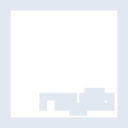

# raylib

[← Back to main README](../../README.md)

<table><tr>
  <td></td>
  <td></td>
  <td></td>
</tr></table>

## 16 px

### black
```
https://georgegach.github.io/compatible-icons/simple-icons/compat/raylib/16/black.png
```

### slate
```
https://georgegach.github.io/compatible-icons/simple-icons/compat/raylib/16/slate.png
```

### white
```
https://georgegach.github.io/compatible-icons/simple-icons/compat/raylib/16/white.png
```

## 64 px

### black
```
https://georgegach.github.io/compatible-icons/simple-icons/compat/raylib/64/black.png
```

### slate
```
https://georgegach.github.io/compatible-icons/simple-icons/compat/raylib/64/slate.png
```

### white
```
https://georgegach.github.io/compatible-icons/simple-icons/compat/raylib/64/white.png
```

## 128 px

### black
```
https://georgegach.github.io/compatible-icons/simple-icons/compat/raylib/128/black.png
```

### slate
```
https://georgegach.github.io/compatible-icons/simple-icons/compat/raylib/128/slate.png
```

### white
```
https://georgegach.github.io/compatible-icons/simple-icons/compat/raylib/128/white.png
```

## 512 px

### black
```
https://georgegach.github.io/compatible-icons/simple-icons/compat/raylib/512/black.png
```

### slate
```
https://georgegach.github.io/compatible-icons/simple-icons/compat/raylib/512/slate.png
```

### white
```
https://georgegach.github.io/compatible-icons/simple-icons/compat/raylib/512/white.png
```

## 1024 px

### black
```
https://georgegach.github.io/compatible-icons/simple-icons/compat/raylib/1024/black.png
```

### slate
```
https://georgegach.github.io/compatible-icons/simple-icons/compat/raylib/1024/slate.png
```

### white
```
https://georgegach.github.io/compatible-icons/simple-icons/compat/raylib/1024/white.png
```

## 16 px in base64

### black
```
data:image/png;base64,iVBORw0KGgoAAAANSUhEUgAAABAAAAAQCAYAAAAf8/9hAAAABmJLR0QA/wD/AP+gvaeTAAAAoElEQVQ4je3TPQ4BURSG4WeMwgZsQSzBHtSsQKIVrT1o7IIFaCxgOqVaYgMKhRBXcyYZiRCjUTjNPX/fe7/mZEi+iGa8cxQfanuYloACqzoOGnVEf8CvAZrvVx4+yyO/vAK0MEIWdcIeY/SjN8NVZWFQAbRxxiZmCbtKnnDCEumZgyu2mGAdjrq44RDOchxFkbw+pg6GIVhU+j1MS0DtuAPm+SGTUwrheAAAAABJRU5ErkJggg==
```

### slate
```
data:image/png;base64,iVBORw0KGgoAAAANSUhEUgAAABAAAAAQCAYAAAAf8/9hAAAABmJLR0QA/wD/AP+gvaeTAAAA3UlEQVQ4je2ToUoEYRSFv3MdZEAEk2CyiQ9gsBvtPoFgFes+gxYfw+wTWLaI1bbsuOAIIv+KaZz5j0HRMorDFoMnXs73hQtHVZ3MAikAsM6Mx0NAoV3kkwLAeLy5sXYxRDC9TwiIIVBf/gV/QVD8tmg7rmEJYEd6/VYwmbhcXnk+zDmLCOg6ZxXT2UM6Wkf7AFX9NJJp3Scoy5fVpvNpSFfO3kMBbm+t2P5qxYjgEvf8oGm6VtKNycfIM+BR73AWrrDvwCmbOYCqOvmnMUlsgQ8wc6Pzz/vHmLTonN8Am81hFFky0uAAAAAASUVORK5CYII=
```

### white
```
data:image/png;base64,iVBORw0KGgoAAAANSUhEUgAAABAAAAAQCAYAAAAf8/9hAAAABmJLR0QA/wD/AP+gvaeTAAAAs0lEQVQ4je3Tu02DQRBF4W9sB26AFpBLcA/EUAESqeWUHpzQBRRAQgHOCImRaICAAGH5ErArjHjph4SAk6w0mnt2JphKEr9g0t4V1gOzcyy7YF1VF0PSffDRwF/f8S/4C4LJ9y0vJBlhDFX19KkgyRTHqF7CLU5w0HpOsemBJDncEewleUxylVdu8paHJOdJ8tEKG1xjgUtMMcMWd22yMe6h2jV+dUz7OGqBs536HMsu+DHP3oBgWrLDKuAAAAAASUVORK5CYII=
```

