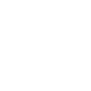

# readme

[← Back to main README](../../README.md)




## 16 px

### black
```
https://georgegach.github.io/compatible-icons/simple-icons/readme/16/black.png
```

### slate
```
https://georgegach.github.io/compatible-icons/simple-icons/readme/16/slate.png
```

### white
```
https://georgegach.github.io/compatible-icons/simple-icons/readme/16/white.png
```

## 64 px

### black
```
https://georgegach.github.io/compatible-icons/simple-icons/readme/64/black.png
```

### slate
```
https://georgegach.github.io/compatible-icons/simple-icons/readme/64/slate.png
```

### white
```
https://georgegach.github.io/compatible-icons/simple-icons/readme/64/white.png
```

## 128 px

### black
```
https://georgegach.github.io/compatible-icons/simple-icons/readme/128/black.png
```

### slate
```
https://georgegach.github.io/compatible-icons/simple-icons/readme/128/slate.png
```

### white
```
https://georgegach.github.io/compatible-icons/simple-icons/readme/128/white.png
```

## 512 px

### black
```
https://georgegach.github.io/compatible-icons/simple-icons/readme/512/black.png
```

### slate
```
https://georgegach.github.io/compatible-icons/simple-icons/readme/512/slate.png
```

### white
```
https://georgegach.github.io/compatible-icons/simple-icons/readme/512/white.png
```

## 1024 px

### black
```
https://georgegach.github.io/compatible-icons/simple-icons/readme/1024/black.png
```

### slate
```
https://georgegach.github.io/compatible-icons/simple-icons/readme/1024/slate.png
```

### white
```
https://georgegach.github.io/compatible-icons/simple-icons/readme/1024/white.png
```

## 16 px in base64

### black
```
data:image/png;base64,iVBORw0KGgoAAAANSUhEUgAAABAAAAAQCAYAAAAf8/9hAAAABmJLR0QA/wD/AP+gvaeTAAAA6klEQVQ4ja3Szy4EQRAG8N/I7hLsIHFwcHD0Up5o38K+jRdwJdnESiQIYhaZdZgeSptZEb6k01VdX/3pquKPKDDEYZJbPOMq4x5gM+hLzAqcYzcj13jASdKnGGMt490VeMWgp8LLlOmox/5WJEIfFule7yPEzDNUQd/W/BvmeAy2DU3fvgQo02lRZw6xgZ0VLLMse0Ee4Tar7luAYeZUZ3K0ffQtBnjSjK7FTsi0wH2wjbFFszyVFV3+AdUAZ5o5x00cYd/n4tS4wUvgLHHRFbXEMSa41oxwkt7KLodVmOL0t04RA/1r/j94B6tUKq2mWd2vAAAAAElFTkSuQmCC
```

### slate
```
data:image/png;base64,iVBORw0KGgoAAAANSUhEUgAAABAAAAAQCAYAAAAf8/9hAAAABmJLR0QA/wD/AP+gvaeTAAABRElEQVQ4ja2STS+DURSEn7l9i6BFEI1YdONnsfG7bPTfiL2FBUW0hGipKNo7Fv14b6U+glmd3DNnzszJhT9CR3Zx7bq9JaHRo0Pxubq+0EiJpzedSnBvfswxvt1YutRFo3UcA8vJPHKMffsxUNgBiPRrBalkhTAWwBBp6aLZejNk0+zZrksyUJ3un1722fAAoWLDQGPaBrJ82L5E6ubqWhSuDOsmdifhziFtQbpdlBHlhBQnBxgfMEUiIE9sgRXGh/UM5j51hz8KRBcRK7khRU/UznvGo15yQD0Bj4mDJWBxWL+A2nkiSogFAJ03Wl3E7LR830PdjKBD2VXLGhm2mQmwZgiDF2KEW4lXhuFl2Y5n+qh5cndXzl6Km1kh7kWzK2Tcr/Wd7fdm3662V1cffmyw3mzX6lf3B7+LB9jObH/xU/8B7/vTk95cievGAAAAAElFTkSuQmCC
```

### white
```
data:image/png;base64,iVBORw0KGgoAAAANSUhEUgAAABAAAAAQCAYAAAAf8/9hAAAABmJLR0QA/wD/AP+gvaeTAAAA+UlEQVQ4ja2SQUoDQRBFX8skippRwUUWLlzmUp7IW5jbeAG3CgEjCCoqTlTmuZiJlj1ORMyHpqv6V/0qqgv+iaQOgCMghfeXlNJ1DFTHwHZ8AmZJvQD2M+EaeAROWn8KjICNLO4+qW9A0dPhVVvpuId/T6o9JMCivTf7AmLlGVAFfxcYt/YceArcFs3cvgmU7VmizhLiAH/swKzKQbCHwF3WXUdgkCXVmR25z7lFgWear1tiL1RaAA+BGwE70CxSxYop/4KqAM5p/jlu4hA45GtxauAWeA0xApcdSbVUJ+qpeqPOW3uilp2EVVCn6tmfkjKBQu1b8/XgA2pcYHqE3PjTAAAAAElFTkSuQmCC
```

