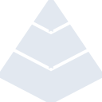

# red

[← Back to main README](../../README.md)

<table><tr>
  <td></td>
  <td></td>
  <td></td>
</tr></table>

## 16 px

### black
```
https://georgegach.github.io/compatible-icons/simple-icons/compat/red/16/black.png
```

### slate
```
https://georgegach.github.io/compatible-icons/simple-icons/compat/red/16/slate.png
```

### white
```
https://georgegach.github.io/compatible-icons/simple-icons/compat/red/16/white.png
```

## 64 px

### black
```
https://georgegach.github.io/compatible-icons/simple-icons/compat/red/64/black.png
```

### slate
```
https://georgegach.github.io/compatible-icons/simple-icons/compat/red/64/slate.png
```

### white
```
https://georgegach.github.io/compatible-icons/simple-icons/compat/red/64/white.png
```

## 128 px

### black
```
https://georgegach.github.io/compatible-icons/simple-icons/compat/red/128/black.png
```

### slate
```
https://georgegach.github.io/compatible-icons/simple-icons/compat/red/128/slate.png
```

### white
```
https://georgegach.github.io/compatible-icons/simple-icons/compat/red/128/white.png
```

## 512 px

### black
```
https://georgegach.github.io/compatible-icons/simple-icons/compat/red/512/black.png
```

### slate
```
https://georgegach.github.io/compatible-icons/simple-icons/compat/red/512/slate.png
```

### white
```
https://georgegach.github.io/compatible-icons/simple-icons/compat/red/512/white.png
```

## 1024 px

### black
```
https://georgegach.github.io/compatible-icons/simple-icons/compat/red/1024/black.png
```

### slate
```
https://georgegach.github.io/compatible-icons/simple-icons/compat/red/1024/slate.png
```

### white
```
https://georgegach.github.io/compatible-icons/simple-icons/compat/red/1024/white.png
```

## 16 px in base64

### black
```
data:image/png;base64,iVBORw0KGgoAAAANSUhEUgAAABAAAAAQCAYAAAAf8/9hAAAABmJLR0QA/wD/AP+gvaeTAAABFklEQVQ4jZXSK0uDYRjG8d+cA4NDZEVYMogYFv0SBr+B1aBx4KFZjVYxCNZlwSYYbXNBRTTtAC7MMDyA07Bb3OF9h15whed+/vfhebhJVwY34cwELlW7eMcH9v+bvIg6vsJ1LCWBUymxdcNjZ7CWxGcTChxgG6fo4gHn2MIcLieNvoJGjN3FfbgbsUYwiZpG1e+701wNdkwb6PyhQCfYIZVwhXJ0SCrUibtysKWf5BxqAT3rf9KO/gK96u/CLfZwgVawNeQyOMImZgYmauEad3FexioWBpg3HEN7wntbAx2T3M6igCLyxhdlNjyqHpo4+wnkcYhHfE7o2MNTjD6fUFgBJ/q73xtJbqIy8g+pKgb8Eq5EbEzfM+Zt7k7gG5MAAAAASUVORK5CYII=
```

### slate
```
data:image/png;base64,iVBORw0KGgoAAAANSUhEUgAAABAAAAAQCAYAAAAf8/9hAAAABmJLR0QA/wD/AP+gvaeTAAABzElEQVQ4jYWTvWvTURSGn/c2BRGLwZamH6S1IBaRKhbcFXHQwc2hg4tDJ8FF1EHo0Mmxq6D1r3ApbjopFQxFxMGaNO0vH9akFVFI7utgJP34RQ+c4b485/Cew7miR9hWqdJ8j01+JHtOktO40KvBRrJ73+a0pelipfmwF6c0cT1pTMl+JWkMQNIm4lJ++Pin/zqwHRR0QwqyzZ9EEa7bPsRnDgrFamNBkdsoPBOa7cirasd7xWrjBLDQc4T1zd0zIbRegkZBP8DlDjYOPgreijFz5eTYwIdDDWxnSpXGKmgmbS97hizkc9lZSa19OyhXd+aMJv5dDEYT5erO3N93ACgl2zPtGOclL4ILQDOltgkuSF5sxzhfSrZnAPTW7h+uNN6BzgJ1YE3ihfEtrFOGgPiM43Op7zL4PCZnvFbLZS+olDSXDPPgI12bJOA3QfoIEO1p0EXBSNeQfgqeqLjVqCMG0ydWpdMy12MhX4PhKWgd3E4hcqnFIoI2CSwLoFarDXxv9T8KcFMwiXr+EQNfBCvxFw8mJ7Pf9h3SxsbOoDPxMdI17FHvvRNIgnnd6svcmRo+lnTNpESpXh+nnVkyXO1AK/S17uaHhsoH2d+HhsfV7mp7ZQAAAABJRU5ErkJggg==
```

### white
```
data:image/png;base64,iVBORw0KGgoAAAANSUhEUgAAABAAAAAQCAYAAAAf8/9hAAAABmJLR0QA/wD/AP+gvaeTAAABO0lEQVQ4jZWSvS6EQRSGn9mQaBQoSDaRKEQUFBI3odBrFW6A+KnUSq34uQE3oJMoJYqlQIHGIkgoxE+y+ygcdtlviJNMvsw5z3vOO/NNIhNqAiqxHU0pmWNzDRbUV/VNXfqveEC9tBGX6mARWyoQl4BJIDWlEzARtW/RVtB0GZgGNoGxyB0Ac0B31LPWh9Vq2H5ST2M9Ra6qDufEbWrFv6OifjlvPtMU0J+114j+YL9NH1H31NmY8FAw+SFqs8GOfIrb1aOAbtVddV49VJ/jLRyri+qOeh3skdqe1FVgBuhoMnUN7AMnsR8CxoG+JuYFWEvqHdCTOe9NfHsz9fsSsAFcALUCoDcjrgNVYOvzHjrVFfVMrf3yC+vqubqmdrW0VXvUdT/efv2H+ErdVvtahAWNygE/xtpWy0XsO7kLemz+iFSkAAAAAElFTkSuQmCC
```

