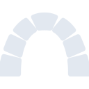

# redmine

[← Back to main README](../../README.md)





## 16 px

### black
```
https://georgegach.github.io/compatible-icons/simple-icons/redmine/16/black.png
```

### slate
```
https://georgegach.github.io/compatible-icons/simple-icons/redmine/16/slate.png
```

### white
```
https://georgegach.github.io/compatible-icons/simple-icons/redmine/16/white.png
```

## 64 px

### black
```
https://georgegach.github.io/compatible-icons/simple-icons/redmine/64/black.png
```

### slate
```
https://georgegach.github.io/compatible-icons/simple-icons/redmine/64/slate.png
```

### white
```
https://georgegach.github.io/compatible-icons/simple-icons/redmine/64/white.png
```

## 128 px

### black
```
https://georgegach.github.io/compatible-icons/simple-icons/redmine/128/black.png
```

### slate
```
https://georgegach.github.io/compatible-icons/simple-icons/redmine/128/slate.png
```

### white
```
https://georgegach.github.io/compatible-icons/simple-icons/redmine/128/white.png
```

## 512 px

### black
```
https://georgegach.github.io/compatible-icons/simple-icons/redmine/512/black.png
```

### slate
```
https://georgegach.github.io/compatible-icons/simple-icons/redmine/512/slate.png
```

### white
```
https://georgegach.github.io/compatible-icons/simple-icons/redmine/512/white.png
```

## 1024 px

### black
```
https://georgegach.github.io/compatible-icons/simple-icons/redmine/1024/black.png
```

### slate
```
https://georgegach.github.io/compatible-icons/simple-icons/redmine/1024/slate.png
```

### white
```
https://georgegach.github.io/compatible-icons/simple-icons/redmine/1024/white.png
```

## 16 px in base64

### black
```
data:image/png;base64,iVBORw0KGgoAAAANSUhEUgAAABAAAAAQCAYAAAAf8/9hAAAABmJLR0QA/wD/AP+gvaeTAAABAUlEQVQ4jc3SPUoDURTF8V8mAfEjhSAifmFnb5vGwkW4ARtJ4RpciXYKWghCAiqYQgtXIAgRJShiE7ARjMYid/AhiaYSDzy4vHP+5w4zw3/VDHZxFWcHU8OAczjBBtroxmljE6eYHQQv4DaAZjJ3Y24m3nwOFZOCbayihFGc4xgXeMVK4o2gnm6v4gw1PGMPWeJn2A+vFtlqat7E4z3hMDZ9VwkHkekGk2Wo6L11mMYdOn0KOriPjGAqRYxhHJMoYCu29NMj1vGAIzQKuEYZL2hhbQCcq46lnClhwte3/fgFhkUsx9zKoinX2xAFaaZc0vsx3uPicoiCRlJS/Cn4N/oEp5c857TApfMAAAAASUVORK5CYII=
```

### slate
```
data:image/png;base64,iVBORw0KGgoAAAANSUhEUgAAABAAAAAQCAYAAAAf8/9hAAAABmJLR0QA/wD/AP+gvaeTAAABnklEQVQ4jcWRMWtTYRSGn/fLxcl4Eek1ib0lgljc3YoO4i66CA7+Ajf7J+zsD8hSFBdXFwdFHKSuYkGN6U21TaJJqJO5974OiVprNZN4tu/wnofnOwf+d+mwZrv3pRZc3JF9DoCgV1Gu1Ubj2OBgNtr/yAaDU86jlsr8AeKKIQaQfTav8KKzM7qmyuTm0sLCh98Mtrc/pXkITyU1bbcREmoCGL/HWNJpoB3y4uLi4okuQPgOKCvR7UCoAUiqI21YrFmsYb2UVJ/aqO4oWv3FIOuNb5VFeTUEfXWp86h4nJ48fkNSCWA7ZLvje1iXFLxRlj4SKuFhmsR3ZTtkvfEm5oxxT9KzNImvS8r378d2tLUzvo98QShBvEmTeDlk/eEKMFVHCVbn4PDsW7mkLaFk1qpl/eFKKPKoj1k3fosZSkXrsNNOIUULM5xl1134szofR68lVSX2MN20Fl/+EwAg2x09AjVtqpL3IslHgYY9Pcbfhqe70BJ4GcDQDYbqT0Um8wCSf2RsqlFA7ywKgNJ+Pg9Q2k8kTQCCqczL//v6BpOgt26xBY9MAAAAAElFTkSuQmCC
```

### white
```
data:image/png;base64,iVBORw0KGgoAAAANSUhEUgAAABAAAAAQCAYAAAAf8/9hAAAABmJLR0QA/wD/AP+gvaeTAAABBklEQVQ4jc2Ru0oDURRF11ynNJ1IfGLnR6T1V2wknX6FXxELQUHrCGphYyHaC5KIkkYCGrD0sSw8g5cQwzSCGy4czt5rz50Z+JdSm+qeehWno87VAZfUU3VTHfmjkbqlnqmLv8Er6n0A/Ww25n7mLVdcyjq2gWbMC8A1sBvnJnaVtzP+9LZ6rnbVoXqgpsxP6mF43ci2c/MurvekHqvlhFcs1aPIGExKQCu7+jzwUBTF+3hB7B4jQzCtBAyBfaAHvACdiV/5W53I9IJ5LtRboAG8AoOiKDamFKCeAGsVUwKzQPVvP6fBoVVgPeZBiqZKbzUK8kyjBPrARywuaxRcZCUzNfJ/rC/HMuApEwRCdgAAAABJRU5ErkJggg==
```

