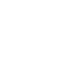

# removedotbg

[← Back to main README](../../README.md)




## 16 px

### black
```
https://georgegach.github.io/compatible-icons/simple-icons/removedotbg/16/black.png
```

### slate
```
https://georgegach.github.io/compatible-icons/simple-icons/removedotbg/16/slate.png
```

### white
```
https://georgegach.github.io/compatible-icons/simple-icons/removedotbg/16/white.png
```

## 64 px

### black
```
https://georgegach.github.io/compatible-icons/simple-icons/removedotbg/64/black.png
```

### slate
```
https://georgegach.github.io/compatible-icons/simple-icons/removedotbg/64/slate.png
```

### white
```
https://georgegach.github.io/compatible-icons/simple-icons/removedotbg/64/white.png
```

## 128 px

### black
```
https://georgegach.github.io/compatible-icons/simple-icons/removedotbg/128/black.png
```

### slate
```
https://georgegach.github.io/compatible-icons/simple-icons/removedotbg/128/slate.png
```

### white
```
https://georgegach.github.io/compatible-icons/simple-icons/removedotbg/128/white.png
```

## 512 px

### black
```
https://georgegach.github.io/compatible-icons/simple-icons/removedotbg/512/black.png
```

### slate
```
https://georgegach.github.io/compatible-icons/simple-icons/removedotbg/512/slate.png
```

### white
```
https://georgegach.github.io/compatible-icons/simple-icons/removedotbg/512/white.png
```

## 1024 px

### black
```
https://georgegach.github.io/compatible-icons/simple-icons/removedotbg/1024/black.png
```

### slate
```
https://georgegach.github.io/compatible-icons/simple-icons/removedotbg/1024/slate.png
```

### white
```
https://georgegach.github.io/compatible-icons/simple-icons/removedotbg/1024/white.png
```

## 16 px in base64

### black
```
data:image/png;base64,iVBORw0KGgoAAAANSUhEUgAAABAAAAAQCAYAAAAf8/9hAAAABmJLR0QA/wD/AP+gvaeTAAAAzElEQVQ4jc3SwUoCURTG8Z9KuYioVZueQNy1y5XPEPmWrYVeoaBA7BFiUlNTBEkoW3hmiEEGx4X4wbc59/zvvd/hcMzqoB++LwO28YIZ1uE53nBXBN7iCZN/YN4T9OKRTE08YlgA5v2JZ9zAtASY97SGa1zhApXdxmSNdzxUUcNZwB87wGnPaVpII3zHHH6QbPluEmfD6M0idNHAeURZ4RcnGGCJetQruMQXXm12JVPLZrLjuH2BUXgRtXH0tIoytuP20ouU196rfFj9AUWmXgFUM4zKAAAAAElFTkSuQmCC
```

### slate
```
data:image/png;base64,iVBORw0KGgoAAAANSUhEUgAAABAAAAAQCAYAAAAf8/9hAAAABmJLR0QA/wD/AP+gvaeTAAABL0lEQVQ4jc2SzS5DcRTEf3PbNBEJSuozEik7K0sWeAiewY4n8AqVPoPE0jPY8ATWGnqlV6XuRYTQ/semEaGNWjHLk5k5c04G/i3iZrZdT9LzepKex81sqx9PXwe123QzH1QJgUWJEQDjRxHVQwj7C7PF454G8c3Dagihqoglm2LvdUpxiGV252eKJwC6bLSWFeUrMisBl75F6h27ZaiFHDu6Su5T8NgAul5WWWSHQ5saJvxCaUyMfRQJ5SJpGCGb5EdllyOpAPDpBL0C9+AJUBM8/SVuAp4EtYBRcAGURaKzDpwYZ+CSrTfsgkTbuGHTlGhj54EXcAn8iHQqdTY+nn5987DWsauCsvE4+AnpuZt7CDQsdGe4yEl7c1MjZ9CnSFFHB5jyIEXqi0Gr/Pd4B/kJpoXJxZXEAAAAAElFTkSuQmCC
```

### white
```
data:image/png;base64,iVBORw0KGgoAAAANSUhEUgAAABAAAAAQCAYAAAAf8/9hAAAABmJLR0QA/wD/AP+gvaeTAAAA20lEQVQ4jc2SwUoCYRSFP6do08ZNT+GuXS7MZ5B8wsB3aNemTUJB6NpNMDGpY+WiSP1azA1DVJpZRAcu/Nz/nAPncOHfQu2qg5iLMsK2eqe+uMarOlQ7+4Rn6q06dTem6oPa/ilsqFdqtke4ibHaV09rag7UK1Y1S4BLYASsSggFHoFeAhwAx0ANePqF+JtzVFhpHrk+ooelmm7JncZfFlzVPAFawDUwA06Az3BfACmQxfsQeA/OG3ADnK9DaTOanYT7XH2OmcduEpzm7naKQ7q37CFtMap2yn+OL1CPRkNLI/jJAAAAAElFTkSuQmCC
```

