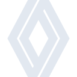
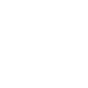

# renault

[← Back to main README](../../README.md)





## 16 px

### black
```
https://georgegach.github.io/compatible-icons/simple-icons/renault/16/black.png
```

### slate
```
https://georgegach.github.io/compatible-icons/simple-icons/renault/16/slate.png
```

### white
```
https://georgegach.github.io/compatible-icons/simple-icons/renault/16/white.png
```

## 64 px

### black
```
https://georgegach.github.io/compatible-icons/simple-icons/renault/64/black.png
```

### slate
```
https://georgegach.github.io/compatible-icons/simple-icons/renault/64/slate.png
```

### white
```
https://georgegach.github.io/compatible-icons/simple-icons/renault/64/white.png
```

## 128 px

### black
```
https://georgegach.github.io/compatible-icons/simple-icons/renault/128/black.png
```

### slate
```
https://georgegach.github.io/compatible-icons/simple-icons/renault/128/slate.png
```

### white
```
https://georgegach.github.io/compatible-icons/simple-icons/renault/128/white.png
```

## 512 px

### black
```
https://georgegach.github.io/compatible-icons/simple-icons/renault/512/black.png
```

### slate
```
https://georgegach.github.io/compatible-icons/simple-icons/renault/512/slate.png
```

### white
```
https://georgegach.github.io/compatible-icons/simple-icons/renault/512/white.png
```

## 1024 px

### black
```
https://georgegach.github.io/compatible-icons/simple-icons/renault/1024/black.png
```

### slate
```
https://georgegach.github.io/compatible-icons/simple-icons/renault/1024/slate.png
```

### white
```
https://georgegach.github.io/compatible-icons/simple-icons/renault/1024/white.png
```

## 16 px in base64

### black
```
data:image/png;base64,iVBORw0KGgoAAAANSUhEUgAAABAAAAAQCAYAAAAf8/9hAAAABmJLR0QA/wD/AP+gvaeTAAABUElEQVQ4jY3Ty0pdUQwG4E8nDq0ztYUipU9Q0UcoWHyq4qSDIioI0onowCIIhQqKOFFQWqwo4m0gWBXvSr2hUlEHK/Zs9znHGtis7PzJWsmfhNLShr8YwDZu8LGMb5G8wG+s4xuucBC26udc0INrfInXj9Abtu68c2Xuvx4t2MTryKYKddhCa+hlZRCX6MI+FrAUJXQFNlgu+C12sIxpnOI9PuAPJrGCvfAtknGc4zOO8SOD/YxL2nGGsXzwOxxiFnMScU0ZvDnwX5gPvJECibdxVoZe4THBFfHdxZmN+SdjUcKneGEmg81EWQ8ljBQRgAaJxFVMSSS2SCSeYCKwPbwpdQF8lVrVEY4LWJTa2Ok/baQwMGuR5jkuMBq2TdRmA/KTuINhvAr9OtLfCNt37D6VAYVlOpAWaUharHUllimfAWlg+lEjdeMSL9EX2TySeyW8ZqgcYXRvAAAAAElFTkSuQmCC
```

### slate
```
data:image/png;base64,iVBORw0KGgoAAAANSUhEUgAAABAAAAAQCAYAAAAf8/9hAAAABmJLR0QA/wD/AP+gvaeTAAACFUlEQVQ4jYWTTUuUYRiFr/PMq4Ilzih+mykZLfqQLDdhmzZB0DLoT/grIih3hUT7PugH5EfgSqSNkUiLQDHtNXRKzJnCZNR5TivNMaN7+XDOxbkPzw3HTLr6/X6aL+6m+cKr9Ovm6kq+uJfmN+8dp9XRh6XNzWympDmBjeaMb8r6Cf61WxMvnWloKB7Wh6OApKRho1bwJMSBAFsmjllqrSqFB0f1FYB0fb0dcUvySoTTmKyhRlKb5C/It5fXt9r+CXBMHtlqJGpCqA+xaEiBy0SPYzVm4u7jYztY+VY86+gpQyFAIeLzUrgTAkmMfgH6YNxEJBcyGjzVXL9QkSBGPwXXZaRxm3MifOxqqX/T2VQ/ijVvx4vYExK1tp9UrPB5tXBFqE/SvO0bCMsMHYo5JGtPCteBT5j+dLVw9QCQJI5gMAERbST9SSeQQY42IBuSKuIBoKM5NwuaNfQCkwJHMbIPKNsjCgh5GuhR0Ex7U/Z9RYnL+UJPgLcyP6K0EYgXyg53kwSVy/GlzBxBLTZZiWtdLdnFihK7W7NLwJSlLuAdCtuZ4IexHIdl7QBzRHUhT+2bKxIALK9vtYXyzoyhFKwFi0GMMNPO0Bugek/JQE/zyfyxH6m76cSa0SiETgevYUrIRQVSrE5HXh82/5UAKo6p1lYd8pigH8ROdbnvv8fUk8sViPG5IWfFDcQ2qMPEZ0fNAL8Bii8GwJXWPtQAAAAASUVORK5CYII=
```

### white
```
data:image/png;base64,iVBORw0KGgoAAAANSUhEUgAAABAAAAAQCAYAAAAf8/9hAAAABmJLR0QA/wD/AP+gvaeTAAABcElEQVQ4jY2TTUsVcRSHn78LXabLW4JE+gnU3LQPDD9VtGkhokIgbsQWihAICoK4qSgqi0R8w42meL3eFK8GKolPm3NlHOZKA8PA+b0czu/MgYJHfaX+VafUA/VafVnELRK3qrvqjjqrXqrVqD34H4Mx9Uodj+7H6kTU3uT5TTnxQ6Af2AM6gFagBSgB+8CAWrqv+4x6oY6qR+qquh4jjAY200jcpZbVDfWzeqY+V1+op+oHdVOtqF1FBkvqH3VQPVG/ZLCvYTKknquLeXG3+lv9of6M4J5m8L7Av6srgfdkQ7zJhHoDpFzAKV7jm9XcdlmMEV5Hh+UMthxj1UdYKMrgcYS4pX6KEPsjxJr6PrCK+qTRJqZjVcNBXFXXYo0jRWtMOYMS8A24AraBZ8H5CHQCzUBvSumwrrnzJ6aUysA80A6Uw6gG/IraXFbcaIz6MVXjkN7FYe0UHVNTvpBSOgXeAm3AMXABPAImU0q1PP8ff4aqdBCLcdUAAAAASUVORK5CYII=
```

