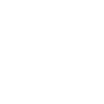

# replicate

[← Back to main README](../../README.md)

<table><tr>
  <td></td>
  <td></td>
  <td></td>
</tr></table>

## 16 px

### black
```
https://georgegach.github.io/compatible-icons/simple-icons/compat/replicate/16/black.png
```

### slate
```
https://georgegach.github.io/compatible-icons/simple-icons/compat/replicate/16/slate.png
```

### white
```
https://georgegach.github.io/compatible-icons/simple-icons/compat/replicate/16/white.png
```

## 64 px

### black
```
https://georgegach.github.io/compatible-icons/simple-icons/compat/replicate/64/black.png
```

### slate
```
https://georgegach.github.io/compatible-icons/simple-icons/compat/replicate/64/slate.png
```

### white
```
https://georgegach.github.io/compatible-icons/simple-icons/compat/replicate/64/white.png
```

## 128 px

### black
```
https://georgegach.github.io/compatible-icons/simple-icons/compat/replicate/128/black.png
```

### slate
```
https://georgegach.github.io/compatible-icons/simple-icons/compat/replicate/128/slate.png
```

### white
```
https://georgegach.github.io/compatible-icons/simple-icons/compat/replicate/128/white.png
```

## 512 px

### black
```
https://georgegach.github.io/compatible-icons/simple-icons/compat/replicate/512/black.png
```

### slate
```
https://georgegach.github.io/compatible-icons/simple-icons/compat/replicate/512/slate.png
```

### white
```
https://georgegach.github.io/compatible-icons/simple-icons/compat/replicate/512/white.png
```

## 1024 px

### black
```
https://georgegach.github.io/compatible-icons/simple-icons/compat/replicate/1024/black.png
```

### slate
```
https://georgegach.github.io/compatible-icons/simple-icons/compat/replicate/1024/slate.png
```

### white
```
https://georgegach.github.io/compatible-icons/simple-icons/compat/replicate/1024/white.png
```

## 16 px in base64

### black
```
data:image/png;base64,iVBORw0KGgoAAAANSUhEUgAAABAAAAAQCAYAAAAf8/9hAAAABmJLR0QA/wD/AP+gvaeTAAAAfklEQVQ4je3SMQrCUAyA4U8plB7A2V7BQTxLx27uXsPDeI1exam0o4KdCo+2D8p7q/8UEvKThBzwk0ERxO+E/jIUPPHKnaBFg+/O/qpYJE6oUycI6dFhSBV88MANlxTBzB3XHMH8I73tdVZHjDHivFU47hRE+QvignJRr2KCCbrrD2ghAfXOAAAAAElFTkSuQmCC
```

### slate
```
data:image/png;base64,iVBORw0KGgoAAAANSUhEUgAAABAAAAAQCAYAAAAf8/9hAAAABmJLR0QA/wD/AP+gvaeTAAAApElEQVQ4je3QPQrCQBCG4fcbFkI6G8FG9AoW4lks7ey9hofxGl7DSlIFLZUZmygpEvNj61S787EPM6vLtQx+qPQ+CAofSoks1S5HM51GT+BuheQ7iK2kZ5/HHpGneiOIqdAyeq4iRGpJStzPMrt1IY2A0MOJAxEbsNVgoEbtIdajAYmo/qMUNK2Td0xQQXCfzyaLpsz6AN/qD7QAQWQA7p88bwNehrssZbApU0YAAAAASUVORK5CYII=
```

### white
```
data:image/png;base64,iVBORw0KGgoAAAANSUhEUgAAABAAAAAQCAYAAAAf8/9hAAAABmJLR0QA/wD/AP+gvaeTAAAAfklEQVQ4je2SMQqAMAwAryKUPsBZv+AgvsXRzd1v+Bi/4VecREeFOhVKbaG0qzeFhBxJiNBaazIorXhP6Je2YAHW3AlGYACeyH5VOokKaFInsDmADThTBTcwAz3QpggME9DlCMyPHPjX+RwxxCWEqH2FIlIQ5BeEBdKpq5DgBd5MEmj2sih4AAAAAElFTkSuQmCC
```

