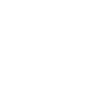

# rescuetime

[← Back to main README](../../README.md)




## 16 px

### black
```
https://georgegach.github.io/compatible-icons/simple-icons/rescuetime/16/black.png
```

### slate
```
https://georgegach.github.io/compatible-icons/simple-icons/rescuetime/16/slate.png
```

### white
```
https://georgegach.github.io/compatible-icons/simple-icons/rescuetime/16/white.png
```

## 64 px

### black
```
https://georgegach.github.io/compatible-icons/simple-icons/rescuetime/64/black.png
```

### slate
```
https://georgegach.github.io/compatible-icons/simple-icons/rescuetime/64/slate.png
```

### white
```
https://georgegach.github.io/compatible-icons/simple-icons/rescuetime/64/white.png
```

## 128 px

### black
```
https://georgegach.github.io/compatible-icons/simple-icons/rescuetime/128/black.png
```

### slate
```
https://georgegach.github.io/compatible-icons/simple-icons/rescuetime/128/slate.png
```

### white
```
https://georgegach.github.io/compatible-icons/simple-icons/rescuetime/128/white.png
```

## 512 px

### black
```
https://georgegach.github.io/compatible-icons/simple-icons/rescuetime/512/black.png
```

### slate
```
https://georgegach.github.io/compatible-icons/simple-icons/rescuetime/512/slate.png
```

### white
```
https://georgegach.github.io/compatible-icons/simple-icons/rescuetime/512/white.png
```

## 1024 px

### black
```
https://georgegach.github.io/compatible-icons/simple-icons/rescuetime/1024/black.png
```

### slate
```
https://georgegach.github.io/compatible-icons/simple-icons/rescuetime/1024/slate.png
```

### white
```
https://georgegach.github.io/compatible-icons/simple-icons/rescuetime/1024/white.png
```

## 16 px in base64

### black
```
data:image/png;base64,iVBORw0KGgoAAAANSUhEUgAAABAAAAAQCAYAAAAf8/9hAAAABmJLR0QA/wD/AP+gvaeTAAAAuUlEQVQ4jbWTwQrCMBBEX2tQUSj0pkcv/f/PsZ4K3q0Xo6i0HhJlmyZrERwI2UmGyW42gTFqoE+MfSjOIwYLEbfAWfDlFIM3On9q7ucojGKQAyc/F5pBDazE2lrEVyATvACOglsDVEoWz4CXfgwy0PCIrPUyq28GFneZFlfqHNgCd2AzxWCHa2uHu8yZN/mUlqG0KIFBCb8YDGCAA+M2lnE5LXAR3MZEDem/0IRi7SlPwl8Mbop+tPcCzSQsb+9MwuUAAAAASUVORK5CYII=
```

### slate
```
data:image/png;base64,iVBORw0KGgoAAAANSUhEUgAAABAAAAAQCAYAAAAf8/9hAAAABmJLR0QA/wD/AP+gvaeTAAAA/UlEQVQ4jbWSMU8CQRSEv1kuYCRB6aAgakP8///mrPQohIa7xtMo3lhgjs1yq7HwdTtvdubN2xVJVc91ibROcQBZ5Wp5dR9j4YwkTfqDqYEmUrhI+WcCPRc6kA0ByTlekWsYgoL3mIA9ywpsdk1pfBlhU05+r9JxjO+xZtWu3vTdjrawWYNiZyLCIQ5pMwfN45zZCAAWHyTpDVbk+KMAuBWjzny2kkrQ2PYS6R178auA0J3liawOCNgj4bHMoV9LtW2yT5RRNT5FyP6DbEWXAQqJh/gZhabHbQ+Yi9r4JeK2SkmbbfNouBmenqfV4vo2xv4eIal/EBBvWfZA7wudel89B1kgDgAAAABJRU5ErkJggg==
```

### white
```
data:image/png;base64,iVBORw0KGgoAAAANSUhEUgAAABAAAAAQCAYAAAAf8/9hAAAABmJLR0QA/wD/AP+gvaeTAAAAwElEQVQ4jbWTTwuCQBTEf5pUFAjd6til7/9xspPQPbtkUeF0cKvn2m4SNCD75u04vD8KHiQVCmPr61M/AUxMXAFHw6dDDJ5oADmNQqIsYpACB3fmQQNJBTAzubmJz0BieC5pb3idAZtIFXePL9zzriDyMsDtQ062qm8GNe0wa6AAxsAKuALLIQZr2rU2tMMcOZNXa4mk4IoC6LQQ+w5CsFshA3b019iZtEEFnAyv+/VJZeRfKH39Ly383+AS0ffuHqeqZDkflmqbAAAAAElFTkSuQmCC
```

