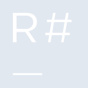
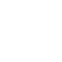

# resharper

[← Back to main README](../../README.md)

<table><tr>
  <td></td>
  <td></td>
  <td></td>
</tr></table>

## 16 px

### black
```
https://georgegach.github.io/compatible-icons/simple-icons/compat/resharper/16/black.png
```

### slate
```
https://georgegach.github.io/compatible-icons/simple-icons/compat/resharper/16/slate.png
```

### white
```
https://georgegach.github.io/compatible-icons/simple-icons/compat/resharper/16/white.png
```

## 64 px

### black
```
https://georgegach.github.io/compatible-icons/simple-icons/compat/resharper/64/black.png
```

### slate
```
https://georgegach.github.io/compatible-icons/simple-icons/compat/resharper/64/slate.png
```

### white
```
https://georgegach.github.io/compatible-icons/simple-icons/compat/resharper/64/white.png
```

## 128 px

### black
```
https://georgegach.github.io/compatible-icons/simple-icons/compat/resharper/128/black.png
```

### slate
```
https://georgegach.github.io/compatible-icons/simple-icons/compat/resharper/128/slate.png
```

### white
```
https://georgegach.github.io/compatible-icons/simple-icons/compat/resharper/128/white.png
```

## 512 px

### black
```
https://georgegach.github.io/compatible-icons/simple-icons/compat/resharper/512/black.png
```

### slate
```
https://georgegach.github.io/compatible-icons/simple-icons/compat/resharper/512/slate.png
```

### white
```
https://georgegach.github.io/compatible-icons/simple-icons/compat/resharper/512/white.png
```

## 1024 px

### black
```
https://georgegach.github.io/compatible-icons/simple-icons/compat/resharper/1024/black.png
```

### slate
```
https://georgegach.github.io/compatible-icons/simple-icons/compat/resharper/1024/slate.png
```

### white
```
https://georgegach.github.io/compatible-icons/simple-icons/compat/resharper/1024/white.png
```

## 16 px in base64

### black
```
data:image/png;base64,iVBORw0KGgoAAAANSUhEUgAAABAAAAAQCAYAAAAf8/9hAAAABmJLR0QA/wD/AP+gvaeTAAAA2ElEQVQ4jd3SvUpDQRAF4O9K0hnsgkUqX8DCJtj5FIqvYBUIFlbpbE3jU6TOG4iKWAmCnWhA/KlsJBJdi8yFyxILuUXAgWFnOXvOzl+BpIat1CFDoxIP8WSeURu76AR2jfXAHrBdFUnhe3gNkRv08I0J9jHCKfp4KXl5CQmtiL/iXMUmdrCBAzQXlQDHeA/SIT7xgVn4LbawVhLyDI4wwFv8MsN53C9xhnvZ5MoenESDEq7MGzcNwh2eMa68T0hFrvZXq70H/0CgugcXeMzwDroofhNY/hR+AD5DN9HjAwtMAAAAAElFTkSuQmCC
```

### slate
```
data:image/png;base64,iVBORw0KGgoAAAANSUhEUgAAABAAAAAQCAYAAAAf8/9hAAAABmJLR0QA/wD/AP+gvaeTAAABAUlEQVQ4jd2SIUtEARCEv1nftRMtiuEsgklBUMNh8y9Y/BEWk+GSzeSB+JvEM1iNIqeoyAtiOdD3dgwinDxNFw7ctLDs7MzsaPj8aiaomGQZoPhuhM7SfgpwDYszwb5NBwBzjbxkY8RQaKcBYBiEOE+oApeO6JOc2vnYKqJfJ3uYlzS3IVYNC00JkoVnQdjU2IDaH+kNkl2ClRAHFq0GAwA7T4TeCLVJH4HegZHrusqISvYNaIv0HNIvJlo9m2NM+XUlq0CXESplX0m6wNwhucFA0LU8Ai07fQg8mFiXclPWWgbzQgXy9g/VU8/BPwAYz8FA4n58mKYj6AL6C2D6X/gEK0R1Ac2FVnIAAAAASUVORK5CYII=
```

### white
```
data:image/png;base64,iVBORw0KGgoAAAANSUhEUgAAABAAAAAQCAYAAAAf8/9hAAAABmJLR0QA/wD/AP+gvaeTAAAAz0lEQVQ4jd3SMUvCURQF8N8/dCtsURxsCZoMgnSINr+CSx/Cpamhqa0pQfpMkQ2tjSImCdLUIoTxHLqB/Ps3OQi95Z3Heefcc7k3SyklG5ydTcRQWsMDzJBQwwUawT2jHtwE50UGQ9xjiXf0cYe3wF3MMcIRqkUtJOwF/op7Fyfo4BA9lIsSwC0+QnSFTywi1RIvaKHyI8gnuMZNtFAO0WO8n/CAcST9leAsqh3gElMc4xRN7Mf/9nrFbOt78A8M8pv4muMbvqeT/WWw/SmsAKsVMc0dAiMXAAAAAElFTkSuQmCC
```

