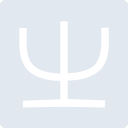
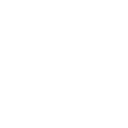

# rime

[← Back to main README](../../README.md)





## 16 px

### black
```
https://georgegach.github.io/compatible-icons/simple-icons/rime/16/black.png
```

### slate
```
https://georgegach.github.io/compatible-icons/simple-icons/rime/16/slate.png
```

### white
```
https://georgegach.github.io/compatible-icons/simple-icons/rime/16/white.png
```

## 64 px

### black
```
https://georgegach.github.io/compatible-icons/simple-icons/rime/64/black.png
```

### slate
```
https://georgegach.github.io/compatible-icons/simple-icons/rime/64/slate.png
```

### white
```
https://georgegach.github.io/compatible-icons/simple-icons/rime/64/white.png
```

## 128 px

### black
```
https://georgegach.github.io/compatible-icons/simple-icons/rime/128/black.png
```

### slate
```
https://georgegach.github.io/compatible-icons/simple-icons/rime/128/slate.png
```

### white
```
https://georgegach.github.io/compatible-icons/simple-icons/rime/128/white.png
```

## 512 px

### black
```
https://georgegach.github.io/compatible-icons/simple-icons/rime/512/black.png
```

### slate
```
https://georgegach.github.io/compatible-icons/simple-icons/rime/512/slate.png
```

### white
```
https://georgegach.github.io/compatible-icons/simple-icons/rime/512/white.png
```

## 1024 px

### black
```
https://georgegach.github.io/compatible-icons/simple-icons/rime/1024/black.png
```

### slate
```
https://georgegach.github.io/compatible-icons/simple-icons/rime/1024/slate.png
```

### white
```
https://georgegach.github.io/compatible-icons/simple-icons/rime/1024/white.png
```

## 16 px in base64

### black
```
data:image/png;base64,iVBORw0KGgoAAAANSUhEUgAAABAAAAAQCAYAAAAf8/9hAAAABmJLR0QA/wD/AP+gvaeTAAABA0lEQVQ4jaXTTyuEURTH8c8zEbFQGmIhtrKWlL234BV4A94ML2CKnZQXwNZKFiIW/kQMJSXpeRiL55pujzvTDL86nVv3nO8999xz4RI5Wn1ajossLAb8TUUWaJ3UDH6iU0AtWh/hobK/HyzWDQ5TgB2cdqnmR+fYSwEG8dUD4DPOiwEzeOwBcIu5FGAZW3jukvyETaykALPKbm/gTNnQQvnMdzjBOhZCtW3Fw3EfqpjHCCYxhlEsYjuA2zmpOWgp3z9HQ9ncNQxhvHqn1ARm4WSRn07E/QI0cYA3vOADu6GiY9QxHPwqpqqAIvh6MFhSNvo1insXXfvfn6mG6+j0vpJx9Q2Re0padpPH3wAAAABJRU5ErkJggg==
```

### slate
```
data:image/png;base64,iVBORw0KGgoAAAANSUhEUgAAABAAAAAQCAYAAAAf8/9hAAAABmJLR0QA/wD/AP+gvaeTAAABaElEQVQ4jZ2TQU6TURRGz3fbgkacmNLgAHEMCyAmTByxBVfgBtiIQ1kAA2eGhAXo1JFxYDRh0EKEUkwaDBDa/7+fg8qPtpWKN3nJe4Nz3ndv3lPnqL+v4IlNnTuUpCIz2/E/MIDtekgrMQPu/VrTJVCP35QfgO5Yzj2kvTHuAPP++nAjiNob4POs6JK+ErE7IbCzIUfOEtguRVZctZFZtvJklgB8WCZPJxPAs7LmbcH3W+hTHK9DbEwmECtR5GLaWzZfgK7tQvYQ9M32J6VfQq7JLFdc57jvmxQ6Dmm3LPVqjh/ti3i4oLnh1YPBoBj4/iryluG5oDVVUM0JepKHQjtCjTQvwPPAo/Gepj0iCVpYWGqN7H78t6FUAkEP+Z2Tc4t+WlcN6S22S/SxFm5myT1wE8UmeOkPgXEhhKSmoBmCzHLdEKE4cwoJEJeZaUmjiw+6/eH1f/AoyT+XoIhMdyQV3BWWCkP7J/+GrfOj9DmxAAAAAElFTkSuQmCC
```

### white
```
data:image/png;base64,iVBORw0KGgoAAAANSUhEUgAAABAAAAAQCAYAAAAf8/9hAAAABmJLR0QA/wD/AP+gvaeTAAABGklEQVQ4jaXTwUobURjF8V+CYmkXgmhoF23dStdShO77Cn0CX8CXMQ8gtLtS8AF060pciAUXtqKksSCFIpLo6WJuyhgmwbQHLt+F+c7/fnPmTivJKV5hzmwa4qyVZPAP5r+QVpJMaeiXujKpoV3bH6A39ny3rLq+Y78J8AnHU6YZ6Su+NAHmcf8IwF3dVwe8xI9HAM6x2gTYQBc/p5ivsI13TYDXqrS3cKIKdIgBLnCETbwp01bKQ10m6SZZS/I0SSfJYpJnSdaTfEzSqxua7kFU33+AHVW4H7CApfF3arqBLXTKflRfTAqlDuhjD79xjVt8LhMdYhlPSn2P5+OAYanLZcFbVdC/an03BVqN+78/UxvfaqfPZMbZH2Y5fFWU+9qXAAAAAElFTkSuQmCC
```

