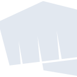
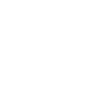

# riotgames

[← Back to main README](../../README.md)

<table><tr>
  <td></td>
  <td></td>
  <td></td>
</tr></table>

## 16 px

### black
```
https://georgegach.github.io/compatible-icons/simple-icons/compat/riotgames/16/black.png
```

### slate
```
https://georgegach.github.io/compatible-icons/simple-icons/compat/riotgames/16/slate.png
```

### white
```
https://georgegach.github.io/compatible-icons/simple-icons/compat/riotgames/16/white.png
```

## 64 px

### black
```
https://georgegach.github.io/compatible-icons/simple-icons/compat/riotgames/64/black.png
```

### slate
```
https://georgegach.github.io/compatible-icons/simple-icons/compat/riotgames/64/slate.png
```

### white
```
https://georgegach.github.io/compatible-icons/simple-icons/compat/riotgames/64/white.png
```

## 128 px

### black
```
https://georgegach.github.io/compatible-icons/simple-icons/compat/riotgames/128/black.png
```

### slate
```
https://georgegach.github.io/compatible-icons/simple-icons/compat/riotgames/128/slate.png
```

### white
```
https://georgegach.github.io/compatible-icons/simple-icons/compat/riotgames/128/white.png
```

## 512 px

### black
```
https://georgegach.github.io/compatible-icons/simple-icons/compat/riotgames/512/black.png
```

### slate
```
https://georgegach.github.io/compatible-icons/simple-icons/compat/riotgames/512/slate.png
```

### white
```
https://georgegach.github.io/compatible-icons/simple-icons/compat/riotgames/512/white.png
```

## 1024 px

### black
```
https://georgegach.github.io/compatible-icons/simple-icons/compat/riotgames/1024/black.png
```

### slate
```
https://georgegach.github.io/compatible-icons/simple-icons/compat/riotgames/1024/slate.png
```

### white
```
https://georgegach.github.io/compatible-icons/simple-icons/compat/riotgames/1024/white.png
```

## 16 px in base64

### black
```
data:image/png;base64,iVBORw0KGgoAAAANSUhEUgAAABAAAAAQCAYAAAAf8/9hAAAABmJLR0QA/wD/AP+gvaeTAAABHUlEQVQ4jZ3Tu0oDQRjF8Z+JQcQYtLXRzkLQJ7C0FnwLO1/E2ndIK6Sw1EoQGwsLFUTxFm+J16gJsdhZGQYTgwe+4tvZ8//OzOwW9dcMNrCKCu7x+IcHzGMTZ+iG6uAWJ9jBGuZS4xJ2UY+MvaqDByhgBfsh4l/GtBzh+R/GLroFjKM8yMGgkU/NVQjTeynfUq6ffceA46iv4yOBxNfWwFsKqOIr9O1kQhOvUV/ESwqoye5XALUSQwwY/i3BDZ4iw2cCeE8A5ykADqIX4oglXEZ9WXZmTVzgqhgW2lgOgD1M4U52A1VMyL7QfRyGtWu0hgKggvVArwXjaUgzje2QthRSjOWRckA/FbEVUo1hFJPh+UCAWCOYlf2ti1j4BnOxaep0+LOyAAAAAElFTkSuQmCC
```

### slate
```
data:image/png;base64,iVBORw0KGgoAAAANSUhEUgAAABAAAAAQCAYAAAAf8/9hAAAABmJLR0QA/wD/AP+gvaeTAAABkklEQVQ4jZWQzWpTQQCFvzOTYKS3RYWmRdD6s3DXPoFLl4IP5FJx5XOIguCqgu76Ci4T7U8wMUqSmxp/anPnuDBN7gWJ9SyHc775ZsSS7PdGN6LCE+H1wulVCOH19Y1L78sd/W3Y6Q+3cXxsvANcmx0niSFwnJK7KLzE07cVwGE/vyfzCHMTsb7MDpxsjWU7HPbyB5IegrckXVk+rEZHn/IWsAlk/zM8S7BZPe/YkBu7ApD4umQzAM0HMoUIwwoA054XpM+Yk+q1HpXaOfb3CiDG8AJxOlOcIi1uEGPEt1I/GiYVwInDLtaXP4o+Bf8sKUdbZUBNgarBrY2sLzgGsIg2v+b2IhL8YyGkGqZT/QMAp3dnBYWSoqmT3F18R8oQbWAMfDTq1WaYZyTdt5w5sa/AbcEk2QpBe040BR1LY5IOFPzcsEpKmwJoDQZrjaL+lII2mu4a3AjTg2azOfnQHW3Vg/ZsB6Q6IsOsLJ71j9iOR/38DdZV4RWFcNH2ZSCeC1BOq+ULjbXRnVTEbUJxV8Sd353tuggQELvTAAAAAElFTkSuQmCC
```

### white
```
data:image/png;base64,iVBORw0KGgoAAAANSUhEUgAAABAAAAAQCAYAAAAf8/9hAAAABmJLR0QA/wD/AP+gvaeTAAABNklEQVQ4jZXTsU6UQRTF8d8sawxhNbExxMRoQmEHT2BJScNz+BqWPgfRxJYCrehsbKxMTCQxYMCAroIiiMfim00+RlnwdHfmnv+c3JlhipLcT7KW5GWSR0kW2p5ygXERj7GEu3X5Nw7wFTt4jhetcTnJqyR7uVxnSQ4kGSRZTfI6yf4VjOc0xFvMYzRtHhdpgBv/Yf6CtIBvUwz7jeFMN8hzgHe9eg8/G8jnJsH3FvAMp7X+1ZwwxlGvnsFhC1jHp1qf4rgx9AHDvxKUUnZ1j2NiOGkAPxrAhzYBvOk19CNe0726iUa6mY2xjY/DurGGldrwHgsVVLCJ2/XkMbbwVHf98wWS3MSTSl/XXd1WKeUwyb0KGdREI8xNIv3zM/WVZAYbuFONs7ilm8/lgAZ2HQ+wiIdY+gN35MpHO3S3wQAAAABJRU5ErkJggg==
```

