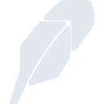
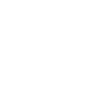

# robinhood

[← Back to main README](../../README.md)

<table><tr>
  <td></td>
  <td></td>
  <td></td>
</tr></table>

## 16 px

### black
```
https://georgegach.github.io/compatible-icons/simple-icons/compat/robinhood/16/black.png
```

### slate
```
https://georgegach.github.io/compatible-icons/simple-icons/compat/robinhood/16/slate.png
```

### white
```
https://georgegach.github.io/compatible-icons/simple-icons/compat/robinhood/16/white.png
```

## 64 px

### black
```
https://georgegach.github.io/compatible-icons/simple-icons/compat/robinhood/64/black.png
```

### slate
```
https://georgegach.github.io/compatible-icons/simple-icons/compat/robinhood/64/slate.png
```

### white
```
https://georgegach.github.io/compatible-icons/simple-icons/compat/robinhood/64/white.png
```

## 128 px

### black
```
https://georgegach.github.io/compatible-icons/simple-icons/compat/robinhood/128/black.png
```

### slate
```
https://georgegach.github.io/compatible-icons/simple-icons/compat/robinhood/128/slate.png
```

### white
```
https://georgegach.github.io/compatible-icons/simple-icons/compat/robinhood/128/white.png
```

## 512 px

### black
```
https://georgegach.github.io/compatible-icons/simple-icons/compat/robinhood/512/black.png
```

### slate
```
https://georgegach.github.io/compatible-icons/simple-icons/compat/robinhood/512/slate.png
```

### white
```
https://georgegach.github.io/compatible-icons/simple-icons/compat/robinhood/512/white.png
```

## 1024 px

### black
```
https://georgegach.github.io/compatible-icons/simple-icons/compat/robinhood/1024/black.png
```

### slate
```
https://georgegach.github.io/compatible-icons/simple-icons/compat/robinhood/1024/slate.png
```

### white
```
https://georgegach.github.io/compatible-icons/simple-icons/compat/robinhood/1024/white.png
```

## 16 px in base64

### black
```
data:image/png;base64,iVBORw0KGgoAAAANSUhEUgAAABAAAAAQCAYAAAAf8/9hAAAABmJLR0QA/wD/AP+gvaeTAAABD0lEQVQ4jZXSzypEYRjH8c8gRhasZDaThRuwdAXuQpaWkjW3oixdASkb2ZANCY1GZoTNREKjYSzOc3Q6OjPjV2/v6Tnv9/09f176ax41tNDBG+qYGYC1gAa6ufWNdRjpAVexj3a4lzAVewkVGCqAZ7GNV3xFbAkPmTPPRc4TuMik+44THKMZsfsw+aMS9iTN6ob7uaRpjbighZUi981IO3Wv4zK+b/CCnSIYrjLwI46ihG7820U5C+SnMBx7JxznMJ6JLeYdi6bQxHQsksez1Sv1VDVJnaeZ1Ls462H2qyqeJLXeBtjGneQ599UGPnAoGdUBljE5CCzSvMYYRgeFUlXwidX/gqnWJJ0u9zuY1w+sL0/6bsS33wAAAABJRU5ErkJggg==
```

### slate
```
data:image/png;base64,iVBORw0KGgoAAAANSUhEUgAAABAAAAAQCAYAAAAf8/9hAAAABmJLR0QA/wD/AP+gvaeTAAABuklEQVQ4jY2SMU9TURiGn/fcqiDQppgUm8YCUTSGMDgSf4C/QaPEzX/g6OLszmji6GDirImjiYODiZvSEGwvkLQEQoDb3vM6tCqFAn7b+c55nrzfOUdcUL+2Ovd6OW+FpiUVwUfR3orJpeX5ymQazoM3NneXo/Ve0k1E2TgxXJU0mzg+BjhT0Gy267nzD45MYNrIHcCDbYGrZwrWWp25nvQGtAfkAHayAm5BXxNhZ2AarjRNJ44Y+yK42+/4AIXvMjaxCqqBm7m5P18tN4YS2FbG2DvBbQCJiMNP7GvR8Xo/vDqo8HK+Wm6cGmE93XkBXgaSvpB1QQGYk5QhTSn6Y31mavUPMyQQegSaHKw2BS3L9X489YQ+9w5LT44zhSFBILFBuBejfzjolmB8YO/dmCk9OHlnI18hmo2QhIqgMmjtR/n1qLOjBLsBOrZr/1pem62UXo0S/B2h2WzX86gpglPQNDAOysCbSWBFUjw3QTfRU4si9rZNEfgUgp51L8elWqX8dRQMxz7SerrzTejK4V5xKcvw4qKys6BTIzS296uO3TvBPF9Y0NH/gEOCEPOHmG73oLh6EXCyfgPqp7U4D8dHZQAAAABJRU5ErkJggg==
```

### white
```
data:image/png;base64,iVBORw0KGgoAAAANSUhEUgAAABAAAAAQCAYAAAAf8/9hAAAABmJLR0QA/wD/AP+gvaeTAAABNUlEQVQ4jZWTQSuEURSGn4sYiUSJzWQhOwtLv8C/mOxsJXsLf0RZWlgrCysbYjElNGOUkZEaNFE05rG56s74xnDq63yde57zvqfbhR6hLqolta421Ve1ok73YlGX1Ft/RkvdABj4Bc4DB8A7UAcCMB5zAGYA+rrAs8AO0AA+Y7kA3Cdtz92UR9TzxO6beqIeq9VYu4si7SuoAdgD5mOpBVwDk0nvE7AVQrjJUt9UG4l6Rb2I/2X1Rd3NtB4HXCZwTT2KKxjP9tVcynTeQn/MTaAMzAHD37UQwnKnaOYtAFVgKn4Ar8B2V+vJCqW452liXbWoZooNJHAeGAVqwES0/gE8AIUQQitrQDp1BRgDHmM+BFaBhRDC2V/sF9UrdUgd7Al0wDPqh7r2LzAZsB6faa53d3t8AXwOFcIsoRRXAAAAAElFTkSuQmCC
```

