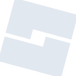

# robloxstudio

[← Back to main README](../../README.md)





## 16 px

### black
```
https://georgegach.github.io/compatible-icons/simple-icons/robloxstudio/16/black.png
```

### slate
```
https://georgegach.github.io/compatible-icons/simple-icons/robloxstudio/16/slate.png
```

### white
```
https://georgegach.github.io/compatible-icons/simple-icons/robloxstudio/16/white.png
```

## 64 px

### black
```
https://georgegach.github.io/compatible-icons/simple-icons/robloxstudio/64/black.png
```

### slate
```
https://georgegach.github.io/compatible-icons/simple-icons/robloxstudio/64/slate.png
```

### white
```
https://georgegach.github.io/compatible-icons/simple-icons/robloxstudio/64/white.png
```

## 128 px

### black
```
https://georgegach.github.io/compatible-icons/simple-icons/robloxstudio/128/black.png
```

### slate
```
https://georgegach.github.io/compatible-icons/simple-icons/robloxstudio/128/slate.png
```

### white
```
https://georgegach.github.io/compatible-icons/simple-icons/robloxstudio/128/white.png
```

## 512 px

### black
```
https://georgegach.github.io/compatible-icons/simple-icons/robloxstudio/512/black.png
```

### slate
```
https://georgegach.github.io/compatible-icons/simple-icons/robloxstudio/512/slate.png
```

### white
```
https://georgegach.github.io/compatible-icons/simple-icons/robloxstudio/512/white.png
```

## 1024 px

### black
```
https://georgegach.github.io/compatible-icons/simple-icons/robloxstudio/1024/black.png
```

### slate
```
https://georgegach.github.io/compatible-icons/simple-icons/robloxstudio/1024/slate.png
```

### white
```
https://georgegach.github.io/compatible-icons/simple-icons/robloxstudio/1024/white.png
```

## 16 px in base64

### black
```
data:image/png;base64,iVBORw0KGgoAAAANSUhEUgAAABAAAAAQCAYAAAAf8/9hAAAABmJLR0QA/wD/AP+gvaeTAAABLElEQVQ4jZXTSyuFURQG4OfgIEpCysDEkBkDpfgNQvkDhsrA3MDAT6DMZGLgNjcRUgYUSUQopdzvHbkP9ndyfA6Ot1bt1uXde613bT5Rg3McYxOjaENSjujBE94z7AYHWMMQmpD4iWAuVpzNLrCLRfShNl2cwF4OBJn2jLO8iKAeZbn2GqEAqTRBB6piCQ94/IPkKj86DKISRRnBQ/SiUGjxGaW+DnE6IcjUiBJ0owUVWEFnlFiDarSiSxheOdoTkXMW1zjCJJZwKuwETKEZl1jGBFKCvIZ9ne5rVLiNmejGnVjOLRbSfaz7Xa4U7mO+NwykCY7+IMhmJ2iAPBTjxf9why3Ix5jweZIRYTa54ljF+E/BOvRjHvu48n2Fe3J9alKQeQQbwrzOhL0AHx7Ndf/5AfnrAAAAAElFTkSuQmCC
```

### slate
```
data:image/png;base64,iVBORw0KGgoAAAANSUhEUgAAABAAAAAQCAYAAAAf8/9hAAAABmJLR0QA/wD/AP+gvaeTAAAB20lEQVQ4jY2TTUvUYRTFf+c6A1KRo5Q6C6coKChoEUGS1KYWbYLeIAhaBG38Fm36BuEiWtYuQ2gT1LKMQCQIihDCkpgZhZlJE8vx/5wWkzZNOXS2595zzr33ecQvzC+tFiNrvgWt29SQp5X8YLFYeHVCarINtCVQadwKMYHJt7HLoJqT6xJPnZgsFftmJfkvgc+VxjPg3HZOAJgaoma7gniUy9JjAdjWQuXrHOJgV4H26GID04iWe+0IYvf/NrdMyYHWopUsLgv2dDisIn3vPpHrARDS2WR/+4NM+hLyDfCUzQdQGUjtNcm81IydH6ouH5fTjiRdA06BB5Bel4YKV6B14lxaH7TitLN01WhEokBKF3OD5fqoI6YSasheUE/cE36R1FzcdIrUvJvMSewa0nTYtyHWqsX+Wc2XGxMhxtuTgaq2lyW/j9DDlOkO8qGt/dgriXizr9h3JhdirGM3AS5KFEGHk3Ve4cz+XWBpF0rPAXKIAcz2sHs7aaElp2yydQDTK7HRReIfml4pDQ+8A4gf9BxNWboJfgLMIVWgayYQHzf/gzq5T9XGAROXwumCTQnRLyhs9bae8PjIcOH+PwXaMWPnB8v1USuuA2MK+mV6s578sf17d5YBfgIk59piRT/rowAAAABJRU5ErkJggg==
```

### white
```
data:image/png;base64,iVBORw0KGgoAAAANSUhEUgAAABAAAAAQCAYAAAAf8/9hAAAABmJLR0QA/wD/AP+gvaeTAAABYklEQVQ4jZWSsUqcURCFv5EIEkhQEcUiTdKECBZaKAnaKNZiJIGAnW+Q3tJHsPAJLNzE3kYkEdIIAREXQQtRQxKym2hYiaufxX9/WH8W1xy4xZ175szMPQMJar/6Uz1Rd9RldVxt5z5Q59V/3sZv9VDdVhfVYTUa86JBYB2YbFHnVzrfgFXgQ6TkAPaBZ/dqN0MdqLalywvg8X8kAzwAarnADNBTIPwFLlqIVHKBCeC88HgMzAFrQBk4Ba4LnM+RbBoCHgJvgZdAN/AlIl5DZjHQC4wBs8AToBOYDnUsVakCR2S/+wn4HhEnSaAEjJA5sAWsADVgG3Wp4P1VWqY99aM6q5YLnD/qJkn9q3ejpp4XYtfqQm5Fd4uf7mgS+wGUANoSod5CpIgzYDfvYACYAt4Az4FHQB8Na94EBxFh0xf1qfpe3VAP1Eph/kt1PuffVYW0I6PAO+AV0EU28mBEnALcALQwGx9uI01mAAAAAElFTkSuQmCC
```

