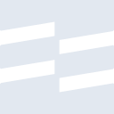
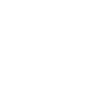

# rootsbedrock

[← Back to main README](../../README.md)





## 16 px

### black
```
https://georgegach.github.io/compatible-icons/simple-icons/rootsbedrock/16/black.png
```

### slate
```
https://georgegach.github.io/compatible-icons/simple-icons/rootsbedrock/16/slate.png
```

### white
```
https://georgegach.github.io/compatible-icons/simple-icons/rootsbedrock/16/white.png
```

## 64 px

### black
```
https://georgegach.github.io/compatible-icons/simple-icons/rootsbedrock/64/black.png
```

### slate
```
https://georgegach.github.io/compatible-icons/simple-icons/rootsbedrock/64/slate.png
```

### white
```
https://georgegach.github.io/compatible-icons/simple-icons/rootsbedrock/64/white.png
```

## 128 px

### black
```
https://georgegach.github.io/compatible-icons/simple-icons/rootsbedrock/128/black.png
```

### slate
```
https://georgegach.github.io/compatible-icons/simple-icons/rootsbedrock/128/slate.png
```

### white
```
https://georgegach.github.io/compatible-icons/simple-icons/rootsbedrock/128/white.png
```

## 512 px

### black
```
https://georgegach.github.io/compatible-icons/simple-icons/rootsbedrock/512/black.png
```

### slate
```
https://georgegach.github.io/compatible-icons/simple-icons/rootsbedrock/512/slate.png
```

### white
```
https://georgegach.github.io/compatible-icons/simple-icons/rootsbedrock/512/white.png
```

## 1024 px

### black
```
https://georgegach.github.io/compatible-icons/simple-icons/rootsbedrock/1024/black.png
```

### slate
```
https://georgegach.github.io/compatible-icons/simple-icons/rootsbedrock/1024/slate.png
```

### white
```
https://georgegach.github.io/compatible-icons/simple-icons/rootsbedrock/1024/white.png
```

## 16 px in base64

### black
```
data:image/png;base64,iVBORw0KGgoAAAANSUhEUgAAABAAAAAQCAYAAAAf8/9hAAAABmJLR0QA/wD/AP+gvaeTAAABA0lEQVQ4jaXTzSqEYRQH8N+jVybJR6EUysZClmwoN2BlMa7BBbgYl6Ao96DYsJSFjUKZWPhoMMxbLOaZenuM1zTzbM7inPP/Oj0BTWR6e3nAd4/LYKCkV0ftP4AMb3hGA6+4wSnOsIi9kv1mhk1c4rHDwGSi6AWfsd7hOBQGprGMVaxjDjO4xlFUdJESBZxjAhWMYiRRsY2DP4hWurnCPoajorGUqAjwrhXoh1aYt9F3tQw9w2G00fb4UOhXOwDUI0EDT8HvN1XwuIUF3EdFJylRwC42MBs9DsXaDjMNsUi0FPCFwRKbO7iKitYwrxViBePdXKEW1aTn1bbQ92fK+9jPfwC3dj3MiEFJbQAAAABJRU5ErkJggg==
```

### slate
```
data:image/png;base64,iVBORw0KGgoAAAANSUhEUgAAABAAAAAQCAYAAAAf8/9hAAAABmJLR0QA/wD/AP+gvaeTAAABhElEQVQ4jZ2Tz2pTURjEf3PuEUtJ/whaesEqgriQLs1GwRdw5aLSR+gD+DA+gqDgOwi6SZfFhQjSRLi3ujBJU23tvWe6aI3XNCHQWZ6P+eabGY565eDUOHIFCFXhqmQA4xguP44xQpTzlkShI+S+rWPbQ0ld2R+FO7X0QPBqJls6jTg9i46f8nzpx+R8v+jfRI2LYGBzEtDApG8ovB+Pv5SHa5F6M3Nom/qJpQ0gD/AV8064kxH3JoW0X/R3gRuSF4SWDa3/MjEv7uarb6YJEdIjdcu+mQIDAkLQ61SnRRE2El6ZFGpW+EtwZPu3YSjUU2CUkrctAb6IQ82miBJvSWG3VupUZHv386XvjRC3JLbUIAhGxkNbx8DP5gyAoji8VVNtGrURzxPcAwrZPZF9GAutnwupezB8SaqfinD73CPXgRUuPE6G2BSqqB6qezD4g31tWpAAFjtZ8mejtqXHtu9IWpa8gLU6s4WG6RLTAlp/m2li/kcy6/92XUYQquYumXmcqjMLaL1X5vn76QAAAABJRU5ErkJggg==
```

### white
```
data:image/png;base64,iVBORw0KGgoAAAANSUhEUgAAABAAAAAQCAYAAAAf8/9hAAAABmJLR0QA/wD/AP+gvaeTAAABD0lEQVQ4jaXTyyrFURQG8N/WEUkuhVIoEwMZMqG8gJEBeQQP4GE8gqK8g2LCUAYmCkUMXHI5nFPL4Gz1t8sh9mQN1v72d2uniGig5m+nmSIi/ggGHW12T7j+6YEannGPOh5xjgMcYgqbbfCNGpZwklK6LbcRMVQoesBbnpfYS5XLI5jBHBYwjlGcYTcrOi6JUkQcYRDd6ENvIWQ1pbT9DdHsb1rYQk9W1F8SVft/0Qr0VSvMi+x7rd3rNezgqOLxpiJ3BSsF5ikT1HGXiqWIGK54XMYkrrKi/ZIoRcQGFjGWPXbl+RnmlxALoukUEe/obGNzHadZ0TwmtELsxsBvWrjOasp6fVr492dq/gPf/ACyW2a7nhDZfgAAAABJRU5ErkJggg==
```

