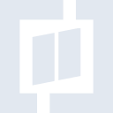
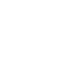

# rtlzwei

[← Back to main README](../../README.md)

<table><tr>
  <td></td>
  <td></td>
  <td></td>
</tr></table>

## 16 px

### black
```
https://georgegach.github.io/compatible-icons/simple-icons/compat/rtlzwei/16/black.png
```

### slate
```
https://georgegach.github.io/compatible-icons/simple-icons/compat/rtlzwei/16/slate.png
```

### white
```
https://georgegach.github.io/compatible-icons/simple-icons/compat/rtlzwei/16/white.png
```

## 64 px

### black
```
https://georgegach.github.io/compatible-icons/simple-icons/compat/rtlzwei/64/black.png
```

### slate
```
https://georgegach.github.io/compatible-icons/simple-icons/compat/rtlzwei/64/slate.png
```

### white
```
https://georgegach.github.io/compatible-icons/simple-icons/compat/rtlzwei/64/white.png
```

## 128 px

### black
```
https://georgegach.github.io/compatible-icons/simple-icons/compat/rtlzwei/128/black.png
```

### slate
```
https://georgegach.github.io/compatible-icons/simple-icons/compat/rtlzwei/128/slate.png
```

### white
```
https://georgegach.github.io/compatible-icons/simple-icons/compat/rtlzwei/128/white.png
```

## 512 px

### black
```
https://georgegach.github.io/compatible-icons/simple-icons/compat/rtlzwei/512/black.png
```

### slate
```
https://georgegach.github.io/compatible-icons/simple-icons/compat/rtlzwei/512/slate.png
```

### white
```
https://georgegach.github.io/compatible-icons/simple-icons/compat/rtlzwei/512/white.png
```

## 1024 px

### black
```
https://georgegach.github.io/compatible-icons/simple-icons/compat/rtlzwei/1024/black.png
```

### slate
```
https://georgegach.github.io/compatible-icons/simple-icons/compat/rtlzwei/1024/slate.png
```

### white
```
https://georgegach.github.io/compatible-icons/simple-icons/compat/rtlzwei/1024/white.png
```

## 16 px in base64

### black
```
data:image/png;base64,iVBORw0KGgoAAAANSUhEUgAAABAAAAAQCAYAAAAf8/9hAAAABmJLR0QA/wD/AP+gvaeTAAAA1ElEQVQ4jcXSPWpCQRQF4E8xKQQbQbBIkz3EDWQXFm4gXbaRjWQlacTGHQRiosRSQUgUUziTNzzm/XQeOMwwd+bce+ceODdw7YJHHMrxrmYckv2pHOwl+y02GYGfsO7wgV+MMYoXYjnLFtXEhEstWrjHBM+YY4WnuhYipngJsVU4e6i6n6vgLnCsaK8SbaZQi+sL5D4xRSdwg6PiU2sFjvjEF17xhm+8V2UpG6mpKhIjdRRjila+wQyLwNuMwL+V02yjwD0G4Wzo4shK5KaQivbrHsMfTyE3nSx+p3kAAAAASUVORK5CYII=
```

### slate
```
data:image/png;base64,iVBORw0KGgoAAAANSUhEUgAAABAAAAAQCAYAAAAf8/9hAAAABmJLR0QA/wD/AP+gvaeTAAABIUlEQVQ4jcWSP0oDURjEf/OIIoKYiCF/iIFcQBtLK2+RwgulEfQQnsAj2KXRE4Q16mJAFxUETXZsFjdmNZvO6R7f++bNvBlFcWKWQYq7je3WKE6OA7oEb8yPw9JlAPs9P6SzxXElf4kJdlzc5wMgWK+GW8mfSE1MHUC5Bd90m7WD5WJckTSN4udr0P5PBQsYxUkvWLsoPQL1Ee3x5GUAnP1uIUMUP/WxBkAFMQYBHGIwaeF+4ROl0EHqAE2wBUtTKk+hBP9P8GcKGWQji1j2NASNSwlsT5HuMPfgCxGuZk4fe63aaCUFe43quaTTVS3kTcyqbGtN5qTbrg6jh2SIvF7cyqucKzB1UF2Bt5B6KyPdAfUKBHPNKKZgfZPabJZZ+AKb+3F/h3ou0gAAAABJRU5ErkJggg==
```

### white
```
data:image/png;base64,iVBORw0KGgoAAAANSUhEUgAAABAAAAAQCAYAAAAf8/9hAAAABmJLR0QA/wD/AP+gvaeTAAAA40lEQVQ4jcWSMW4CMRBFn9GGAokGaaUtaLhDuEBuQZEL0HGNXIST0ETbcAMkCEFQJtJKYaNPMybWxth0fGnk0Yz9Z8bzUR6fAJJeJDXdZI88msD/7SaLwD8BhwjBj51fwBY4AxVQYq15rHOtSCrsXGdHkDSRNJW0kPQuaQfMUyP4hzPgzXI7Cz/fuh/rYGxWATK7iXu2kMTjCf59SgfO7AC0/H1qkqAFPoA9sARWwNE5t4mW6ArJiyWFUEhOkl+Tl/IT8OqcqyXVQD/CcZVyWK00+waGFhsBk1Q3sS2EpIPMNFwA4kamNBT3GuYAAAAASUVORK5CYII=
```

