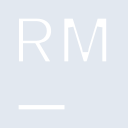
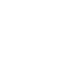

# rubymine

[← Back to main README](../../README.md)

<table><tr>
  <td></td>
  <td></td>
  <td></td>
</tr></table>

## 16 px

### black
```
https://georgegach.github.io/compatible-icons/simple-icons/compat/rubymine/16/black.png
```

### slate
```
https://georgegach.github.io/compatible-icons/simple-icons/compat/rubymine/16/slate.png
```

### white
```
https://georgegach.github.io/compatible-icons/simple-icons/compat/rubymine/16/white.png
```

## 64 px

### black
```
https://georgegach.github.io/compatible-icons/simple-icons/compat/rubymine/64/black.png
```

### slate
```
https://georgegach.github.io/compatible-icons/simple-icons/compat/rubymine/64/slate.png
```

### white
```
https://georgegach.github.io/compatible-icons/simple-icons/compat/rubymine/64/white.png
```

## 128 px

### black
```
https://georgegach.github.io/compatible-icons/simple-icons/compat/rubymine/128/black.png
```

### slate
```
https://georgegach.github.io/compatible-icons/simple-icons/compat/rubymine/128/slate.png
```

### white
```
https://georgegach.github.io/compatible-icons/simple-icons/compat/rubymine/128/white.png
```

## 512 px

### black
```
https://georgegach.github.io/compatible-icons/simple-icons/compat/rubymine/512/black.png
```

### slate
```
https://georgegach.github.io/compatible-icons/simple-icons/compat/rubymine/512/slate.png
```

### white
```
https://georgegach.github.io/compatible-icons/simple-icons/compat/rubymine/512/white.png
```

## 1024 px

### black
```
https://georgegach.github.io/compatible-icons/simple-icons/compat/rubymine/1024/black.png
```

### slate
```
https://georgegach.github.io/compatible-icons/simple-icons/compat/rubymine/1024/slate.png
```

### white
```
https://georgegach.github.io/compatible-icons/simple-icons/compat/rubymine/1024/white.png
```

## 16 px in base64

### black
```
data:image/png;base64,iVBORw0KGgoAAAANSUhEUgAAABAAAAAQCAYAAAAf8/9hAAAABmJLR0QA/wD/AP+gvaeTAAAA0ElEQVQ4jc3SPUoDURQF4G9kEgTz01oEC4lgkSK9tRuwDem1cikWbsFOF5DGzg2EdBILQVDBZkLSjSZFbmAImTQp4oMDj/tz7j3nvQRzO5yDXZrXCR7wiCcM8IMP9DGOmm9c43UTwTsucYUm3pAgj0aY4BhZmYQcnzG5bunPBSqYBnplEmYY4g6naBdyJ/gLVMsIjtDBLV7wu5a7j62yQlxauJ/HhBa6oTeNTWo4Q8PSl8NVU+I//YP9EBRN/CqpqQW2EszxjNGGmpttBPt/hQXT2yc5jixdmAAAAABJRU5ErkJggg==
```

### slate
```
data:image/png;base64,iVBORw0KGgoAAAANSUhEUgAAABAAAAAQCAYAAAAf8/9hAAAABmJLR0QA/wD/AP+gvaeTAAAA90lEQVQ4jc2SvS6EYRBGz3ktkVi0ClEIiUKhV7sBreipXIrCLei4AI3ODYhOKIjEbqKwQmffR7HJrr8vCgVTnzmTmWe87TyGX1T5TfMHQcihcqQcE04SHpA7dTvkakDZjeygl18EY6XcJGwkbCqzyjXBpP+KdAdUfSo4Z9JrWMFXyH2VO3AaCbhuHBeejc8hWw03yIvkHNkXFiFLo/VYCNRgTZhoEDgVWKW6Zzwj9EdQpkrxQDJdoPde0BpOSVbQCpnvp64VfSK0SFmKaaeyHJkpYHSSDNL3//zBnwmGR0Q73xKpbbD9kyBJPSVefAaK7gYaBX+fwhuckG5rBFgARwAAAABJRU5ErkJggg==
```

### white
```
data:image/png;base64,iVBORw0KGgoAAAANSUhEUgAAABAAAAAQCAYAAAAf8/9hAAAABmJLR0QA/wD/AP+gvaeTAAAA0ElEQVQ4jc3SsUrCURQG8N8/LIQ01wZxiISGhnbnXsA12m3yURx8Bbd6gJa2XkDaooZAsKBFyc28DR7hj/h3cbALH1zO+c53znfuzVJKyQ7nYJfidYEB7vGAR3xjhFu8BecLHbxuEvjANdqo4R0Z5lEIU5xiUmRhjnF0riKhhUP8BG6KLMwwRA9nOM/lGlgEjooEjnGJLp7xu5brx1STXFwpd7+IDnVchd9STFJBEyeWeymvirJ/9Q/2I5Bf4mcBpxLYKpDwhJcNnLttAvt/hT99SzAwQvm+1gAAAABJRU5ErkJggg==
```

