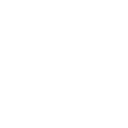

# rubyonrails

[← Back to main README](../../README.md)

<table><tr>
  <td></td>
  <td></td>
  <td></td>
</tr></table>

## 16 px

### black
```
https://georgegach.github.io/compatible-icons/simple-icons/compat/rubyonrails/16/black.png
```

### slate
```
https://georgegach.github.io/compatible-icons/simple-icons/compat/rubyonrails/16/slate.png
```

### white
```
https://georgegach.github.io/compatible-icons/simple-icons/compat/rubyonrails/16/white.png
```

## 64 px

### black
```
https://georgegach.github.io/compatible-icons/simple-icons/compat/rubyonrails/64/black.png
```

### slate
```
https://georgegach.github.io/compatible-icons/simple-icons/compat/rubyonrails/64/slate.png
```

### white
```
https://georgegach.github.io/compatible-icons/simple-icons/compat/rubyonrails/64/white.png
```

## 128 px

### black
```
https://georgegach.github.io/compatible-icons/simple-icons/compat/rubyonrails/128/black.png
```

### slate
```
https://georgegach.github.io/compatible-icons/simple-icons/compat/rubyonrails/128/slate.png
```

### white
```
https://georgegach.github.io/compatible-icons/simple-icons/compat/rubyonrails/128/white.png
```

## 512 px

### black
```
https://georgegach.github.io/compatible-icons/simple-icons/compat/rubyonrails/512/black.png
```

### slate
```
https://georgegach.github.io/compatible-icons/simple-icons/compat/rubyonrails/512/slate.png
```

### white
```
https://georgegach.github.io/compatible-icons/simple-icons/compat/rubyonrails/512/white.png
```

## 1024 px

### black
```
https://georgegach.github.io/compatible-icons/simple-icons/compat/rubyonrails/1024/black.png
```

### slate
```
https://georgegach.github.io/compatible-icons/simple-icons/compat/rubyonrails/1024/slate.png
```

### white
```
https://georgegach.github.io/compatible-icons/simple-icons/compat/rubyonrails/1024/white.png
```

## 16 px in base64

### black
```
data:image/png;base64,iVBORw0KGgoAAAANSUhEUgAAABAAAAAQCAYAAAAf8/9hAAAABmJLR0QA/wD/AP+gvaeTAAAA50lEQVQ4jc3RPS+DURjG8V9LQiokIjbxCRpbDQajzWI1sYrdR+gkEpNvIDH5FMRkYpAwiMRLvHTRlupj6HnkpE49xl7Jvdz3+V/nOudm2DWFGsqDDowkepPYwQU2cYQ5jOMAt7j+69Z5fOIOTWSh2njAOaopcDnAp2hFYG52iVe8oIN9jObwRBg28BXBTzjEIxawhzVs4D4880fH+IjgRoi9hVIi8RjqMI0VPEdwpvdZi3HMQWqGiFmitovgMk783nMHuzj7j8ENZvr6XawWwblBDe991cUs1osMSlhCJTG7wpveNoZY3yTgQuQHAS3uAAAAAElFTkSuQmCC
```

### slate
```
data:image/png;base64,iVBORw0KGgoAAAANSUhEUgAAABAAAAAQCAYAAAAf8/9hAAAABmJLR0QA/wD/AP+gvaeTAAABbklEQVQ4jc2RP2uTYRTFf+fJo4n/XjWlGLCtX8EluDmIi4OTo+Lg5CTUb9DJRRzt5Cy4uSouLoKDk1so2lLSkNiaVBAt73uPg5H2FWLd9MJdzj3ncO698F9Xb3u72NiadG2nWRz9DoxGo1PfyrycyavfU3k7WQ+BJynxIsL3XMXKhfNzL2ca9Ps7S1UjrWENDW1wa0rdMx4nsWXHraVO+33NYGP4+XIu/bFKjWdhX5RoTgmlpaHDu0p0AGMK8OriuTPLAhgMBif2OLZpnIRPgn7t/Al4hXRFVFej0h2TXyeVp5Ee2OzsJxhMniNfwxyZLreL1SJxf3G+eCzJtQP33DxaTFa0vj4+W7Xo5uApor1/Xm8q0o2FTvFOUjnrC1lN9XPEF6R2bWIt0OCSpLezxADJ9huk2p8FJdYjgj+KAVISH4C5g2CYIPn6YeKfCXAX/PVgSwrMPHDzMIMcatwVcbwOm6pyz60Y/02Kf1s/AJRSmruL1hKTAAAAAElFTkSuQmCC
```

### white
```
data:image/png;base64,iVBORw0KGgoAAAANSUhEUgAAABAAAAAQCAYAAAAf8/9hAAAABmJLR0QA/wD/AP+gvaeTAAAA+ElEQVQ4jc2QL0uDURxGzx0Dwb+IrO4TWGcwGERtVottVUx2qyaL1S/hB7CIoJhsC4aFaVB0c8VtbuwYvC++jhffmeaBy4V7Oc99fhf+Neq8WlELf5Hm1EO1pB74xZm6o16pm3kBZbWvPqodv+mpT+qdupwlrkX5Ru2mxCSsprbUpjpQT9ViiPIM8AAUgNm4A7wAF8A6sAFUgUtgATgCmukG5+pH6uV2rL2nhozGU+ox6qK6pb76k4a6ohbzPq2jPpvN/q9ynPU6NXPCADgBbscJqANLI+dDYDtPTgIqwPvIGgIlYDcvIKirwHTG3T3wFkJoj9NkcnwC6wz/jbnq4+UAAAAASUVORK5CYII=
```

