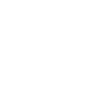

# sahibinden

[← Back to main README](../../README.md)




## 16 px

### black
```
https://georgegach.github.io/compatible-icons/simple-icons/sahibinden/16/black.png
```

### slate
```
https://georgegach.github.io/compatible-icons/simple-icons/sahibinden/16/slate.png
```

### white
```
https://georgegach.github.io/compatible-icons/simple-icons/sahibinden/16/white.png
```

## 64 px

### black
```
https://georgegach.github.io/compatible-icons/simple-icons/sahibinden/64/black.png
```

### slate
```
https://georgegach.github.io/compatible-icons/simple-icons/sahibinden/64/slate.png
```

### white
```
https://georgegach.github.io/compatible-icons/simple-icons/sahibinden/64/white.png
```

## 128 px

### black
```
https://georgegach.github.io/compatible-icons/simple-icons/sahibinden/128/black.png
```

### slate
```
https://georgegach.github.io/compatible-icons/simple-icons/sahibinden/128/slate.png
```

### white
```
https://georgegach.github.io/compatible-icons/simple-icons/sahibinden/128/white.png
```

## 512 px

### black
```
https://georgegach.github.io/compatible-icons/simple-icons/sahibinden/512/black.png
```

### slate
```
https://georgegach.github.io/compatible-icons/simple-icons/sahibinden/512/slate.png
```

### white
```
https://georgegach.github.io/compatible-icons/simple-icons/sahibinden/512/white.png
```

## 1024 px

### black
```
https://georgegach.github.io/compatible-icons/simple-icons/sahibinden/1024/black.png
```

### slate
```
https://georgegach.github.io/compatible-icons/simple-icons/sahibinden/1024/slate.png
```

### white
```
https://georgegach.github.io/compatible-icons/simple-icons/sahibinden/1024/white.png
```

## 16 px in base64

### black
```
data:image/png;base64,iVBORw0KGgoAAAANSUhEUgAAABAAAAAQCAYAAAAf8/9hAAAABmJLR0QA/wD/AP+gvaeTAAAA7UlEQVQ4jcXTMUsDQRAF4O/UYKeIjVgEREhhY2UrafwNVnaCjZ0/xdr/EWzVzsrOBFRUUtkFLELMpbgJ3K13KERwYGB39u3beY/ZDLkFYmmRy39CsNJQH+IJD1jFHnawVQfOk3xBB5s4xUmsD/Beg69spriIzh7xFbU+dnGVEqQSMoUvOcYYYR1t3AZmKvEubekV3QB1cYl7vNVgv0mY50dI6OEMG9jGXchqJBiFUcNSbRKvd0JK+SxP52CCcxyXHIcW1sKPim9ZCTSPAY6i1UMs4wafuMb+TwSi5WfFMI0Vg9SOrEQTwa/j/z/TDHe4V7lWgOjjAAAAAElFTkSuQmCC
```

### slate
```
data:image/png;base64,iVBORw0KGgoAAAANSUhEUgAAABAAAAAQCAYAAAAf8/9hAAAABmJLR0QA/wD/AP+gvaeTAAABQUlEQVQ4jcWTsUvWcRDGP899fyUKakOIIr7Q6uLaUhDhmLj1T9hfk4ujqw7OtYWRbUG0Ba9Umi6Kkoj4/r73NCSU+qqBQTced8/d5+FOX3cPzC0ibtP8TwSavlnpuzO7Qh8lBhKmBQ+A8Rs3MP4SoSellnk1fMjUm9LGM6w5xPb1AsI2LyfvD3dd8p0rS4pcziY3CO9jXl2PYEQqADt8CvqBNQp0QG8RCKf9e/AlhFJ4sbV78Ghq7N6M0vNCi4hP4BZ7/M9mAF1xB3uYPUKbrnWNXqxoqDeobFZtHoKir4DEke3DX5tp4oyrInYiytPotSdtlPfgib4ItlrEAlGeS2yBLQmIO9nLkRqMYp/z7TKC+NxWz97NrG6ax5mUVK5XNccDal/bmrnZA/MNvAl0JZ1anpbVMXQull5l4l/H/3+mn9oFm2WSIyvaAAAAAElFTkSuQmCC
```

### white
```
data:image/png;base64,iVBORw0KGgoAAAANSUhEUgAAABAAAAAQCAYAAAAf8/9hAAAABmJLR0QA/wD/AP+gvaeTAAAA/klEQVQ4jcXTvS7EQRjF4Wd9RDS0RLIJum20KpEIvcpN6FyK2g1Q6BRaCoVKh2TFR6gUQgSxexQ7xe7fCgmJt5nknd+cmXNmppYkflEDv1n8JwJDX/Rv0cQJRtDANCaqYK1PBpdYwT1W8Yo9zGAXUz10equdZCPJUJLTJK3SO0sym2SrwqdqoaaTS/CGR4yjjsPCtHVnV1VMcpVkMclAGTeTHCe57sOmXwaK/3tcFN/bGMUO5rtPUBV4wkMBJkuvhTss4QVHXXOf3sE71rGGm5IFDGOs5NGTWz8L51guOy9gEAd4xj7mvhOA6+K/qXMbDZ2bqFfBrwR+XP//mT4Al5m5v1CvvK4AAAAASUVORK5CYII=
```

