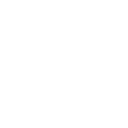

# saopaulometro

[← Back to main README](../../README.md)




## 16 px

### black
```
https://georgegach.github.io/compatible-icons/simple-icons/saopaulometro/16/black.png
```

### slate
```
https://georgegach.github.io/compatible-icons/simple-icons/saopaulometro/16/slate.png
```

### white
```
https://georgegach.github.io/compatible-icons/simple-icons/saopaulometro/16/white.png
```

## 64 px

### black
```
https://georgegach.github.io/compatible-icons/simple-icons/saopaulometro/64/black.png
```

### slate
```
https://georgegach.github.io/compatible-icons/simple-icons/saopaulometro/64/slate.png
```

### white
```
https://georgegach.github.io/compatible-icons/simple-icons/saopaulometro/64/white.png
```

## 128 px

### black
```
https://georgegach.github.io/compatible-icons/simple-icons/saopaulometro/128/black.png
```

### slate
```
https://georgegach.github.io/compatible-icons/simple-icons/saopaulometro/128/slate.png
```

### white
```
https://georgegach.github.io/compatible-icons/simple-icons/saopaulometro/128/white.png
```

## 512 px

### black
```
https://georgegach.github.io/compatible-icons/simple-icons/saopaulometro/512/black.png
```

### slate
```
https://georgegach.github.io/compatible-icons/simple-icons/saopaulometro/512/slate.png
```

### white
```
https://georgegach.github.io/compatible-icons/simple-icons/saopaulometro/512/white.png
```

## 1024 px

### black
```
https://georgegach.github.io/compatible-icons/simple-icons/saopaulometro/1024/black.png
```

### slate
```
https://georgegach.github.io/compatible-icons/simple-icons/saopaulometro/1024/slate.png
```

### white
```
https://georgegach.github.io/compatible-icons/simple-icons/saopaulometro/1024/white.png
```

## 16 px in base64

### black
```
data:image/png;base64,iVBORw0KGgoAAAANSUhEUgAAABAAAAAQCAYAAAAf8/9hAAAABmJLR0QA/wD/AP+gvaeTAAAA5klEQVQ4jaXSMUpDURAF0PMlCBHSaApRF2DlBtyACqIrsFBQscgKLAQRrC1EXI1bsHMF/hTRQouUsZkPT/9/eUgGhnlwZy537psKMwvEUgGvMS6RzDJZYx+H8c71ZYf3sBl5lCOptD2ocYpjvGIFW3jBE9bneTDGGXZxgh6WcYEdXP71JCWY4BzbuEI/wfoYYSPqRwP0kqYBbqNpVTuGuAkFgy4FVWTpLn7hKcEXrnGPz47BSSi4w3cXwRDPeMMjpgk2xQPeo66lshf6xman3BUWDylH0JAcKJxyyfU61mzJnufBv+IHoxJdlMpjfKAAAAAASUVORK5CYII=
```

### slate
```
data:image/png;base64,iVBORw0KGgoAAAANSUhEUgAAABAAAAAQCAYAAAAf8/9hAAAABmJLR0QA/wD/AP+gvaeTAAABTElEQVQ4jaWTvUpcURSFv3XOHUHBxiiYwcbOKpWdL5EnCGQGVCx8AgtBBGsLMYKvZDGVdYrMLUwISSHoPXvZSPy5d25Ad3k262PttffR9/q3eUel/ranQP0mgKEOp3HOabsPMgtQR+hrHtxPQndX4F3PgFStF2laCqOc/FmlWoe0YLwmYhd0Dqz2OagjynhQxZbwF0sVZk7ETlL61OXkOeDGpO1KeaMU9ozmn/LQfMA+0hCXfaGfHSNoMSmOwgwlLbVGs5cFh0q5tr3YcmAsG1n87y5e9P8BBH9MOsjWie1fLZl0Y3EYUY6Bv10ZLIu4aFyuc+YMfPsE9y3BKfYPKZ8CHzoyAGA1pXx53zDKySuyG6Q7O31DMelao2b8hTocozyICYCbvGl0rlfiPgCG2o7xoKpyU+KiS9wLeMRMQXpt+3m1T/kl/2N/Hx4AUeyX10mQkCgAAAAASUVORK5CYII=
```

### white
```
data:image/png;base64,iVBORw0KGgoAAAANSUhEUgAAABAAAAAQCAYAAAAf8/9hAAAABmJLR0QA/wD/AP+gvaeTAAAA6klEQVQ4jaXSMS5EURQG4O8xkYxkGqaYYAEqG7ABKlagIEEUVqCQiEStELEaW9BZgTfFUFBMeTT3ysP1nsz8yc1J7n/On/+/91QREebAQgdfYzyrwBhHOG4ViTLqiNiJiPV09tLdL1SFN6hxiH08YRkbeMQ9Rm0Rsu1tHKCHJZxgC6c/4zQFJinvJs7Qb3B9nGMt1ddM9BpNA1ylppXCcw1xmRwMSg6qdLr24hvfFHjHBW7wVhicJAfX+CgJDPGAZ9xh2uCmuMVLqqtftuf9xrZF2p11kTLyTiymaKNSU5tAjlP9NfwfgU58Al/vuAw7rnjKAAAAAElFTkSuQmCC
```

