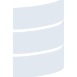
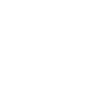

# scala

[← Back to main README](../../README.md)

<table><tr>
  <td></td>
  <td></td>
  <td></td>
</tr></table>

## 16 px

### black
```
https://georgegach.github.io/compatible-icons/simple-icons/compat/scala/16/black.png
```

### slate
```
https://georgegach.github.io/compatible-icons/simple-icons/compat/scala/16/slate.png
```

### white
```
https://georgegach.github.io/compatible-icons/simple-icons/compat/scala/16/white.png
```

## 64 px

### black
```
https://georgegach.github.io/compatible-icons/simple-icons/compat/scala/64/black.png
```

### slate
```
https://georgegach.github.io/compatible-icons/simple-icons/compat/scala/64/slate.png
```

### white
```
https://georgegach.github.io/compatible-icons/simple-icons/compat/scala/64/white.png
```

## 128 px

### black
```
https://georgegach.github.io/compatible-icons/simple-icons/compat/scala/128/black.png
```

### slate
```
https://georgegach.github.io/compatible-icons/simple-icons/compat/scala/128/slate.png
```

### white
```
https://georgegach.github.io/compatible-icons/simple-icons/compat/scala/128/white.png
```

## 512 px

### black
```
https://georgegach.github.io/compatible-icons/simple-icons/compat/scala/512/black.png
```

### slate
```
https://georgegach.github.io/compatible-icons/simple-icons/compat/scala/512/slate.png
```

### white
```
https://georgegach.github.io/compatible-icons/simple-icons/compat/scala/512/white.png
```

## 1024 px

### black
```
https://georgegach.github.io/compatible-icons/simple-icons/compat/scala/1024/black.png
```

### slate
```
https://georgegach.github.io/compatible-icons/simple-icons/compat/scala/1024/slate.png
```

### white
```
https://georgegach.github.io/compatible-icons/simple-icons/compat/scala/1024/white.png
```

## 16 px in base64

### black
```
data:image/png;base64,iVBORw0KGgoAAAANSUhEUgAAABAAAAAQCAYAAAAf8/9hAAAABmJLR0QA/wD/AP+gvaeTAAAA+UlEQVQ4jaXSMUoDURCH8V9kBZWgiIiFCnaCYKk3MBewFbyCh5Ccxjtoa2EritgIWonEKEnWkGgxTwlm143kD696+76Z+XaoTg07OME5Wmh8X2YjH27gGGtYwRaWUMc8VhOsW1apgR4+K05ntIOZX5DhBCMNE2hshL8ywDPecJ86LQR08ZKqdPCOB1whxx4OhJMxwB2a6bKObWyKP7AvxM6pkJibUuKgjF6WSSUSC/SKx9RFIaCPduqkLyS2cIkn4eQIC0WAG5ymxxnWsSvkHWIRyyoktvFhCokZZssqFOU/EnOxjdfCSSGgJsbIxSg9sb63OMNFgvzkC4GyUzEdPM9HAAAAAElFTkSuQmCC
```

### slate
```
data:image/png;base64,iVBORw0KGgoAAAANSUhEUgAAABAAAAAQCAYAAAAf8/9hAAAABmJLR0QA/wD/AP+gvaeTAAABe0lEQVQ4jY2SzU6TURRF1z7fV6WGoKYhJPwYJ0YlccBA30CnDkgYkfAkzAhPwxMwYsrAqdEYJw0aBtXw01Bq+53NoKFpaaHu8Tnr3r3uFTNiW83T9ttU/1NpPqe0IbH1YunZIUB5O3hy8mc1S+2IYsm4YfwS87R5ej4fUl3WooWEO6DhAUNA1op1zK7xYwCh4Zzx6M5Y4s6Fc1YlUBo8cYMZqWxaEpc2P5V5PR1gdSz/DZRpXQm3kZsR+pKmG+Z9hj9C1CcAaX5EeF+mnmZe4dcka3asp/0Bq5F4DtMZ9TEEhHhFah/xSGLQUiBuG5tpGZcoVzNtePw5/lciiDObc+RfyFdTAbZ6ki4gK1s9cFsRZ8Ax5O8g1my2sZ5MAMoqv1WKPSsroVJoJe132A3BJtKC8XPJHU/7if0i3ji9C5rD1MBIg8FRh3dVjlWQKAfLD8u4F/BQjLoiWxBfe7Xq+B6ABFxI6tr5z9Y14lLme1H4IPrF0fLyQmt04wbcHrIsYUAZcgAAAABJRU5ErkJggg==
```

### white
```
data:image/png;base64,iVBORw0KGgoAAAANSUhEUgAAABAAAAAQCAYAAAAf8/9hAAAABmJLR0QA/wD/AP+gvaeTAAABDklEQVQ4jZXSzS6DQRjF8d8rRUlDRMQCiY2QJpbcATdgK3ELbsBOXI17YGthK0RsJKwaKRVVTftYzCt501Y/zmomM+fMmX8eRigisoioRsRpRFxFRD0iDv/OS4WL6zjBKpaxiUVUMIcVZGgWHygV1lWcYXZUq6KmevbdMTxdxKAGw9RBDQ084fu/gCbe8le+8Iln3KKFPRxITPoCHnGRH1awjQ2Jzb4EtmwIxK08YGbMb6EfYmcSc2+DUarjHS8Sn4EBbXzkTdoSxDpu8CoxOcb8oIB7nOfmEtawK8E7wgKWDIG4I01iGdPj/qsXYmkSc2+DUWpJ03gnMRkYkEkQW/iRRraBB1ziOsuyWtHwC83ASvBtIRykAAAAAElFTkSuQmCC
```

