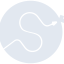
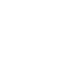

# scipy

[← Back to main README](../../README.md)





## 16 px

### black
```
https://georgegach.github.io/compatible-icons/simple-icons/scipy/16/black.png
```

### slate
```
https://georgegach.github.io/compatible-icons/simple-icons/scipy/16/slate.png
```

### white
```
https://georgegach.github.io/compatible-icons/simple-icons/scipy/16/white.png
```

## 64 px

### black
```
https://georgegach.github.io/compatible-icons/simple-icons/scipy/64/black.png
```

### slate
```
https://georgegach.github.io/compatible-icons/simple-icons/scipy/64/slate.png
```

### white
```
https://georgegach.github.io/compatible-icons/simple-icons/scipy/64/white.png
```

## 128 px

### black
```
https://georgegach.github.io/compatible-icons/simple-icons/scipy/128/black.png
```

### slate
```
https://georgegach.github.io/compatible-icons/simple-icons/scipy/128/slate.png
```

### white
```
https://georgegach.github.io/compatible-icons/simple-icons/scipy/128/white.png
```

## 512 px

### black
```
https://georgegach.github.io/compatible-icons/simple-icons/scipy/512/black.png
```

### slate
```
https://georgegach.github.io/compatible-icons/simple-icons/scipy/512/slate.png
```

### white
```
https://georgegach.github.io/compatible-icons/simple-icons/scipy/512/white.png
```

## 1024 px

### black
```
https://georgegach.github.io/compatible-icons/simple-icons/scipy/1024/black.png
```

### slate
```
https://georgegach.github.io/compatible-icons/simple-icons/scipy/1024/slate.png
```

### white
```
https://georgegach.github.io/compatible-icons/simple-icons/scipy/1024/white.png
```

## 16 px in base64

### black
```
data:image/png;base64,iVBORw0KGgoAAAANSUhEUgAAABAAAAAQCAYAAAAf8/9hAAAABmJLR0QA/wD/AP+gvaeTAAABaElEQVQ4jW3TTUpcQRQF4K87DbYREfFvEDCjgIoIQYIOsgA3ILiAZBDINoKLCDh3IEKIExFxoAgBcSAGRAcG1DZtoGkTDaJtO6h6Uj7fgcvjVd2fw7mnSp5jHJ/wDh1o4RcWsIL7ghrQh1X8RrsgLvETU0XFwziM3bOCBk7wN9foHHNZYQlV7GAsaXiEA/Sjhrd4ndyfYwb/4Atukgmn+I7/8b+J5XieZ9LMpqUX+9jLndWxGL81fMQFNivozunxUlA9xQDeYwOD+IAurJci1WqSfIcf6ERvjB7FWKp4vtcKpiPVyxhXGInNUrTLMSFDTdDkGq8wigkMxfM89suCkneCD/aE/e/iNknsEwyWoo7FF4KI3ZF6tu9GZDaQJLcjq8fpmIeyIFq6titsYQ3bgi/+eOqV8ZTOoOC8VpLUwplg59RoZ5gt0EMvvglCFj2mZtRoMi0qFTR6g8/CKquCmMf4KrzWdpr8AE3CgSWlEt2zAAAAAElFTkSuQmCC
```

### slate
```
data:image/png;base64,iVBORw0KGgoAAAANSUhEUgAAABAAAAAQCAYAAAAf8/9hAAAABmJLR0QA/wD/AP+gvaeTAAACFklEQVQ4jWWSz0vUURTFP+fNpKM26WjqZOgEGVRE0UIQijYt6j9oWxBBENQ/0F8SBK4qomWLgiSoRUVSYBGS4E9mRkObGVMhnXdajOJ3prt6j3feOefec0VLLZbXz0WHu0GMSbQDdcOCHR6PDGZfSopJvPYPy8u1vpiOT4QuGA+0Ehs2gOWAbg3nuz82ERSL6yO7IbwBnQQLwKIiexOpG3M4QbQi4oORfO9TAM3NOZPqrE1hn00IzgrNGI5CLAkuGhUS7+UgX4/oTzrVXn3oqFHtNyMXHZlBugrOIGq2JiUdsj20h8rXrVfgjkDwDcltB82GiqQCONO46whwyfZ7wS+g7Fi/E1BKCtNBhGzLuDrBay0z7AdfRuFttGcU0reNuwJxUoulyjYik5jqLvInojocyAE5THdrKg1zfpGWiG6OK401jihhahHXUmjT0mnsXJIggANSLfG9BMwCW8Bx4ExA5w2DMrPN8hDhe4jRVaFd4CeEacFvpC+InQS8D1hpts+q6+lngRQTxp+x/xpfMYzZzjoeKAqqrdspNH9iKPtDtsNSufoBMZbg3xJ8BW0jdWHWjMf3nIBUxPVrI/nebwKYLW8MtKn+TjBqE/Ykou0VQYTQD/u74pKt+4VjPc/33DVqYaGSo90TksYw+f8yk2syizGlm4X+nqlEe821tFo9Bdxz9HhjlbVjmBd6NDxw5LWkZOr8A6y69RmB1wJHAAAAAElFTkSuQmCC
```

### white
```
data:image/png;base64,iVBORw0KGgoAAAANSUhEUgAAABAAAAAQCAYAAAAf8/9hAAAABmJLR0QA/wD/AP+gvaeTAAABkElEQVQ4jXXTTYuPURgG8N/5mxg0NA1joVgpJCWJIlu+gPgAUsrX8CmUsrSQEptZyMJCMlHjpWksRjEvpPEfzORl5rJ4zr+enhlXncU5576u6+469yk6SHIM13EK27CGD7iNR6WU9S5nQBxLMpFkMZtjOcnbJKc3Ix9IMpNkvUVYSvIxyfeO0EKSKwNuSTKMSRxtab7HNPZgHidwsHW/gIv4IcnNJL9aDp+SPEyyWvf9JPfrebeTfg+XsbWl/q26Ddf9LpzFU3yp7tewBVNDGOlEsqOm3sZenMMTjOMqduJxSbLacoO/eI7tGK1r94bkG9wbQvddh3Cmhrdc108crmJtpFcLBpjXvMAK9uMIjmNfPe/iTQ/92vYMprCEl/jTKhzDYof8GXd7uIMX+I3zmhEe6Tj2NeG1MVtKeVeS9PCsEgdYwSusatL+qsllrN7P4UIp5XWTRDKeZDrJWmtQ1pLM1XFuD9pckksb0kgymuRBkvn/fKZ+kqkkJ9u8sonQIdyoLQ/XMGdxCxOllLTr/wE20kMVzkhUIAAAAABJRU5ErkJggg==
```

