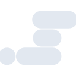
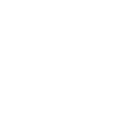

# scrimba

[← Back to main README](../../README.md)





## 16 px

### black
```
https://georgegach.github.io/compatible-icons/simple-icons/scrimba/16/black.png
```

### slate
```
https://georgegach.github.io/compatible-icons/simple-icons/scrimba/16/slate.png
```

### white
```
https://georgegach.github.io/compatible-icons/simple-icons/scrimba/16/white.png
```

## 64 px

### black
```
https://georgegach.github.io/compatible-icons/simple-icons/scrimba/64/black.png
```

### slate
```
https://georgegach.github.io/compatible-icons/simple-icons/scrimba/64/slate.png
```

### white
```
https://georgegach.github.io/compatible-icons/simple-icons/scrimba/64/white.png
```

## 128 px

### black
```
https://georgegach.github.io/compatible-icons/simple-icons/scrimba/128/black.png
```

### slate
```
https://georgegach.github.io/compatible-icons/simple-icons/scrimba/128/slate.png
```

### white
```
https://georgegach.github.io/compatible-icons/simple-icons/scrimba/128/white.png
```

## 512 px

### black
```
https://georgegach.github.io/compatible-icons/simple-icons/scrimba/512/black.png
```

### slate
```
https://georgegach.github.io/compatible-icons/simple-icons/scrimba/512/slate.png
```

### white
```
https://georgegach.github.io/compatible-icons/simple-icons/scrimba/512/white.png
```

## 1024 px

### black
```
https://georgegach.github.io/compatible-icons/simple-icons/scrimba/1024/black.png
```

### slate
```
https://georgegach.github.io/compatible-icons/simple-icons/scrimba/1024/slate.png
```

### white
```
https://georgegach.github.io/compatible-icons/simple-icons/scrimba/1024/white.png
```

## 16 px in base64

### black
```
data:image/png;base64,iVBORw0KGgoAAAANSUhEUgAAABAAAAAQCAYAAAAf8/9hAAAABmJLR0QA/wD/AP+gvaeTAAAAzUlEQVQ4jcXRMU6CQRAF4E8wMcRAbOjtbDwAJyAcg4aGHg9gbW3hJUisPYEhUFDYQgIhIYQCG4OJP8VSbPRn145Jpph9+2bem+HccZHBOxigVoJ94yVFbmKBIpHrSqLBDS4zCq9yFp7RVm61wCQ34Q2tSMkX+hhleBxJc399T+NPqR38K6oJ7Acz3GGD9bHuYRXLHOJe8PWAVzRONK3hFuP4cSd422IiffcCHzG5ImwW9sKC9glb8BkXVSxRxyOecC3cfVGS7+j+bnLeOADtpjqVA1onSgAAAABJRU5ErkJggg==
```

### slate
```
data:image/png;base64,iVBORw0KGgoAAAANSUhEUgAAABAAAAAQCAYAAAAf8/9hAAAABmJLR0QA/wD/AP+gvaeTAAABIUlEQVQ4jcVRu0oDURScufeKBHwsQiAgBltBwVKwF/8ivU1s9FME/QlBLP0BIbhFLGxEjJJEFPJqQty9Y5E1asherHS6wxzmcQ7w32CIfGj29h15BKPCNOe9f5fRWa5AqzUoJiaNJawGPF5NHpNYH0l0oYQg5oMVGq3uCYg9zK4qEnHQwRl7lSLdkZTtcQiLg3Ixqn2FyIEk9/zSvRdYnqJuy6Vo63PIvcFvkStAMhFRJREDqgOqE7h2FpXve67R7pyD3IRQs2l6nFh7QWBp3APQWC4bVYB36wBuJkZP7U5f4CKEDslHQduhyATv1krLG5MKAoeZ2cjT1wGOQgKCBj8qePhDA1Mx0mn/LbpcWOm1jeEuZnzIe980c2k1ZPD3+AC7lmue5X2GPgAAAABJRU5ErkJggg==
```

### white
```
data:image/png;base64,iVBORw0KGgoAAAANSUhEUgAAABAAAAAQCAYAAAAf8/9hAAAABmJLR0QA/wD/AP+gvaeTAAAA0ElEQVQ4jcXRrUpEURTF8d8dLsgUsdh9AJNJsIvRN5hu0aKPIuhLCGL0AQzDDDhhsiAiBoMW0bAM3nCF6zlB0AWHE/bH2v+9+W81pWCSPRxjPBD+wHmpeD3Jfcp6GhUGWENbIVipIZxi1zBqMK85XGO7N8kbDpqmmVbqSNImuRvgXvTzSjv4vZLsJ5klue3eTZKtfk6b5AKbmOIEl1j9oecYG5j1XV46tuck88rdk2TZ7zjytVl4x6L7S3r9hoAjTHCGKzxix/DtH3BYMfhjfQJYtqjOSHGzDAAAAABJRU5ErkJggg==
```

