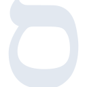

# sefaria

[← Back to main README](../../README.md)





## 16 px

### black
```
https://georgegach.github.io/compatible-icons/simple-icons/sefaria/16/black.png
```

### slate
```
https://georgegach.github.io/compatible-icons/simple-icons/sefaria/16/slate.png
```

### white
```
https://georgegach.github.io/compatible-icons/simple-icons/sefaria/16/white.png
```

## 64 px

### black
```
https://georgegach.github.io/compatible-icons/simple-icons/sefaria/64/black.png
```

### slate
```
https://georgegach.github.io/compatible-icons/simple-icons/sefaria/64/slate.png
```

### white
```
https://georgegach.github.io/compatible-icons/simple-icons/sefaria/64/white.png
```

## 128 px

### black
```
https://georgegach.github.io/compatible-icons/simple-icons/sefaria/128/black.png
```

### slate
```
https://georgegach.github.io/compatible-icons/simple-icons/sefaria/128/slate.png
```

### white
```
https://georgegach.github.io/compatible-icons/simple-icons/sefaria/128/white.png
```

## 512 px

### black
```
https://georgegach.github.io/compatible-icons/simple-icons/sefaria/512/black.png
```

### slate
```
https://georgegach.github.io/compatible-icons/simple-icons/sefaria/512/slate.png
```

### white
```
https://georgegach.github.io/compatible-icons/simple-icons/sefaria/512/white.png
```

## 1024 px

### black
```
https://georgegach.github.io/compatible-icons/simple-icons/sefaria/1024/black.png
```

### slate
```
https://georgegach.github.io/compatible-icons/simple-icons/sefaria/1024/slate.png
```

### white
```
https://georgegach.github.io/compatible-icons/simple-icons/sefaria/1024/white.png
```

## 16 px in base64

### black
```
data:image/png;base64,iVBORw0KGgoAAAANSUhEUgAAABAAAAAQCAYAAAAf8/9hAAAABmJLR0QA/wD/AP+gvaeTAAABJ0lEQVQ4jY3TyyrFURTH8Q85cqmTy0QRRi4TGbodQ3kCAyNv4R0MzJWBkpgaegUlE4QiiXTcKQYcl8He+LfjOKt2/1p7re9e67fWnx+bxxEG0JycGn9YVfzmsYsOXOElifuIvj3M4CYF9aEYA8udd+ygMQXkcFwB4AOvmEtbgBGsoR1neM7c1Qo65NGEffSnVbTgHltoSC8jYAoX8YHWNGABT2j7JTlrqzGukHXmcIn1f5JhQpjINFRH55DQ30oFgFNByOYsoEcQtFgBoCbm3WUBJaGN0QoAY5lKvq2AB5ygt0xyEw6EKTTyswd1wmy7cI5DbAj/xhu6MY5BdGITwyl9UVA3Xd1S4rvF5G/l1WFbUPivNX7EUpkW1WNZ0OI6A/vSZzZN+AR8Q1sXh1rIjAAAAABJRU5ErkJggg==
```

### slate
```
data:image/png;base64,iVBORw0KGgoAAAANSUhEUgAAABAAAAAQCAYAAAAf8/9hAAAABmJLR0QA/wD/AP+gvaeTAAAB/klEQVQ4jYWTv0+TURSGn3O+r8AgbQmRtLUUu0h0clPxxz/gYHB0MExOLv4FTsbNxN3EyYQ4OmnioKsx0QVDNAhUiCWmNrRBoHzffR2AjzZBecd7z3nOed/caxxopbn5xNEtszAbdvwHfarVCl0zSzhGBvCt1coPJ9ECogr8AvUGqoSE9Rx9sTSaq1bzrcOrGCDezVXkYcj2z04fcAfGGCC8rljvm83mpVKptAXgAK3y6JIZW8etOCgZpuldjTwcsACwstGZcYV5pDPAmpn/6XMwhBTjlkcUJVucKhfOZxYAop4WlSOP8zlOt69XypUMACApbjR/38aip24aXVvrjFer+ZZnFUP2GMillrtZqQw2A5hZMlUefxnBO0ljwZMLWQYfpZwUZh17W5841fxfCsF4jlnOPJrMABM/25eBPK4XJ8WYpt4A9lKlYxkguJ+TMKXaOAkQeRKDeWRROwPE7omb5WTR1ZMAmF9DInjaONogSb4LdUW4t77emf5X73K7XSTwAKc1HHqf4OAdLC9rxEc2F82YwlhX4KvjbwJhyV2pxFnghmQXza1m0ofJUvFKBgBoNNvPMLuLyPUNlWFBKDo6oZ1Gdqc+UXidWQBIt4v3TSwYA7/O+ptNdMFeHTYPAOp122GvOxNg3mAV0TJI9oeqY2g1RP6oVi7M9efyF33+1qBpe2mzAAAAAElFTkSuQmCC
```

### white
```
data:image/png;base64,iVBORw0KGgoAAAANSUhEUgAAABAAAAAQCAYAAAAf8/9hAAAABmJLR0QA/wD/AP+gvaeTAAABQUlEQVQ4jY2SSyuFURSGn61DLnVymSjCyGUiQ7djKL/AwMi/8B8MzJWBkpga+gtKJghF0pGOO8WAw2Ngy2fncN7ak/Wt9/nWfveCKHVBPVYH1Zbk5KigEM15YA/oBK6Al6TPWNsHZkMINz+/ar9a8n+9q7tqUwqoVU+qAKi+qvM/rhAho8A60AEUgefMP+qAHJAHmoGDEMJAOkWreq9uq41pWGpOnVYv1KLaljYsqk9q+69xf/etxb5CmsGluvGXOfZOqi/qDEBNrA/H+63+BwDOgFegJQvo5TPQUhWAXPTdZQFloBYYqwIwnpnkU2pBfVBP1b5KTrVZPYyv0ATfq1wPHADdwDlwBGwCx8Ab0ANMAENAF7AVQhhJ6Usx3XR1y0ntVp36bbx6dSeuaiU9qssV01Eb1JWYxXUG9pXPXOr5ABkUgAk1bu78AAAAAElFTkSuQmCC
```

