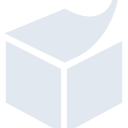

# semanticweb

[← Back to main README](../../README.md)





## 16 px

### black
```
https://georgegach.github.io/compatible-icons/simple-icons/semanticweb/16/black.png
```

### slate
```
https://georgegach.github.io/compatible-icons/simple-icons/semanticweb/16/slate.png
```

### white
```
https://georgegach.github.io/compatible-icons/simple-icons/semanticweb/16/white.png
```

## 64 px

### black
```
https://georgegach.github.io/compatible-icons/simple-icons/semanticweb/64/black.png
```

### slate
```
https://georgegach.github.io/compatible-icons/simple-icons/semanticweb/64/slate.png
```

### white
```
https://georgegach.github.io/compatible-icons/simple-icons/semanticweb/64/white.png
```

## 128 px

### black
```
https://georgegach.github.io/compatible-icons/simple-icons/semanticweb/128/black.png
```

### slate
```
https://georgegach.github.io/compatible-icons/simple-icons/semanticweb/128/slate.png
```

### white
```
https://georgegach.github.io/compatible-icons/simple-icons/semanticweb/128/white.png
```

## 512 px

### black
```
https://georgegach.github.io/compatible-icons/simple-icons/semanticweb/512/black.png
```

### slate
```
https://georgegach.github.io/compatible-icons/simple-icons/semanticweb/512/slate.png
```

### white
```
https://georgegach.github.io/compatible-icons/simple-icons/semanticweb/512/white.png
```

## 1024 px

### black
```
https://georgegach.github.io/compatible-icons/simple-icons/semanticweb/1024/black.png
```

### slate
```
https://georgegach.github.io/compatible-icons/simple-icons/semanticweb/1024/slate.png
```

### white
```
https://georgegach.github.io/compatible-icons/simple-icons/semanticweb/1024/white.png
```

## 16 px in base64

### black
```
data:image/png;base64,iVBORw0KGgoAAAANSUhEUgAAABAAAAAQCAYAAAAf8/9hAAAABmJLR0QA/wD/AP+gvaeTAAABFUlEQVQ4ja3SsStFARQG8B+eZKAMxPYGk8GqrPQSu7IY+BfMtmfxV8hksyjpldWgLAZKPZfFoIS6Tx6e4Z2X+7jIy6lvuOd+33fvd86hs5rC9k+ELsziEEdYRD96on+HuTzhENZxHqRGIMU1kugn6P78S3u4Qj0jzMM9VrLiEezi9hdhA6+oREQi0yTGsIZRDGAwJ94LTjCPPmzgEUqoRa5NTGAnMr/Fl280pz4cnCQ0pZZBGsQ6LlHGOLawHzMqx7vWjNI8gxaeUcVqoBq9LCdFqZCTFXpRxFI8F7/hte+yk/oXg6fAX6tNN41jzSvLDqoSyPYecIqZPNcFnPnYStaghgssy1xiXhU0rzLBQSCJ3petvQP1B2a+9g/4pAAAAABJRU5ErkJggg==
```

### slate
```
data:image/png;base64,iVBORw0KGgoAAAANSUhEUgAAABAAAAAQCAYAAAAf8/9hAAAABmJLR0QA/wD/AP+gvaeTAAABy0lEQVQ4ja2Tv0vUcRzGX8/ne1camElgZtdpNDQ1R9AiVkMF0dBg/QeC4NIUCEWrEbS1ukgtRRA0ROAatURDcA1nZ5xG1p2Dh33v/TSchqLZD3q2N7yf5/28f8E/4GO9capa/zoDUNgpwbbmlxqjsm9idRvupnzlaalUWvu01BjJ7UcppTEAbSZWq9/66PKE0HWgH3NgXXEV9EUiDPsxzaMDvcckRWHDUuAp2SdFOmx7qzOpGyi5EzWRb0kKAFXqK/17iAfgM8DBXZs3YfGyfKj3nCQDpC75eBIfUvJZ4DFiYSeuIAfe7Mu+X6ksL/fUFhvTtcXm6RRET5jxaOsJpuLIzpt4iKlJeJ29CJotkl1YzYtTe9eyt2HGg+hJHf0wokxiEtrPFKmiTCMOzdg8l3XZ4fk12q9ITCLKEN6+RlOQGELccPhaBHcAnHmWxBFBcd3TT+x4B0ARGM4KGuts0cO/mmvaZeZ/hP8g0HbLpvW3RJsWbbdSebBvrpCyS0ivDc3fEsUK9rtMuloe7Jvb8gu1z42Led6eTkploFvSi041j9pqKXnB4dvlgQMzG5eobRXsQrXemEx4gpTeAxBxItD9oYHee5Lyzfk/AHQv0H6DUpefAAAAAElFTkSuQmCC
```

### white
```
data:image/png;base64,iVBORw0KGgoAAAANSUhEUgAAABAAAAAQCAYAAAAf8/9hAAAABmJLR0QA/wD/AP+gvaeTAAABP0lEQVQ4ja2SvyvEcRjHX99zBgMxsChONv+AjEqXomSgUAa7MvAf2OSvuIXNQtGVMimxKQPDnZSBhHJXuJfBg+t0fuVdz/B5nvf7+fF5HvgD1H419xUhUYfUXXVfnVSb1Ibw36jDAEmNsA2YB2aADqA1QiXgGqgALcAd0JMkSaW6pU21qD76NW7VueqqHeqGevWNUPVZzavvnaeAXuAMGAI2gIs6X/MEHAHjQLO6qg6gZtWSWlBX1D51XT1XK1H5Us2p7cEphCabepsE6AIWgC3gFBgEcsA2MAYUgYPgdIWGdE2baaAbWAKmgeXwrwGdQGPtXLUJ3tAIZICpeGfq8EjVC/wU/5KgHPZblIFyKkmSPWAUOOT1RL/DPXAMTIT2A+qIeqI+xP7zYcbeT9XZ6kv8BDWtLsax7IQVwvdpay992jhDjCV8SgAAAABJRU5ErkJggg==
```

