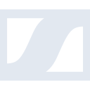

# sennheiser

[← Back to main README](../../README.md)

<table><tr>
  <td></td>
  <td></td>
  <td></td>
</tr></table>

## 16 px

### black
```
https://georgegach.github.io/compatible-icons/simple-icons/compat/sennheiser/16/black.png
```

### slate
```
https://georgegach.github.io/compatible-icons/simple-icons/compat/sennheiser/16/slate.png
```

### white
```
https://georgegach.github.io/compatible-icons/simple-icons/compat/sennheiser/16/white.png
```

## 64 px

### black
```
https://georgegach.github.io/compatible-icons/simple-icons/compat/sennheiser/64/black.png
```

### slate
```
https://georgegach.github.io/compatible-icons/simple-icons/compat/sennheiser/64/slate.png
```

### white
```
https://georgegach.github.io/compatible-icons/simple-icons/compat/sennheiser/64/white.png
```

## 128 px

### black
```
https://georgegach.github.io/compatible-icons/simple-icons/compat/sennheiser/128/black.png
```

### slate
```
https://georgegach.github.io/compatible-icons/simple-icons/compat/sennheiser/128/slate.png
```

### white
```
https://georgegach.github.io/compatible-icons/simple-icons/compat/sennheiser/128/white.png
```

## 512 px

### black
```
https://georgegach.github.io/compatible-icons/simple-icons/compat/sennheiser/512/black.png
```

### slate
```
https://georgegach.github.io/compatible-icons/simple-icons/compat/sennheiser/512/slate.png
```

### white
```
https://georgegach.github.io/compatible-icons/simple-icons/compat/sennheiser/512/white.png
```

## 1024 px

### black
```
https://georgegach.github.io/compatible-icons/simple-icons/compat/sennheiser/1024/black.png
```

### slate
```
https://georgegach.github.io/compatible-icons/simple-icons/compat/sennheiser/1024/slate.png
```

### white
```
https://georgegach.github.io/compatible-icons/simple-icons/compat/sennheiser/1024/white.png
```

## 16 px in base64

### black
```
data:image/png;base64,iVBORw0KGgoAAAANSUhEUgAAABAAAAAQCAYAAAAf8/9hAAAABmJLR0QA/wD/AP+gvaeTAAAA30lEQVQ4jaXTvUpDQRAF4M+fBAS5WEos7ALWYiv4ACmtLUUkgk/gGwRSpc8r5AVSWliLnVaCVYoU4tWYFHuVsO5eizuwDJwzc2aYmaWhbeC8qcA3yn9i2nVkiT4eEvwdTrBf10WJswR+hRmW0VvgGU/4ygnsVkGp5CkKnOJjO9PVLQ4S+At6mP8Am4mgFi4qv27vGK4n5wSu0UngrxjFYCxQ4AY7Ef6JceWzAnuY4DBTfZDAEVbxKAxo4e/kZ7hM5P1uYQtHGfE33AtHdhxxXcIlLnOtCTdSx7cbf6bGtgIk0TZenoQpdQAAAABJRU5ErkJggg==
```

### slate
```
data:image/png;base64,iVBORw0KGgoAAAANSUhEUgAAABAAAAAQCAYAAAAf8/9hAAAABmJLR0QA/wD/AP+gvaeTAAABR0lEQVQ4jaWSMUsDQRSEZ/ZykYhIJFwMUbFRwcpCLf0JltraCSIoNraWdoKF2PsP/A02FvEPaKFJkZiDkENFTc67sZBospezyauWmTff27csMGKx2gi2RgLUnoMYYDe1QyKIbJqdAfAl6hARKgnX6ITkOoDSfwA4se5ny1N3/UatGexB3ACQtzIxoBrFjogFM4zq+/4EpGM7LCEGcNNx4xVJuwCjoYD3yD0SzYytk3jKOeHmYqHw8rul3VSRXGO4Q8kdCAMfhM49z3vt1xMArxHsUyjbuoh6czp/aesDgIdWaxIGBwJyVjgUdLVGhjYg0zs8ttt5p8trEvOSNUWqj5nwzA73ACYiL8ynxgHMiYm1gjjmabFUfEsDOASWQSZMAU1CtwAr1Xqw2u/RYEn4+cpKJP8IXZDpPpHNSNhObQAA+0GsK45c3xCxeRRfnK3HAAAAAElFTkSuQmCC
```

### white
```
data:image/png;base64,iVBORw0KGgoAAAANSUhEUgAAABAAAAAQCAYAAAAf8/9hAAAABmJLR0QA/wD/AP+gvaeTAAAA80lEQVQ4jbWSsS6DURiGn4+/TYg0HYWITWIWq8QFGFnNIiG9AqNNYhC7W3ADRkMvwMYkMRGViLY8hlbC6Tn/0vjG533Pc77hgykn1N1pBV9Av64DNEthBQyBY6CbyU+ATWCxqFf76naGH6jPTs6neq/eqcOsQF0Yl3KPb9SWuqV+zBQW6wDLGf4A7ETE6w+YEKgNYB9oJNE7cB4Rvd8wt8EhsJThj8BlCv8I1BZwBMwlvQFwFRGDokBtA9fAauH3swynGksugHlgJd0KeAFOI+KtJJgF1nMh8ATcAl11I8nWYHTKFh7D6MTr8mYF7NUU/n++AQ6xjwlpnrZQAAAAAElFTkSuQmCC
```

