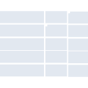
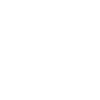

# serverfault

[← Back to main README](../../README.md)





## 16 px

### black
```
https://georgegach.github.io/compatible-icons/simple-icons/serverfault/16/black.png
```

### slate
```
https://georgegach.github.io/compatible-icons/simple-icons/serverfault/16/slate.png
```

### white
```
https://georgegach.github.io/compatible-icons/simple-icons/serverfault/16/white.png
```

## 64 px

### black
```
https://georgegach.github.io/compatible-icons/simple-icons/serverfault/64/black.png
```

### slate
```
https://georgegach.github.io/compatible-icons/simple-icons/serverfault/64/slate.png
```

### white
```
https://georgegach.github.io/compatible-icons/simple-icons/serverfault/64/white.png
```

## 128 px

### black
```
https://georgegach.github.io/compatible-icons/simple-icons/serverfault/128/black.png
```

### slate
```
https://georgegach.github.io/compatible-icons/simple-icons/serverfault/128/slate.png
```

### white
```
https://georgegach.github.io/compatible-icons/simple-icons/serverfault/128/white.png
```

## 512 px

### black
```
https://georgegach.github.io/compatible-icons/simple-icons/serverfault/512/black.png
```

### slate
```
https://georgegach.github.io/compatible-icons/simple-icons/serverfault/512/slate.png
```

### white
```
https://georgegach.github.io/compatible-icons/simple-icons/serverfault/512/white.png
```

## 1024 px

### black
```
https://georgegach.github.io/compatible-icons/simple-icons/serverfault/1024/black.png
```

### slate
```
https://georgegach.github.io/compatible-icons/simple-icons/serverfault/1024/slate.png
```

### white
```
https://georgegach.github.io/compatible-icons/simple-icons/serverfault/1024/white.png
```

## 16 px in base64

### black
```
data:image/png;base64,iVBORw0KGgoAAAANSUhEUgAAABAAAAAQCAYAAAAf8/9hAAAABmJLR0QA/wD/AP+gvaeTAAAA6UlEQVQ4jcXRy0rEQBCF4W+cRs3oRlFB3LnwcXxXV76FF7yACCooIiKDLiSDY4yLlNKLdJZa0KR/uvr0qRP+odZyGOEFdaF5FdfYDq5wg2U0WElYCqG+apAwCW5jvxv7ccLlgN05DrGfCR7jNW9qB9YjjjKe4iLvSTgbcDDDaYwBn+FgFgIpYUc5xAoLWA/+yWsLX6hSNIwLAm188/MUwi0WE97DWl/NdTlsZCPcYjM7HwzxGScZv+kJ8aDwupjzHHfZSFcZG+kSbQoCNe6xF/yBB13wvxlMlf/CJGw/BVchUoe7tnDvD+sb4q9TMB6292AAAAAASUVORK5CYII=
```

### slate
```
data:image/png;base64,iVBORw0KGgoAAAANSUhEUgAAABAAAAAQCAYAAAAf8/9hAAAABmJLR0QA/wD/AP+gvaeTAAABPUlEQVQ4jb2Ry4pTQRRF164Utjc6UXwgAQUFB878Ef/VkZ/RNIoggna3YgcUTQuS0Mmt5SBXyeDeaZ/ZedXZaxdcd5ydre4c5jlfrn4Q12PDktuRj8RH+0I64BNwM6HX3KrgES0ZeyDQB6tmPhQU58BTRMisYt5P6k220t5gXu3302M7JrPVIYLT+15AWaovB6ZfxouQF/9mKvh2UoHZNDwJVoCU7JBjwgYQqRWzmDaRjlCQuwDKUSCaB6Q1SFcpFCizUQS0AC1DX2hYox1G4o2K/EncjSO47eVbKdwbFOwyK59p3B9ObCuwcNrG7wmPlSd7S/hNa89CHh6a+HrSRGhY3pF2ukfCJB8wp/9PnC8vN9D6CQXrhC/q8yG/Er/GLIDBg/ATM/oLhLmNS5IlgNjFckVYk9Ywk/DXF38BKwafo7HV1IUAAAAASUVORK5CYII=
```

### white
```
data:image/png;base64,iVBORw0KGgoAAAANSUhEUgAAABAAAAAQCAYAAAAf8/9hAAAABmJLR0QA/wD/AP+gvaeTAAAA9klEQVQ4jcXSzytEURwF8M+YG2bYkB9JUZSFnX/E/2rlz5BISaEIRX6VZpoxcy3m+7gL7y05q3vePZ3OOffx18g5L5S8lXN+Qq9GP48LrAXv4BKzGGEuYQatGoMRErpVgDhvxbmdcNaQeIhD7BeGR3gtK+QGg3s8YC/4S3zbrQQJJw0GfRyHDj4jQT8qpIR19SN2MIXF4NVeKxijk0LQrjGo6pX3KYwzphM+ItpvGOIOS0WFKyxX91WFOjxiA5vB37GN1TLOQYPBGKe4Dp5xXnCtnHPf5H1/Qw832Ak+wG2k/t7gWf0rdPFm8i8wGW8Q+rGfkf8RX7fhR7inPgi7AAAAAElFTkSuQmCC
```

