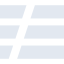
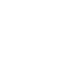

# serverless

[← Back to main README](../../README.md)





## 16 px

### black
```
https://georgegach.github.io/compatible-icons/simple-icons/serverless/16/black.png
```

### slate
```
https://georgegach.github.io/compatible-icons/simple-icons/serverless/16/slate.png
```

### white
```
https://georgegach.github.io/compatible-icons/simple-icons/serverless/16/white.png
```

## 64 px

### black
```
https://georgegach.github.io/compatible-icons/simple-icons/serverless/64/black.png
```

### slate
```
https://georgegach.github.io/compatible-icons/simple-icons/serverless/64/slate.png
```

### white
```
https://georgegach.github.io/compatible-icons/simple-icons/serverless/64/white.png
```

## 128 px

### black
```
https://georgegach.github.io/compatible-icons/simple-icons/serverless/128/black.png
```

### slate
```
https://georgegach.github.io/compatible-icons/simple-icons/serverless/128/slate.png
```

### white
```
https://georgegach.github.io/compatible-icons/simple-icons/serverless/128/white.png
```

## 512 px

### black
```
https://georgegach.github.io/compatible-icons/simple-icons/serverless/512/black.png
```

### slate
```
https://georgegach.github.io/compatible-icons/simple-icons/serverless/512/slate.png
```

### white
```
https://georgegach.github.io/compatible-icons/simple-icons/serverless/512/white.png
```

## 1024 px

### black
```
https://georgegach.github.io/compatible-icons/simple-icons/serverless/1024/black.png
```

### slate
```
https://georgegach.github.io/compatible-icons/simple-icons/serverless/1024/slate.png
```

### white
```
https://georgegach.github.io/compatible-icons/simple-icons/serverless/1024/white.png
```

## 16 px in base64

### black
```
data:image/png;base64,iVBORw0KGgoAAAANSUhEUgAAABAAAAAQCAYAAAAf8/9hAAAABmJLR0QA/wD/AP+gvaeTAAAAzUlEQVQ4jbXSMUoDQRgF4G83CxK0FaxyC6sUOYDgBSw8ggewsPcCHiBd6tjZiKKVYp8UEe1dG4tA3BSZhWWZbBaWPPgZ+N/M+//3GDoiwcsW7g5jnOG6SaSIVI5h4J+23Ckr2pwjxRG+mwQy3Ee2esA/BnjDR5OFToiFOMMlDjHFwS6Ruq9J6F/gL8I3hphjFAQeWzwuMrxWtvnFc7D2U+P2g8QmKFjiCl+4wWlbkdLPAj308amFfxRpRegdK5zjuO30aoi34Tyxz59Xxxrt2ltOKTqeyAAAAABJRU5ErkJggg==
```

### slate
```
data:image/png;base64,iVBORw0KGgoAAAANSUhEUgAAABAAAAAQCAYAAAAf8/9hAAAABmJLR0QA/wD/AP+gvaeTAAABJElEQVQ4jbWSPUoDURRGz32TqEGDEVGDCSPiGkRcgyDuwM7WVrCwtxcX4BZiZymmUiwFQYwzkEkQ42hnnPksghZJHALRr3p/93Dv4cGYsaAVXw27SJP0dGV57uyx+bLlOe/wN0BO0mb/oSDG8x4AnPMOhr35jhvaFvbsLxbr7XZ7Bmk1a4ScYecD7cOFmaWN5rtv9nltuNssyFgZkGhwX12a3Y2iaLrLVA2zySzAoEQjBOhaYUfSBlIhC9AvMSbVCUCapntAZjFAzszqP7tUcbVcupRkQeutY0Y9o/ZvYkEU13pLfbgk2a9U5oOg1TlCbn0kwFP0KgBJDb9cWgvDcEL54h3gjwL4kWiOGzNLlC9uIy2MOkJPooTJHQMIlZ37x5/Xny/DHXMjpDkQiwAAAABJRU5ErkJggg==
```

### white
```
data:image/png;base64,iVBORw0KGgoAAAANSUhEUgAAABAAAAAQCAYAAAAf8/9hAAAABmJLR0QA/wD/AP+gvaeTAAAA2UlEQVQ4jbWSMUoEURBEX+mALJoKRoKHEBEDDyCIN/AIHsDA3AvsAbzCmpksihsp5iaKhoKaCvpMZmEYZj4Dy1bSn6pP0VU0LIio9z3aOMmVegSc9zrYjS/1oNZve/6outLj+wHM1A1gpxShAq47+Jskf+o28AA8lUwWQleJz0lO1XVgAqyVDCpgv8W91/ME2ANGxRU62j+s+Wmp/TkqYNbw+wbu1ACfLW05iDqp3z/AWZI39QLYHeTQiPOirqoj9XVI/vYlPib5BY6BzaERmiVe1nOLZV5eG//YH+eadwR4iQAAAABJRU5ErkJggg==
```

