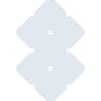

# setapp

[← Back to main README](../../README.md)





## 16 px

### black
```
https://georgegach.github.io/compatible-icons/simple-icons/setapp/16/black.png
```

### slate
```
https://georgegach.github.io/compatible-icons/simple-icons/setapp/16/slate.png
```

### white
```
https://georgegach.github.io/compatible-icons/simple-icons/setapp/16/white.png
```

## 64 px

### black
```
https://georgegach.github.io/compatible-icons/simple-icons/setapp/64/black.png
```

### slate
```
https://georgegach.github.io/compatible-icons/simple-icons/setapp/64/slate.png
```

### white
```
https://georgegach.github.io/compatible-icons/simple-icons/setapp/64/white.png
```

## 128 px

### black
```
https://georgegach.github.io/compatible-icons/simple-icons/setapp/128/black.png
```

### slate
```
https://georgegach.github.io/compatible-icons/simple-icons/setapp/128/slate.png
```

### white
```
https://georgegach.github.io/compatible-icons/simple-icons/setapp/128/white.png
```

## 512 px

### black
```
https://georgegach.github.io/compatible-icons/simple-icons/setapp/512/black.png
```

### slate
```
https://georgegach.github.io/compatible-icons/simple-icons/setapp/512/slate.png
```

### white
```
https://georgegach.github.io/compatible-icons/simple-icons/setapp/512/white.png
```

## 1024 px

### black
```
https://georgegach.github.io/compatible-icons/simple-icons/setapp/1024/black.png
```

### slate
```
https://georgegach.github.io/compatible-icons/simple-icons/setapp/1024/slate.png
```

### white
```
https://georgegach.github.io/compatible-icons/simple-icons/setapp/1024/white.png
```

## 16 px in base64

### black
```
data:image/png;base64,iVBORw0KGgoAAAANSUhEUgAAABAAAAAQCAYAAAAf8/9hAAAABmJLR0QA/wD/AP+gvaeTAAAA30lEQVQ4jaXTQUoDYQwF4M8iaCl4B7d1VcH2EOIpXLkX7+c9rIK2GzvjRnSELnRhfghjpx3qgwf/hLzkhUnoxgwvwdmWvI2YhPA7uMR5X/EY92hSgSZi413iCzzjDWt8hniNKpxMt3VepK4VXoNVii+yk0EqcIph+h7hPThK8WHkbsRtdCy2V6jTODXuusQF15i3bFd4wE07edAO4ChEbRzs6szvCCt82WOEq0jI/34ezDtR47KIDlOBx0gs+MBJeh/Hu8FTl4upv4uUx1nqcRdn/rHKBZNwstcxFfQ65x98F1xY9Z5NTQAAAABJRU5ErkJggg==
```

### slate
```
data:image/png;base64,iVBORw0KGgoAAAANSUhEUgAAABAAAAAQCAYAAAAf8/9hAAAABmJLR0QA/wD/AP+gvaeTAAABtUlEQVQ4jY2TvW4TURSEv7m7KLGI4yiAggOGpHVHATwBSBQpQNQ0vAISEi+AgoSgo+UBQgFSGt6AFDRIKSEmShxAMTYWcsD2HYqsg3/WiK3OjkZz58zRiCnf7kHruu0NAEl3K+dL7/J4ygP3vn6/0u/rDeJiRttPE68tn1t4P84N40Ct3q72+jxHOjsEL3Z7flart6v/dPC53roq+ZXNnALFaHdFkOTUVgv4JXO7Ui5tTQjU6u2q1H8LXMigQyAOOT0z2NBObl4uF7dHVjBxFVM4+TengTbQzuYBsWDi6kQGK+XSZgzhsaRvoKMQSAXzwEIIpMYdoOHA+kq5tJmbAcDOXvN+SHgElIZsH4KaKDy9tFR8McyfuEJINQPyOA7OPfkIuPPlx4PE8WGEYhAJpmkIEvPHF1FHYr2ytPBkQqB20FiTw0vEIoDNkcR+Ni9LzGYhNiK6N8gh/evw1EfU75woi58chziYZ7MnO3L4lLvCbr11DXkjmrkQKMZIFykEOcFqGn4L7gz3YiTESrm0FZ3cAn+w1ZMoCM/Y6kXHbTvcGC/V1DLFqNeGSkabWqZcAfj/Ov8Bia63epx9c1MAAAAASUVORK5CYII=
```

### white
```
data:image/png;base64,iVBORw0KGgoAAAANSUhEUgAAABAAAAAQCAYAAAAf8/9hAAAABmJLR0QA/wD/AP+gvaeTAAAA6UlEQVQ4jZ2TTWoCURCESwmYQcgd3JrVBKKHEE+RlfuQ+3kPJ4LRTZzJRswILj43PVDI/CUNDe81XdXV73VLDQbMga/weVNeEzgNYGUH4KUveAqsgdIIyohNu8CvwA74Aa7Ab4CvQB5KZm2V91Y1B77Dc4vvXcnQOCaSEruPJZ3CxxZPIrdWxXtUrGQfgcLaKYCPrnd4A7I72TmwAVb3+cMajpEkauKD1srWwhG4/LkFYBkJ/vdZuM9EASwq3INxfEoq7X6W9GTnxziXkrZNKmY1g+TtHDr3Anj+9ygbSRpKKuu/TEbSa51v9kmfI/TMoIwAAAAASUVORK5CYII=
```

