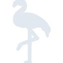
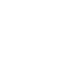

# silverairways

[← Back to main README](../../README.md)

<table><tr>
  <td></td>
  <td></td>
  <td></td>
</tr></table>

## 16 px

### black
```
https://georgegach.github.io/compatible-icons/simple-icons/compat/silverairways/16/black.png
```

### slate
```
https://georgegach.github.io/compatible-icons/simple-icons/compat/silverairways/16/slate.png
```

### white
```
https://georgegach.github.io/compatible-icons/simple-icons/compat/silverairways/16/white.png
```

## 64 px

### black
```
https://georgegach.github.io/compatible-icons/simple-icons/compat/silverairways/64/black.png
```

### slate
```
https://georgegach.github.io/compatible-icons/simple-icons/compat/silverairways/64/slate.png
```

### white
```
https://georgegach.github.io/compatible-icons/simple-icons/compat/silverairways/64/white.png
```

## 128 px

### black
```
https://georgegach.github.io/compatible-icons/simple-icons/compat/silverairways/128/black.png
```

### slate
```
https://georgegach.github.io/compatible-icons/simple-icons/compat/silverairways/128/slate.png
```

### white
```
https://georgegach.github.io/compatible-icons/simple-icons/compat/silverairways/128/white.png
```

## 512 px

### black
```
https://georgegach.github.io/compatible-icons/simple-icons/compat/silverairways/512/black.png
```

### slate
```
https://georgegach.github.io/compatible-icons/simple-icons/compat/silverairways/512/slate.png
```

### white
```
https://georgegach.github.io/compatible-icons/simple-icons/compat/silverairways/512/white.png
```

## 1024 px

### black
```
https://georgegach.github.io/compatible-icons/simple-icons/compat/silverairways/1024/black.png
```

### slate
```
https://georgegach.github.io/compatible-icons/simple-icons/compat/silverairways/1024/slate.png
```

### white
```
https://georgegach.github.io/compatible-icons/simple-icons/compat/silverairways/1024/white.png
```

## 16 px in base64

### black
```
data:image/png;base64,iVBORw0KGgoAAAANSUhEUgAAABAAAAAQCAYAAAAf8/9hAAAABmJLR0QA/wD/AP+gvaeTAAAA40lEQVQ4jaXSMUqDQRQE4A+jIJoL2CroBewFW1PmAN7BGwi2BmtrQSG9gaBgkQtICgs7hWCKBBSJSTCx2C1+f0k2fxx47A7szHs7PH7jDEMMcGUJ3OMEj+guIljJ8UN8YheNZSaoCF/4whPauMbeogYPeIs1zVQHl1hNGdyij3HOYCoEe4e1rKCUM2jhQMhmgHI8O5gI2WyimZpkIz4e4wLrOI78NSXO4gM97ERew3lRgxZeIt/KmM1ECdUonKCO/SJdT/GMI4yEIAvhBtvx/u7vthZCP/Ug5f79n+41YYnmNvkBpEY28Krs1mcAAAAASUVORK5CYII=
```

### slate
```
data:image/png;base64,iVBORw0KGgoAAAANSUhEUgAAABAAAAAQCAYAAAAf8/9hAAAABmJLR0QA/wD/AP+gvaeTAAABgElEQVQ4jZ2QP08UURTFz7kDFq5xwWRYCLBCA3wBC4kJiYk20tgSvwAV0cLCxsSExoYPQE1Jp4l22lOaEKIm8CSZt0OxMxJY/uy8Y6PJAJld5HT35uR3zr1ASS7NVl2Sne75rON8voFryMqDCjyE2RsS3wk9+W/A/bGhxyjCEQJngvTpOgCWhz3/e5EKmyAlahdBXYLfomBvx8fv7vQHJO2vIOcMhKCRks0L+tBs1JdJditPoNkxiVuA7l3M0SjBF/ut/POWNFgJKEJYJrgNKRHg/1bsQHCADiU+in2+WgmYHhvenWzU5yN15qLIFgB2Q9B6cVKfhfSaBqNpqfIHl/WrlR0q4ByGB83G0E+X5msIQc3R4Vf/PAO9AJIgYZvgFwCTgQPvjee3y54rAEmR8/lzM76UVDMiUYEVAJiKa0mvQACAS9rvnM9+7B/kz1wrO0vT9E4vv11eiJwV8XQirn8UcBLH8XHf1Mo2razdz3OlwQUFFDcGOJ+vgaxJ6hnyB1Rmqmk4D07kAAAAAElFTkSuQmCC
```

### white
```
data:image/png;base64,iVBORw0KGgoAAAANSUhEUgAAABAAAAAQCAYAAAAf8/9hAAAABmJLR0QA/wD/AP+gvaeTAAAA5klEQVQ4jZ3QzSpFYRjF8WcflHADZqKOG3AFpgxdgHtwB8rEwMnYWFHmTCgDLkAGBiY+Ss7AKeL4iJ/Jo3apvfc5q956V73r/zzrjSgJG/hAH7sxqHCCNVyg2yTTKpuiKBYj4jUi2hFxNMwGy1nhHVe4xB7mmwJO8ZinrAfsYLQOcIgevvxXH8cYqwLM4By3ORXecINu1ttsUmUC7dxkG+NYTX/f6D8S9IInzKXvYGtQwBnu0k//wapCI1jJ4A8OsDDI1HVcYwmfmGocTsA+ZvP+jFZdpgrWq3tTR/8eGoBOREzWVfgFnccnRp9ETpIAAAAASUVORK5CYII=
```

