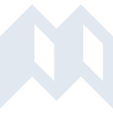

# siyuan

[← Back to main README](../../README.md)

<table><tr>
  <td></td>
  <td></td>
  <td></td>
</tr></table>

## 16 px

### black
```
https://georgegach.github.io/compatible-icons/simple-icons/compat/siyuan/16/black.png
```

### slate
```
https://georgegach.github.io/compatible-icons/simple-icons/compat/siyuan/16/slate.png
```

### white
```
https://georgegach.github.io/compatible-icons/simple-icons/compat/siyuan/16/white.png
```

## 64 px

### black
```
https://georgegach.github.io/compatible-icons/simple-icons/compat/siyuan/64/black.png
```

### slate
```
https://georgegach.github.io/compatible-icons/simple-icons/compat/siyuan/64/slate.png
```

### white
```
https://georgegach.github.io/compatible-icons/simple-icons/compat/siyuan/64/white.png
```

## 128 px

### black
```
https://georgegach.github.io/compatible-icons/simple-icons/compat/siyuan/128/black.png
```

### slate
```
https://georgegach.github.io/compatible-icons/simple-icons/compat/siyuan/128/slate.png
```

### white
```
https://georgegach.github.io/compatible-icons/simple-icons/compat/siyuan/128/white.png
```

## 512 px

### black
```
https://georgegach.github.io/compatible-icons/simple-icons/compat/siyuan/512/black.png
```

### slate
```
https://georgegach.github.io/compatible-icons/simple-icons/compat/siyuan/512/slate.png
```

### white
```
https://georgegach.github.io/compatible-icons/simple-icons/compat/siyuan/512/white.png
```

## 1024 px

### black
```
https://georgegach.github.io/compatible-icons/simple-icons/compat/siyuan/1024/black.png
```

### slate
```
https://georgegach.github.io/compatible-icons/simple-icons/compat/siyuan/1024/slate.png
```

### white
```
https://georgegach.github.io/compatible-icons/simple-icons/compat/siyuan/1024/white.png
```

## 16 px in base64

### black
```
data:image/png;base64,iVBORw0KGgoAAAANSUhEUgAAABAAAAAQCAYAAAAf8/9hAAAABmJLR0QA/wD/AP+gvaeTAAABAElEQVQ4jZ3SO0pDQRQG4E9RkJSpLSzSuAMLd+AWrIybEAKuRzfgGtRGxMJOjWl8RG18JJBcC8/F43gTxAPDHeaf891hGH5Xp2HtLxno4gm9hqwXWXde8z0+8FwgPTxiFN9fyA7uUOEqxks07gVc4Qa3GGK3/HMV4xLruI6TDFN2hg0M8kke0oYakJCqACRkqNiQAdieAcA+qsXyMooazcnG0AQsx2iqFSzkhSZgDUczkA4OM1ICFV6xGchSyiZ4wxYOMlJf0BQXWMWxrwc1iGyC08jO8e773fxobgfawkkgk5i3ImvH3nENlM0KJDfXVSNT6Dc0Z6Rszki/nvy32p/Yb2AplbYgjgAAAABJRU5ErkJggg==
```

### slate
```
data:image/png;base64,iVBORw0KGgoAAAANSUhEUgAAABAAAAAQCAYAAAAf8/9hAAAABmJLR0QA/wD/AP+gvaeTAAAByElEQVQ4jY2ST2tTQRTFz5kkUCI1NG2kPBLIoqt8hlLrUsSF4CewG3cqLrrpvv77BvoFFPfZiispitRFiqAgb8LjJQvJCA3a5t3jwjx8TV/FsxrmnPubO3cGWJAfh43FvX957kwgnexIOojTsLcYjNOwJ+nAp5OdUsDc2IdYB/WwCPmz1n0YLwl8XIQQAOLxjzvKbJ/EFQDfRADSCg3PnKtkgj0Q0AIQQ3Ag6oTb7axffsH85HkAEj5LlVt0WZ9EQyYj2QQAEocU7xr1GuISoV0n8FFenKsbLR/JKtclhLw4V3u98c6Jt0H9FPDEAVorm3g3Wj5y5Llh5hCCzwE0XVkgl5l+XeRRPAEWnnF+z9p7qVYKBJYksbhX1kG3NQr9MgjFjeE4vCpC3LkIcExwszWa9ElWC2ZGaCrpxnAcXtr8C7hiMYABZ1kP0CHhNgF7+rd7fuQs64H8YoabhN0rACjBBjzFVru9Oqza9BqkT4BbA2AQPlTt+Gq7vTrkCbdBfTVgBQDoR8FMNnCnbqvTaXzP+0mSpD5j/Q0AVDXdjqJomnveh6bV7K2j6yFOJ7H34cxnKUKSJKmXed6HZpxOYlxU/D/yPjR/Ayx36vyR1lT1AAAAAElFTkSuQmCC
```

### white
```
data:image/png;base64,iVBORw0KGgoAAAANSUhEUgAAABAAAAAQCAYAAAAf8/9hAAAABmJLR0QA/wD/AP+gvaeTAAABGElEQVQ4jY2SO07DQBRFLyiRkEvXFBRp2AEFO2ALqTCbQIrEemADWQPQRIjCHSGkIWCg4ZNIzqHwG/My2FauZNmaM/d4xh4pCjCIx7ZhYUIGvAGjBjYylnWVF8AP8O4lVn4FlnbP4vIp8EyVB7s+rHhuYoBH4AkogLP4zSE5cAhMbSWFYxPgCJjXKwFe2Exu4iDxmRgLkkL8T+62NmwSGLsA2O38LdKyg60kqUnQB/otpT1gxw80CQ4kjVskA0lXXhILkPQp6VjSWFLPsVLSl6QTSZeSKon7QGvgHtgHrqkO1NxYCdwauwO+sXOjqJyaNAFuTFLac2IstbmrINgo13v5k9Rlx4JkLWAWlyNJ0sJSYKa28jYB0l/ZhNi+9gsD8gAAAABJRU5ErkJggg==
```

