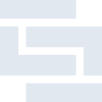
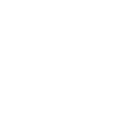

# skaffold

[← Back to main README](../../README.md)





## 16 px

### black
```
https://georgegach.github.io/compatible-icons/simple-icons/skaffold/16/black.png
```

### slate
```
https://georgegach.github.io/compatible-icons/simple-icons/skaffold/16/slate.png
```

### white
```
https://georgegach.github.io/compatible-icons/simple-icons/skaffold/16/white.png
```

## 64 px

### black
```
https://georgegach.github.io/compatible-icons/simple-icons/skaffold/64/black.png
```

### slate
```
https://georgegach.github.io/compatible-icons/simple-icons/skaffold/64/slate.png
```

### white
```
https://georgegach.github.io/compatible-icons/simple-icons/skaffold/64/white.png
```

## 128 px

### black
```
https://georgegach.github.io/compatible-icons/simple-icons/skaffold/128/black.png
```

### slate
```
https://georgegach.github.io/compatible-icons/simple-icons/skaffold/128/slate.png
```

### white
```
https://georgegach.github.io/compatible-icons/simple-icons/skaffold/128/white.png
```

## 512 px

### black
```
https://georgegach.github.io/compatible-icons/simple-icons/skaffold/512/black.png
```

### slate
```
https://georgegach.github.io/compatible-icons/simple-icons/skaffold/512/slate.png
```

### white
```
https://georgegach.github.io/compatible-icons/simple-icons/skaffold/512/white.png
```

## 1024 px

### black
```
https://georgegach.github.io/compatible-icons/simple-icons/skaffold/1024/black.png
```

### slate
```
https://georgegach.github.io/compatible-icons/simple-icons/skaffold/1024/slate.png
```

### white
```
https://georgegach.github.io/compatible-icons/simple-icons/skaffold/1024/white.png
```

## 16 px in base64

### black
```
data:image/png;base64,iVBORw0KGgoAAAANSUhEUgAAABAAAAAQCAYAAAAf8/9hAAAABmJLR0QA/wD/AP+gvaeTAAAAqklEQVQ4jZXSywpBURTG8R+dXMobKAPP4L2UF/AMXsxYwkiZGIncCgM7Ttqc5V+rXd/uW3tddg1X3MTYolsWihRRTp9CgQ2OwQS1Px6LZ1zhjAMGmKIR9DfhnmKexGVJq4z6t6xRchsYo1PhG6EH5QqaGFaY95h4zuxFuF+sk2fuxwx+cf4UCixyF1+4pHOHmT8HniX3NVee/UVo59Z4Rz9aQS5By7vXKuoPmUA0+S4oWZsAAAAASUVORK5CYII=
```

### slate
```
data:image/png;base64,iVBORw0KGgoAAAANSUhEUgAAABAAAAAQCAYAAAAf8/9hAAAABmJLR0QA/wD/AP+gvaeTAAAA5UlEQVQ4jZWSQUoDQRBF328aR0GI7iLCiJ7BewlewCvoAbySa0EJZEASQcggik7E+S7cJNMylH/54XU9ukrNc/vlnp5AJL3U08nxZpcxWYrgAP4cNhlpAf6I8YRHhaNm2c4Enc17fXRwPl+s7lJKOyEhu8rAqQHEA4Ckie2zqEEqlEQVhQHysPg2V8L7Y5DMJVK9bWBX8+XqYgw2ejuZHt4gdaWBVAuuxyYn8QTcbnVjQGFgumGXgUdtKI2l7/v170u8Styb/334nylOs1m2M4SD+F6xRsCY4CG5vAPQru11aH4i/QDlFEx5faEn8AAAAABJRU5ErkJggg==
```

### white
```
data:image/png;base64,iVBORw0KGgoAAAANSUhEUgAAABAAAAAQCAYAAAAf8/9hAAAABmJLR0QA/wD/AP+gvaeTAAAAt0lEQVQ4jZWSQQoCMQxFX4biKAgeQBD0DN5L8AKewYu5FhVXghtXougo+F1MRRmrk3lQSlP+b5rEJN2BBz4OZtb/DIS4vFyrgQDsgYvTwBo85nSUtAUK4GxmY0kLoOXU5wEYxsM67j1g5M0gS7l6xZDuwAzo1uimwKCaQS5pUiM+mdmcsmYlasYualavQKoG/yiqgQBsUhc/uMX9CCxpWPAkX6MZB0tOfSfVRtFgkFIGbd5/rSN7AmiGY03lC0MbAAAAAElFTkSuQmCC
```

