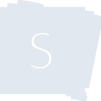

# slides

[← Back to main README](../../README.md)





## 16 px

### black
```
https://georgegach.github.io/compatible-icons/simple-icons/slides/16/black.png
```

### slate
```
https://georgegach.github.io/compatible-icons/simple-icons/slides/16/slate.png
```

### white
```
https://georgegach.github.io/compatible-icons/simple-icons/slides/16/white.png
```

## 64 px

### black
```
https://georgegach.github.io/compatible-icons/simple-icons/slides/64/black.png
```

### slate
```
https://georgegach.github.io/compatible-icons/simple-icons/slides/64/slate.png
```

### white
```
https://georgegach.github.io/compatible-icons/simple-icons/slides/64/white.png
```

## 128 px

### black
```
https://georgegach.github.io/compatible-icons/simple-icons/slides/128/black.png
```

### slate
```
https://georgegach.github.io/compatible-icons/simple-icons/slides/128/slate.png
```

### white
```
https://georgegach.github.io/compatible-icons/simple-icons/slides/128/white.png
```

## 512 px

### black
```
https://georgegach.github.io/compatible-icons/simple-icons/slides/512/black.png
```

### slate
```
https://georgegach.github.io/compatible-icons/simple-icons/slides/512/slate.png
```

### white
```
https://georgegach.github.io/compatible-icons/simple-icons/slides/512/white.png
```

## 1024 px

### black
```
https://georgegach.github.io/compatible-icons/simple-icons/slides/1024/black.png
```

### slate
```
https://georgegach.github.io/compatible-icons/simple-icons/slides/1024/slate.png
```

### white
```
https://georgegach.github.io/compatible-icons/simple-icons/slides/1024/white.png
```

## 16 px in base64

### black
```
data:image/png;base64,iVBORw0KGgoAAAANSUhEUgAAABAAAAAQCAYAAAAf8/9hAAAABmJLR0QA/wD/AP+gvaeTAAAA9ElEQVQ4jZ3RPUoEQRAF4G9WmVEWMTIz8gyewmt4BK9irIaGmq+ZKxiIsSsGKxqJ+AOCuuOMQffAsvSM6z4ouumuevVeFQF72EeJGxxj1xzIMMIKclSYxLPCe6KmwBCHuMhQz9NpBh+x0dmiBC9YxaTXkfTZQZ4Jlt+WWwpH8d7HpuB7GoVgIUnwjAfsdKgr8IVxysKasIFLPLYQ9ITNDQg+Z+MHYxxENamcGtspgjIS1LjCXUtxiTw1gydhz0sxcaPFxj2+uyy8TilJxSmkFDRDWm/5azBoEhdBhfNGwa3g+S/0hRXnOMH1f7tu4UgY8rB5/AX5hVn1HPOFkQAAAABJRU5ErkJggg==
```

### slate
```
data:image/png;base64,iVBORw0KGgoAAAANSUhEUgAAABAAAAAQCAYAAAAf8/9hAAAABmJLR0QA/wD/AP+gvaeTAAABTElEQVQ4jZWRPy8DUBTFf+eRtoloGVCJNGUQSQffwsAXsdt9E/EVzNTkT2JqwlaRaEMQEUqaaKvvGLDoa8od37vnd869VwDXd89bARZBmwpcydQ+4KBcnNphRKl536qDc6AMEHHsIUUgSrz+FthkjU+ssd3yXP5UzfsXj3IZcIW2oWdxGP4rBrDoYnLBrA0HmHehdDojiQyiNZ4I+I5dR8ZiwpEFieyvpmw0PaxBgIlPKNwI1jFICQvIAh3LjYERhCYDMQqdIW5TMxiCcU6omtpB3mgdez6YffBtag2SRPRRAuA+EhalvlkV6qQAiP7bc+E8tcRH7LZhTEE2nknewjQrFXUTAIpABN6wS4Ihp/YFQAoAEASFIX9fOUOowlD6yIp94vF3Al1Kbv9BNGFrEpzB7JVnp2sA46ViYfkvlo2HlyWJbSIbkld+3j8BvseFrkIAiAcAAAAASUVORK5CYII=
```

### white
```
data:image/png;base64,iVBORw0KGgoAAAANSUhEUgAAABAAAAAQCAYAAAAf8/9hAAAABmJLR0QA/wD/AP+gvaeTAAABDUlEQVQ4jZ2RMUqDQRCFv/kj+dUg2giCYpE7eAULr+ERvIq9lpYeIOmMYKOFVZIqolUQURHUmP9ZzP4gMhtjXrPL7sx78+YBIOlI0rGkL0l9SWeSDpkDJmkALANNoAIm6ayAl6CnBHrAiZldmiTNo/QLb0mouyjBE7ACTIoZRe9Ajtxwy89LmcZBureAHdz3T5S4hZDgEbgHDmZMVwIfwCiysIYncAU8ZAgKPLlObolVmqIL7APbGaK9iGCKL6kAroENoB00T4HVaAdjPOcGnsJmRv3OzD4jgq1k4RXYTZNEuAWICEhN65m/Gp26cBFUwEU9wRD3/BdaeMRN4NzMbv4lKakt6VTSWFKvfv8GaJFmWS6X5N4AAAAASUVORK5CYII=
```

