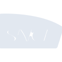
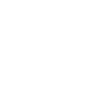

# sncf

[← Back to main README](../../README.md)





## 16 px

### black
```
https://georgegach.github.io/compatible-icons/simple-icons/sncf/16/black.png
```

### slate
```
https://georgegach.github.io/compatible-icons/simple-icons/sncf/16/slate.png
```

### white
```
https://georgegach.github.io/compatible-icons/simple-icons/sncf/16/white.png
```

## 64 px

### black
```
https://georgegach.github.io/compatible-icons/simple-icons/sncf/64/black.png
```

### slate
```
https://georgegach.github.io/compatible-icons/simple-icons/sncf/64/slate.png
```

### white
```
https://georgegach.github.io/compatible-icons/simple-icons/sncf/64/white.png
```

## 128 px

### black
```
https://georgegach.github.io/compatible-icons/simple-icons/sncf/128/black.png
```

### slate
```
https://georgegach.github.io/compatible-icons/simple-icons/sncf/128/slate.png
```

### white
```
https://georgegach.github.io/compatible-icons/simple-icons/sncf/128/white.png
```

## 512 px

### black
```
https://georgegach.github.io/compatible-icons/simple-icons/sncf/512/black.png
```

### slate
```
https://georgegach.github.io/compatible-icons/simple-icons/sncf/512/slate.png
```

### white
```
https://georgegach.github.io/compatible-icons/simple-icons/sncf/512/white.png
```

## 1024 px

### black
```
https://georgegach.github.io/compatible-icons/simple-icons/sncf/1024/black.png
```

### slate
```
https://georgegach.github.io/compatible-icons/simple-icons/sncf/1024/slate.png
```

### white
```
https://georgegach.github.io/compatible-icons/simple-icons/sncf/1024/white.png
```

## 16 px in base64

### black
```
data:image/png;base64,iVBORw0KGgoAAAANSUhEUgAAABAAAAAQCAYAAAAf8/9hAAAABmJLR0QA/wD/AP+gvaeTAAAA1klEQVQ4jdXRTUoDURAE4G/UgAsJIrp05+08gBcQPIYL1249iQvBjT8YFSPEaNBxYsZFamAMQmabgkfz+nVXV/Vj5VHgGL3cn/GGa9ziAdNlBLPENsaYoEp8xAXOcbNIUnc8PyG6xBH6jYK6m9s/mJrbO20UjPGSKRVGyQ+Te43VGb5aqiZrYRzhI82fKHGfxrPUFBlS4j25YUOwj008JfYTCxxgJ3XfCwR3RfwUUVDmYS/Tesntpq7CVovssNlBHX9df6TGANsbOMH6f6tegivz3a06fgGroFgMd+ab3gAAAABJRU5ErkJggg==
```

### slate
```
data:image/png;base64,iVBORw0KGgoAAAANSUhEUgAAABAAAAAQCAYAAAAf8/9hAAAABmJLR0QA/wD/AP+gvaeTAAABH0lEQVQ4jdWRzUpCYRRF1/60lAjrFg4cNBBq0nMGPULDCMdNe5agSVmRWcJNs/Lnnt1AiTAKm9UaHtjrbM6Bf49uuvlBYVYAhO/DekrhiylcNRubt5KmPwranTwALcz7oKHwxGgodGdxVkRx2mxkl4sCL9k2gC6oJ6v1tjo52tve7v9G8Jmp0C2KY7U7uQ2DBCPDFlJghuANQQ/IbHJEBmAzlqjMRS8JQHYe8Iw1MX41HmGubfdst4wBJPSAGAkPZnk/ptkltCNTlaKDVRWqSaqiJBK7krZm2z0WjFAazNu0y0ABCLFmpZLsHKgbBhZ1QjXhwkpTKTZB67axNU7i5OOIBuvrO7/F6C4qsV8mOHSJ0lyyNBFx3syy/BeRv8o7a1ibX0hvbewAAAAASUVORK5CYII=
```

### white
```
data:image/png;base64,iVBORw0KGgoAAAANSUhEUgAAABAAAAAQCAYAAAAf8/9hAAAABmJLR0QA/wD/AP+gvaeTAAAA3UlEQVQ4jdXRuy7EYRAF8N9gQyErhFKn8moewAtIPIZCrfUkConGJZslSJZdhF07mvkni8RlK05z5pvLmcvHv0dk5g5a9b7CHU5whk5EjL4TGCM++O/xgGFxF4c4iIjTd5n5c7xmZjczjzJzOzPbzQQ5xeojdLDXCPTxjBWMa+wl3GIZvWJ4wXzZjzNl9DConZ9K7KIE9pt74bpi/fLdNALrWMBlcbs4sFGTNd0nBc4jM0eVOKggrFW3VvlWa+8hFifEtiaPmD5/51foYnMOu5j9RWGD44joTVH31/AG9RmEdkRUSIQAAAAASUVORK5CYII=
```

