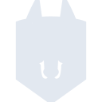

# snyk

[← Back to main README](../../README.md)

<table><tr>
  <td></td>
  <td></td>
  <td></td>
</tr></table>

## 16 px

### black
```
https://georgegach.github.io/compatible-icons/simple-icons/compat/snyk/16/black.png
```

### slate
```
https://georgegach.github.io/compatible-icons/simple-icons/compat/snyk/16/slate.png
```

### white
```
https://georgegach.github.io/compatible-icons/simple-icons/compat/snyk/16/white.png
```

## 64 px

### black
```
https://georgegach.github.io/compatible-icons/simple-icons/compat/snyk/64/black.png
```

### slate
```
https://georgegach.github.io/compatible-icons/simple-icons/compat/snyk/64/slate.png
```

### white
```
https://georgegach.github.io/compatible-icons/simple-icons/compat/snyk/64/white.png
```

## 128 px

### black
```
https://georgegach.github.io/compatible-icons/simple-icons/compat/snyk/128/black.png
```

### slate
```
https://georgegach.github.io/compatible-icons/simple-icons/compat/snyk/128/slate.png
```

### white
```
https://georgegach.github.io/compatible-icons/simple-icons/compat/snyk/128/white.png
```

## 512 px

### black
```
https://georgegach.github.io/compatible-icons/simple-icons/compat/snyk/512/black.png
```

### slate
```
https://georgegach.github.io/compatible-icons/simple-icons/compat/snyk/512/slate.png
```

### white
```
https://georgegach.github.io/compatible-icons/simple-icons/compat/snyk/512/white.png
```

## 1024 px

### black
```
https://georgegach.github.io/compatible-icons/simple-icons/compat/snyk/1024/black.png
```

### slate
```
https://georgegach.github.io/compatible-icons/simple-icons/compat/snyk/1024/slate.png
```

### white
```
https://georgegach.github.io/compatible-icons/simple-icons/compat/snyk/1024/white.png
```

## 16 px in base64

### black
```
data:image/png;base64,iVBORw0KGgoAAAANSUhEUgAAABAAAAAQCAYAAAAf8/9hAAAABmJLR0QA/wD/AP+gvaeTAAABDUlEQVQ4jZXSPUoDURQF4M8Y/1AhiGJpa2OhoIK2gezCzgW4rYDgJtKkEQtxASpElBSBKdTEsZg7MjEviR44vDvnnbl/M6TxgFbluRXaBGoJrYl9HFa0o9CaUwqO4Q45urgKdkO7nfXiJXph/IhzFPys3PXCOzHCMRoRL1XuB8H10BrhBfVfXaxExQEWsVlJCsPw/CC1xBwLeI8TXhO+ZAelVsOOYnYRl8nHkOoAMsUoX8HRfzroYxf32A7tDXuKHWzN66BcUrvSQRvLwbkjZKGfKT5nHeeKfyOblaCDl6gIJ1jFGg4izsPTSRQGp3gOYx4Vs4iHeIrEM7GBa8Uyy0R93MTdn3GBx+DFNNM3oXVENDOjBfIAAAAASUVORK5CYII=
```

### slate
```
data:image/png;base64,iVBORw0KGgoAAAANSUhEUgAAABAAAAAQCAYAAAAf8/9hAAAABmJLR0QA/wD/AP+gvaeTAAABnElEQVQ4jX2QvW4TURSEv7n4j3+DiA1IEW0aiiCFSFAhRUpNapSOx6CiRDwBFS0FD4GUhh6ljq3IXgOJ18IIE+8dil1D8HpzqntHn+bMGVgx/UF62EvS3cW/l6S7/UF6uIoNy8JxMt6xvGF7c6HZfmR54zgZ7yzztWUhM28BZPZ6w9NZIT+3TZTeAJvnef2NPZy8tONrRNfSmey6IAJYira/C7qYRAqv1u/eePffCZH5FqKdb3cdwBAiTIieSFwtVrYj862qE5qSMuOJzSXMdYk2yt2AOdC8sERs21aAmZSfKPha4qpKNNQkBZs1w1khrxWVeRGlOgGANQVnQlEogrPc3CW0lABzgtxF+oK5ky/WN8wDmTni9sUJRFMA9gdwBMf8rQaisYyXDAxTQ8B6YlMH1aL91Pg3aFppEK0DpAQUC+kxomV8OSg8xLRyfyXROvgX+Nz0h+m2iR9B94s8PwvsCpCBh3LYW7938/NKA4DRaHTtV9Z4T+AZ5lZBnWJ9aoXZi06n86PU26o5StL93mDc7w3G/aMk3a/i/gAJo8EdB+MKFwAAAABJRU5ErkJggg==
```

### white
```
data:image/png;base64,iVBORw0KGgoAAAANSUhEUgAAABAAAAAQCAYAAAAf8/9hAAAABmJLR0QA/wD/AP+gvaeTAAABH0lEQVQ4jZWRzUqCURCGn8z+yEAiadnWTYuCDGobuK4LcOfVRDciBN2ElxBeQAVG4SJw4V9PC8c62jHphWHme2fmnZnzQQZqR60n33W1k6stZJqvgCpwktCnQDVycyhmRO/C36iDiK/D3y4Iz01uql2nGIafhI2SXFdt5k44A8oRbyT5j7Dd4MpRmz1hC5hEwzqwl4gCjKPmG78eERBYAwbhAd6yd2c2mHEFoAKMgqsk4nPIbQDQZ3rKZ9jkPxv0gEPgETgI7h04YvoG+6s2mD1SK9mgBWyGrTyhH/wF099ZBC6BYeSWCrSB15gIUAO2gR3gOGKjpp0ZDOq5+uIP+mGqY/VZrWWbE5GSeq/2EqGe+qCW/mxeEGqoT2GNZXVfyfe7jspVezMAAAAASUVORK5CYII=
```

