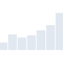
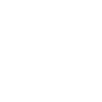

# socialblade

[← Back to main README](../../README.md)





## 16 px

### black
```
https://georgegach.github.io/compatible-icons/simple-icons/socialblade/16/black.png
```

### slate
```
https://georgegach.github.io/compatible-icons/simple-icons/socialblade/16/slate.png
```

### white
```
https://georgegach.github.io/compatible-icons/simple-icons/socialblade/16/white.png
```

## 64 px

### black
```
https://georgegach.github.io/compatible-icons/simple-icons/socialblade/64/black.png
```

### slate
```
https://georgegach.github.io/compatible-icons/simple-icons/socialblade/64/slate.png
```

### white
```
https://georgegach.github.io/compatible-icons/simple-icons/socialblade/64/white.png
```

## 128 px

### black
```
https://georgegach.github.io/compatible-icons/simple-icons/socialblade/128/black.png
```

### slate
```
https://georgegach.github.io/compatible-icons/simple-icons/socialblade/128/slate.png
```

### white
```
https://georgegach.github.io/compatible-icons/simple-icons/socialblade/128/white.png
```

## 512 px

### black
```
https://georgegach.github.io/compatible-icons/simple-icons/socialblade/512/black.png
```

### slate
```
https://georgegach.github.io/compatible-icons/simple-icons/socialblade/512/slate.png
```

### white
```
https://georgegach.github.io/compatible-icons/simple-icons/socialblade/512/white.png
```

## 1024 px

### black
```
https://georgegach.github.io/compatible-icons/simple-icons/socialblade/1024/black.png
```

### slate
```
https://georgegach.github.io/compatible-icons/simple-icons/socialblade/1024/slate.png
```

### white
```
https://georgegach.github.io/compatible-icons/simple-icons/socialblade/1024/white.png
```

## 16 px in base64

### black
```
data:image/png;base64,iVBORw0KGgoAAAANSUhEUgAAABAAAAAQCAYAAAAf8/9hAAAABmJLR0QA/wD/AP+gvaeTAAAAtUlEQVQ4jdXQPWoCcRQE8J+6KFilSBGsRdJYWJg2uYDnySVsvUIu4AG8gVgJfpRioWYJQZEEYS38B0QXVLaJ0z1m3ryZx90jl2G3i0qW4yMk+SwOEN2or6ON5a0GL3hCFW+YYXdq8Ioi+vh0eHA5cB00MAlzkpbgAw9BnMMC74GLUUiLFqGJH2zxiBaeMcXvpW4Relj9dTpCci5PNxhhjhK+MMAGQ9SCbozvIy4OqdfXHPnn2ANAqSNRdZflXAAAAABJRU5ErkJggg==
```

### slate
```
data:image/png;base64,iVBORw0KGgoAAAANSUhEUgAAABAAAAAQCAYAAAAf8/9hAAAABmJLR0QA/wD/AP+gvaeTAAAA+klEQVQ4jdWQSy6DYRiFn/P+DWIgBgYiHUpjYmDAlA1Yj02Ydgs2YAF2IB1JXAaq4m9d/qpopKXfMdBGiEvaEc/8fc45L/x7NOlhvdnel2KpNHGyVQFXYlLBiLEaNJrFqpXtmnRDGkPQyDsbVlq0WLbZEroEXj4IGnl7M4Wmsuc4LJfn7myr1WrNAvTtKtKaEqfGKLD9qYHFnsz8IEvV87xQvdm5Ds3sACgobLIvf3CRd9YVgx7oKSUWAratWAHOQP2h/tt5JZQOUorbiLdNI6T3mj9RQnEM6crWtEL3dqphdZGPQJVhgxOsB8s1Kbq2C8s9KR5/j/jzvAKA9XDdrQIdngAAAABJRU5ErkJggg==
```

### white
```
data:image/png;base64,iVBORw0KGgoAAAANSUhEUgAAABAAAAAQCAYAAAAf8/9hAAAABmJLR0QA/wD/AP+gvaeTAAAAuklEQVQ4jdXPu0lDYQAF4O/XSwQrCwuxDmJjYaGtLuA8LpE2K7iAA7iBWAmJlmLhI4googSOzX8hQiDmVnra8+bfo3Q1JjnHdufmJKMkWemcUNEs2bqHAR6XCkhyiC30cYw7TH8EJDlCD5ellOckBeuVHmIfN6183oIzbGBYzQ84rdwEq/PWNUkO8IkPbOIEu7jF16J7DS7w1H6avb7I3AaMcI81vOAK77jGTtWN8TrDTerqt9+U/HF8AwYZPjmxINe3AAAAAElFTkSuQmCC
```

