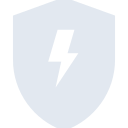
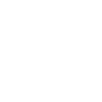

# socket

[← Back to main README](../../README.md)





## 16 px

### black
```
https://georgegach.github.io/compatible-icons/simple-icons/socket/16/black.png
```

### slate
```
https://georgegach.github.io/compatible-icons/simple-icons/socket/16/slate.png
```

### white
```
https://georgegach.github.io/compatible-icons/simple-icons/socket/16/white.png
```

## 64 px

### black
```
https://georgegach.github.io/compatible-icons/simple-icons/socket/64/black.png
```

### slate
```
https://georgegach.github.io/compatible-icons/simple-icons/socket/64/slate.png
```

### white
```
https://georgegach.github.io/compatible-icons/simple-icons/socket/64/white.png
```

## 128 px

### black
```
https://georgegach.github.io/compatible-icons/simple-icons/socket/128/black.png
```

### slate
```
https://georgegach.github.io/compatible-icons/simple-icons/socket/128/slate.png
```

### white
```
https://georgegach.github.io/compatible-icons/simple-icons/socket/128/white.png
```

## 512 px

### black
```
https://georgegach.github.io/compatible-icons/simple-icons/socket/512/black.png
```

### slate
```
https://georgegach.github.io/compatible-icons/simple-icons/socket/512/slate.png
```

### white
```
https://georgegach.github.io/compatible-icons/simple-icons/socket/512/white.png
```

## 1024 px

### black
```
https://georgegach.github.io/compatible-icons/simple-icons/socket/1024/black.png
```

### slate
```
https://georgegach.github.io/compatible-icons/simple-icons/socket/1024/slate.png
```

### white
```
https://georgegach.github.io/compatible-icons/simple-icons/socket/1024/white.png
```

## 16 px in base64

### black
```
data:image/png;base64,iVBORw0KGgoAAAANSUhEUgAAABAAAAAQCAYAAAAf8/9hAAAABmJLR0QA/wD/AP+gvaeTAAABGUlEQVQ4jYXSvUoDURAF4E8xChrQRtAUiiAINiKIhYXvIoi+hoVPYG0piKWlYG9lZ2G0MQaNv4URAy7BWOxNXG5244ELe2fmnLN3ZuhHBXu4QgNvqGI/5HIxgW1coIY2OtH5wRMusYtyVmAHSQ6p6CRBxEgQGEIp+qtP3IXiRUxmcqXA6Qnk4R1r4Tm3kUAPwwME7oP7OqaKiooE2jgJ37N4RWuQQBLFX/CBZZziC+M5Jr0ePAeR0XCfxiEO0MRSRE6kO9LDQghkR9XEFur6x/iIufg51aioLt3GvD24jnsAx1EvypiPXfCNo5y4MdxkXFoF7lV/verDKh4KiJ2QWykid7EpXaKYXMPGf+QuKjiXTqaBM8zkFf4CNjho4UvkbV4AAAAASUVORK5CYII=
```

### slate
```
data:image/png;base64,iVBORw0KGgoAAAANSUhEUgAAABAAAAAQCAYAAAAf8/9hAAAABmJLR0QA/wD/AP+gvaeTAAABwUlEQVQ4jZWTTWtTYRCFn/Pem0htoCmSG+yHIlgVs5X+Ej8oLlwI4j8RXKoIiitRRFz5S0RdaHcmtW3SELFJFXub3OMisflqFs5yOHPmmZn3FRNRazaXlMX3nHGdEM7Yzsm0iHiHjp6eK5V2RvUCqNfr83/IbUREdw1LwDIQjTnbtrQnsW2y53Pqvk6S5CAGOMzyt0MUPbGdmyQatpIEZUxZih6nDgDP4mOSiWKLjuxvSKnNRcHCCE0O9enDzI6m1WkVr60mC+tAa5ZspoHkWqWidLvRXpcp/peBRDfL/LY/SnZWgabg90wDSeloMrP3ohDtV3c7V1eS4vss45fh9Kim614XIAYQoWGcAvmBYcnmBfQebTcO2pIvDy4OgE0K8e4xQU/+YvgxVJATPhL+avXug+bHR1Qr797nfvNBbDV+btpcOhaZ75b2wZUTdrS5Wi5eGVtiht/00QYQogA+P702HdrRq7ElAqTt4gOJ6ojyFFCYqrernVbh4ZTB2poOo+BboH+fZW6qFu+E4JuVyvBqY+9gOVn80A1hA7w1BY5rsaIbK+XFj+P5E6LWbC6pm3vpQAUD4lNP8Z0LSaE+qf0LoFG5Fyqsrb4AAAAASUVORK5CYII=
```

### white
```
data:image/png;base64,iVBORw0KGgoAAAANSUhEUgAAABAAAAAQCAYAAAAf8/9hAAAABmJLR0QA/wD/AP+gvaeTAAABMElEQVQ4jX2TvUoDURBGz4qJYALaCJrGRhBsRBALC59GjI9h4RNYWwpiaSnYW1kpmGhjIiH+g4oB1+CxyBrWu7v5qnvnzndmGOZCILWm7qiXald9VpvqrloL8/9MFXVTPVNbat+sftR79Vytq9U0YEuNc0xFitU6wHjCiIBS0NgHcAvEwAIwlXorJZ4hIE8vwCrQB24CwFBjIwDtKIpiYA2YLkoqAvSBo+Q8BzwBvVGAOIg/Am/qEnAMfAKTOUWGM3hIIOXkPgPsA3vAO7AYmGOgm+7gCnhNJZSAb6ABbAOVAPACXPyLJNuW1l2yjXlqhDMAOAxmUQXmyeoLOMhE1Qn1OlWlV1C9qZaz3AFkRe2MWOGOupxrTkE21HaOuaWujzSnIDX11MF37qon6mxe7i9El2GL34iL3QAAAABJRU5ErkJggg==
```

