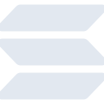

# solana

[← Back to main README](../../README.md)

<table><tr>
  <td></td>
  <td></td>
  <td></td>
</tr></table>

## 16 px

### black
```
https://georgegach.github.io/compatible-icons/simple-icons/compat/solana/16/black.png
```

### slate
```
https://georgegach.github.io/compatible-icons/simple-icons/compat/solana/16/slate.png
```

### white
```
https://georgegach.github.io/compatible-icons/simple-icons/compat/solana/16/white.png
```

## 64 px

### black
```
https://georgegach.github.io/compatible-icons/simple-icons/compat/solana/64/black.png
```

### slate
```
https://georgegach.github.io/compatible-icons/simple-icons/compat/solana/64/slate.png
```

### white
```
https://georgegach.github.io/compatible-icons/simple-icons/compat/solana/64/white.png
```

## 128 px

### black
```
https://georgegach.github.io/compatible-icons/simple-icons/compat/solana/128/black.png
```

### slate
```
https://georgegach.github.io/compatible-icons/simple-icons/compat/solana/128/slate.png
```

### white
```
https://georgegach.github.io/compatible-icons/simple-icons/compat/solana/128/white.png
```

## 512 px

### black
```
https://georgegach.github.io/compatible-icons/simple-icons/compat/solana/512/black.png
```

### slate
```
https://georgegach.github.io/compatible-icons/simple-icons/compat/solana/512/slate.png
```

### white
```
https://georgegach.github.io/compatible-icons/simple-icons/compat/solana/512/white.png
```

## 1024 px

### black
```
https://georgegach.github.io/compatible-icons/simple-icons/compat/solana/1024/black.png
```

### slate
```
https://georgegach.github.io/compatible-icons/simple-icons/compat/solana/1024/slate.png
```

### white
```
https://georgegach.github.io/compatible-icons/simple-icons/compat/solana/1024/white.png
```

## 16 px in base64

### black
```
data:image/png;base64,iVBORw0KGgoAAAANSUhEUgAAABAAAAAQCAYAAAAf8/9hAAAABmJLR0QA/wD/AP+gvaeTAAAAyUlEQVQ4jZ3TMUpDQRAG4G8xikUCdoKNuUda+9zFC6S1koDXUUHEE6QISSGkTKMSFMX4eBa7i8HqTX7YZWbZf3bmn53kD6cY4UB3fFfjHM9o0AbWR315GSS2eMUVzPcgb3ADvVLCLFA33OISEgY7gbqgxVt1UnHegxmscIHPms6XmAZbPOJI2R7knkaD3KeS0jHu5P8QQT/9OziRdemKn93L17IwERxWYyp3I/qhFjDByx7kJc7IAxEhNvLgDcmCjZV+dkSDJ6zhF9EvgSNaTsyeAAAAAElFTkSuQmCC
```

### slate
```
data:image/png;base64,iVBORw0KGgoAAAANSUhEUgAAABAAAAAQCAYAAAAf8/9hAAAABmJLR0QA/wD/AP+gvaeTAAABOklEQVQ4jZWOPUoDURhFz5288SdIoiCoRQwR3IIg2vizCgtxDVZ27kBs7d2FEQUR7MVGIXEUNAFhJhojJOP7bESwe3Pre8694jetbn8uZrTmvUoERrKhAFovab0kLiTVgShUYNhArW5/zpFfYSyHggAmMjwnLvb5pakYLPiQ6bS2UD1wHhB2W2idqLk4X90HcGU3WhkMYhcK+4pZY6aa/b156mQZWD98HSKRMOxv12q1LyWvaVOK1sHGQyUSuaGbj7fKlu7ubKwy2zvzZqtCcagEyA27EkC7bRNuMjv3UFcBA2jqX7+dptPRu4Id5fIo/ys/dXpH4LeL7JspFsBzp3fsYU9YtYgA494lr+mhme1KFIOxB1y+oaSTfgqVC5AeSL7NNhsLM49OsGPGWCgdRfY9Ir5emp/qAvwAR8SA0RUwC1gAAAAASUVORK5CYII=
```

### white
```
data:image/png;base64,iVBORw0KGgoAAAANSUhEUgAAABAAAAAQCAYAAAAf8/9hAAAABmJLR0QA/wD/AP+gvaeTAAAA2UlEQVQ4jZ2TMUpDARBE36B+LBTsBJvYeArb9N7FC3gDEay8SxQkeAKLoIVgaSMfMSjRz7NIvigoZDPdws7M7rAbFlB3gUNgjeUx68kD9UHtrGGahfMYOCg4A7TABeqk6Kr6op4DrC/UbovuoyTHAFG3fwgtA5O0fRG1BV6LEzwCwyRvqCP1vZjBhzpWG9RGvVZnK4hcBUDdBC6BQXGVrfxKR3eA/NP8Fz6/m9VTYFicYKMnn6ltMQPVO9QT9XkF8r26hzotEjvnj7cP80M6AprC3h1wk+QJ4AuMBdAPlJN7kAAAAABJRU5ErkJggg==
```

