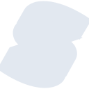
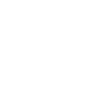

# solid

[← Back to main README](../../README.md)





## 16 px

### black
```
https://georgegach.github.io/compatible-icons/simple-icons/solid/16/black.png
```

### slate
```
https://georgegach.github.io/compatible-icons/simple-icons/solid/16/slate.png
```

### white
```
https://georgegach.github.io/compatible-icons/simple-icons/solid/16/white.png
```

## 64 px

### black
```
https://georgegach.github.io/compatible-icons/simple-icons/solid/64/black.png
```

### slate
```
https://georgegach.github.io/compatible-icons/simple-icons/solid/64/slate.png
```

### white
```
https://georgegach.github.io/compatible-icons/simple-icons/solid/64/white.png
```

## 128 px

### black
```
https://georgegach.github.io/compatible-icons/simple-icons/solid/128/black.png
```

### slate
```
https://georgegach.github.io/compatible-icons/simple-icons/solid/128/slate.png
```

### white
```
https://georgegach.github.io/compatible-icons/simple-icons/solid/128/white.png
```

## 512 px

### black
```
https://georgegach.github.io/compatible-icons/simple-icons/solid/512/black.png
```

### slate
```
https://georgegach.github.io/compatible-icons/simple-icons/solid/512/slate.png
```

### white
```
https://georgegach.github.io/compatible-icons/simple-icons/solid/512/white.png
```

## 1024 px

### black
```
https://georgegach.github.io/compatible-icons/simple-icons/solid/1024/black.png
```

### slate
```
https://georgegach.github.io/compatible-icons/simple-icons/solid/1024/slate.png
```

### white
```
https://georgegach.github.io/compatible-icons/simple-icons/solid/1024/white.png
```

## 16 px in base64

### black
```
data:image/png;base64,iVBORw0KGgoAAAANSUhEUgAAABAAAAAQCAYAAAAf8/9hAAAABmJLR0QA/wD/AP+gvaeTAAABHUlEQVQ4jZXSu0oDURSF4S83rRWsAlpaWViJbyAIFhaCT2FlJ/gSvoJgJaLY2FjYio1gZyGYQBK8gGYSY7wUORMOwyTGBbsYzln/WXvvKcjXGnYxgyIaOMUhXkd4htrHE34y1ccDzrA8yryAxxxztho4RzULuMRHVF28jQHVypF5KdRUBlpBBwWUwneqTnzxZILoSUjVxzM24wRJzkwSgy0UAwCmA+Aex/HlRYMBtsMrSZhDnKAbzjcCaKhVXAdA7482PnEQm0u4m6D/uG5Tcxk7BvsXDaoS+vwOD5TCebqhepzgBe+h33E7T/+NepjXUO1/RO/hSEbzuEBzAkALc1lAqhVcoYavHHMT21lTIQdUxRbWMRtgLezhJnv5F9cOj9sFumBaAAAAAElFTkSuQmCC
```

### slate
```
data:image/png;base64,iVBORw0KGgoAAAANSUhEUgAAABAAAAAQCAYAAAAf8/9hAAAABmJLR0QA/wD/AP+gvaeTAAAB2ElEQVQ4jX2Rv2uTYRSFn3O/L1+qVGoqaiFoVejg0MlBFMFNBEfBP8HNdtLJH4ir/4JjcXNwdRAKbqLg5qCopTVNqzYVEpom33FI8jWJ0bu973vf555zrphQa/XGdXLfRVTcJQht5u6+9JRWzlYqO8O9Gv/89XvjUchLhtnRF3eF1sEfInhYPVF5/xfg88av+VKiNzbVScoOpqoOvCXdvz0C+FbbeW1zeXBp4RD7NtP/QG2khe/az0WbRYls2J/tEtCCkHEiKBWmnLcKgNETxLEJUwI4BEa4BZGDU8xuRHqvAIhoGo/9ddO5QhBIFmBcRnSAT6dOHnkRg97o6jF4HdwE7QEtHKnEFCIDl40C3MS+ufd75gpAAHzZ3L3UiXwFBFIJXO7LzkYluSyU5ebawoL2AMJ2Es6fSVwAqvggpEllSAVXB+d0rb6zDMyDsG2JJkQJ3MHOkRKsxDKityFFbBQArAcIY9ohtQ3T9MLMkAZhArQNbUk/ko6WDgA4wzrclzfmeWghkCH2sVer1ZmPRfhp7vNIrzBb//PeC0CNkpM7Y+BerdUaFy2e2vk5oTn6G+orQ2gLusun52afTwQUoO3tqjvJLaEbiFmbLtJWHr5/5vjRd+P9fwBUMMIQEUrAXQAAAABJRU5ErkJggg==
```

### white
```
data:image/png;base64,iVBORw0KGgoAAAANSUhEUgAAABAAAAAQCAYAAAAf8/9hAAAABmJLR0QA/wD/AP+gvaeTAAABSUlEQVQ4jY2SPWtTURjHf0/zRsWlglPBjpkyOIl+gFIodOhQ8FN06ib002QVUbq4CLq7CIJDB6ENJMFWsL1paOrPIefC4Xpa8oc7nJf/23NPUIC6AxwBG8AaMAbeA8OI+F3i5ORj9Zf/Y6H+VD+oz+8jb6lnBXITY/VE3YyGwCfgVb4F3AKP7wk8amfkATAAuo1LHWAGBNBK6xqz3P3dCtEr9SbN40Ldb2dqVSFixfIvrKU6AD1gAZxGxNs8QT8N8Dq5VOq8keAmne+pPZIy6ktgmHXuAeuFefTS3nZEzGvnlvp9hf45vtWKbeAQ2KqbpN6d1PNvmnwrndeJRnn3S/Uq9f3zgOs8fSO1nyfoAo8aDiV0WT6qzxHxI0/wTP2oTlboPlWfFuXVF+oX9Vy9K5An6usmLwpCm8ABsAs8Ae6AKfAmIr427/8DIoKxMrO3bG8AAAAASUVORK5CYII=
```

