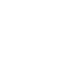

# southwestairlines

[← Back to main README](../../README.md)

<table><tr>
  <td></td>
  <td></td>
  <td></td>
</tr></table>

## 16 px

### black
```
https://georgegach.github.io/compatible-icons/simple-icons/compat/southwestairlines/16/black.png
```

### slate
```
https://georgegach.github.io/compatible-icons/simple-icons/compat/southwestairlines/16/slate.png
```

### white
```
https://georgegach.github.io/compatible-icons/simple-icons/compat/southwestairlines/16/white.png
```

## 64 px

### black
```
https://georgegach.github.io/compatible-icons/simple-icons/compat/southwestairlines/64/black.png
```

### slate
```
https://georgegach.github.io/compatible-icons/simple-icons/compat/southwestairlines/64/slate.png
```

### white
```
https://georgegach.github.io/compatible-icons/simple-icons/compat/southwestairlines/64/white.png
```

## 128 px

### black
```
https://georgegach.github.io/compatible-icons/simple-icons/compat/southwestairlines/128/black.png
```

### slate
```
https://georgegach.github.io/compatible-icons/simple-icons/compat/southwestairlines/128/slate.png
```

### white
```
https://georgegach.github.io/compatible-icons/simple-icons/compat/southwestairlines/128/white.png
```

## 512 px

### black
```
https://georgegach.github.io/compatible-icons/simple-icons/compat/southwestairlines/512/black.png
```

### slate
```
https://georgegach.github.io/compatible-icons/simple-icons/compat/southwestairlines/512/slate.png
```

### white
```
https://georgegach.github.io/compatible-icons/simple-icons/compat/southwestairlines/512/white.png
```

## 1024 px

### black
```
https://georgegach.github.io/compatible-icons/simple-icons/compat/southwestairlines/1024/black.png
```

### slate
```
https://georgegach.github.io/compatible-icons/simple-icons/compat/southwestairlines/1024/slate.png
```

### white
```
https://georgegach.github.io/compatible-icons/simple-icons/compat/southwestairlines/1024/white.png
```

## 16 px in base64

### black
```
data:image/png;base64,iVBORw0KGgoAAAANSUhEUgAAABAAAAAQCAYAAAAf8/9hAAAABmJLR0QA/wD/AP+gvaeTAAABI0lEQVQ4jY3TTSvEURTH8c/MeEyK0jQpVvKwsLHgTXgHbGXvlVh6AzaUDRtZioVkJ1IWFBMa8rQwD7H4n39NY/7Gr063zj3ne849914SjWEbF7jGObYwiXFshu86YnYiB0zhBt9trIwqXtvs3WAaTjKSU6uhEpDPlr1TeOwASO0pYOUm330uWnzHEPL+VhXPsY4glw9SHQ28dQD0oBSFzlDP4QFFvKA3IKUOoPTox3nJcGA4yHXcxvqXipgtYBTzKKALg9HFfbTclwH4wrpo+8rvqd/hIEDtbuUS3SltISOwgv0o0GjylzHX2tKq5K5bIR84wqFkXo9YzhrMmvYPqy75CxtYyUpOtZRxnDssdkpONRMVa03VJ/6bnGoAe9hFf1bQD1Fhg1uS8kVQAAAAAElFTkSuQmCC
```

### slate
```
data:image/png;base64,iVBORw0KGgoAAAANSUhEUgAAABAAAAAQCAYAAAAf8/9hAAAABmJLR0QA/wD/AP+gvaeTAAAB1klEQVQ4jX2TO2tUURSFv7VnTKJCMiYmjBPH2CQiGhDRyh9gaWehWFsKgmBhY2Uh+AcEe0E7K8FKEBSSJqgMsZAJiVfGRxKDed17lkU0MZdkdrn32t9Z6xyOAObnvzdTtfIoJc5K9NhaI/y+EnEvNvO1nHhg+ZykPlsbUvpYKdKt0dGhOc13lk+lonhpdIJSCWWWh5xYlejfPaNdSXFZc9niuwQXVd7eEeaGZaAqqBoO/ZvZTIXh5H7LAIYqMIi1AfQA2TZcboSlGvYPidSFA/JRQ7IA0xb8FqoFyZaUJyj+Wu1WPTJ1cNieBucR0qJhRIkVQdXesbi/Gx1XaKJIvArkpa0mR4xC4RxoC+XdGDYjEZoMCp5764IQ7sMxCpBILcRiF8A68ESzs+7t7V+awYyXbC5gfwCfAR3bA9Dq1AcmY3xc67JuYH0pKRrAedAMMGvveqXsQJVrF6TNAGjWB97avg/6Vjpo0HDJqAN6g1gGOlK60xiuTW/F/q/aX3/exroLDJdAhXFLVF47pamxRu3xdtJytrnO0nWn9BCXc2vB6OZYvf/Frm4ZAPB54ddpRf4s0ISNQC1VuNIcGfhU1u77DbIsO7zJwafJyZGvXG02m6t76f4ARwfSUAiucuwAAAAASUVORK5CYII=
```

### white
```
data:image/png;base64,iVBORw0KGgoAAAANSUhEUgAAABAAAAAQCAYAAAAf8/9hAAAABmJLR0QA/wD/AP+gvaeTAAABRUlEQVQ4jY2SPUtcURCGn3sxu340UWRZFMFC0ICCCOKf8B9oK5ZCanu71Fb+AyvTSMpgCkG7xY9OZTUq8TNF3OzypHCK63LvNS8cZjgz7zsz50wCoI4BX4BpoAL8ARrAevgbwCzQC7SAI2AtSZIL1En1zHxcqS31MSd2pk4l6j4wTzHawBPQE6c/EztIgfESMkEaitYrwM9MbCRRW8Az8BFI3xFrAXdhh4EkBYw2O9FqGSpAPQodAu1EvQZqwD1QDZH6O0IAN8CPFHiMi8FQbgPnYctQA2ZSYDtmgtd/Hg3/BHgoEXgBtlCr6mnOPzfVb+plwY4cqx8AUBcKEn+pu1Gg07Vgc2/6UVfV2xyR3+qe+j028kZdzh1K/RwJ3WirDXVTXSl9WnWpYJymulhKzoh8iop/M9Un/oucERlQv6o7al9R3j9chXiZgHw1ogAAAABJRU5ErkJggg==
```

