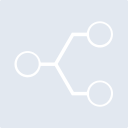
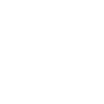

# stackshare

[← Back to main README](../../README.md)





## 16 px

### black
```
https://georgegach.github.io/compatible-icons/simple-icons/stackshare/16/black.png
```

### slate
```
https://georgegach.github.io/compatible-icons/simple-icons/stackshare/16/slate.png
```

### white
```
https://georgegach.github.io/compatible-icons/simple-icons/stackshare/16/white.png
```

## 64 px

### black
```
https://georgegach.github.io/compatible-icons/simple-icons/stackshare/64/black.png
```

### slate
```
https://georgegach.github.io/compatible-icons/simple-icons/stackshare/64/slate.png
```

### white
```
https://georgegach.github.io/compatible-icons/simple-icons/stackshare/64/white.png
```

## 128 px

### black
```
https://georgegach.github.io/compatible-icons/simple-icons/stackshare/128/black.png
```

### slate
```
https://georgegach.github.io/compatible-icons/simple-icons/stackshare/128/slate.png
```

### white
```
https://georgegach.github.io/compatible-icons/simple-icons/stackshare/128/white.png
```

## 512 px

### black
```
https://georgegach.github.io/compatible-icons/simple-icons/stackshare/512/black.png
```

### slate
```
https://georgegach.github.io/compatible-icons/simple-icons/stackshare/512/slate.png
```

### white
```
https://georgegach.github.io/compatible-icons/simple-icons/stackshare/512/white.png
```

## 1024 px

### black
```
https://georgegach.github.io/compatible-icons/simple-icons/stackshare/1024/black.png
```

### slate
```
https://georgegach.github.io/compatible-icons/simple-icons/stackshare/1024/slate.png
```

### white
```
https://georgegach.github.io/compatible-icons/simple-icons/stackshare/1024/white.png
```

## 16 px in base64

### black
```
data:image/png;base64,iVBORw0KGgoAAAANSUhEUgAAABAAAAAQCAYAAAAf8/9hAAAABmJLR0QA/wD/AP+gvaeTAAAA+ElEQVQ4jaXTvS5EURAH8N+9FFQi0azYRiVCg3gG8SrexMNoaURLolGQLYjE+ojdhpBlE1zFmctNJNy9JpmcOSdz/vP1H+ijaKi9LIzGMj6i/xUeMI12XYBnPIZvB4u4jHurDkAH+8ixgbnI4qVOBvc4wBY+wu5JfVsvnQoMI9IRzvEeuoML310f4CaiFyjKDLrxuIYTnOEt6m9XMpoM/ZJqCWXUYXzOMPNHifI4ZzGGPUxhFSsB1q34D3CL1yrIb0y7wzaepFHuRomHcS/qMPFYGmOGTSxJPZrAfB0eLKAl9etUmsI1lgXqKLvwg8r/XqZcWuem0v8EhCZarfLk/ugAAAAASUVORK5CYII=
```

### slate
```
data:image/png;base64,iVBORw0KGgoAAAANSUhEUgAAABAAAAAQCAYAAAAf8/9hAAAABmJLR0QA/wD/AP+gvaeTAAABVElEQVQ4jZ2SwUrUURyFv3PHhcKQZLpQUrBVQm4segSRtj1F9Fi9hBtx56pNi8RdMaaODdEE4jTh3K+F+tcMdPS3u5ff+e45l5NOt98DZnnABHrloWIAYW7ini92Rtgv8phkEaCMoToBD5BjYa8lMxS+gkcAdzqwsldKtghF2TB5ivQJA7wJ8Nxnc5RjqNvWvKekgtuS7wHR15AG8CfmC+GX8ARcBjDsFMpboI0AWQ/5Cc5AJq8ihH1wILxSPgV3U3LWwpNKFmNjagqcum66iaCMKIwKGQpnapLMhtunXGRfSGhZ3RSnE15C1pQhsn+5HDgNOQR+N3edbt//uZeCdKujDyHvDDWWncQFYSCuhDy6FXCB+Zi4BUR5A7yA7IKTwLMxmlifK/OSCeBz4gHWbySrmLuLBGkD7fPPdAj8wKxA5mGMJt6ALSFL18tWAr37Qf6Z3l+IxZJePtONgQAAAABJRU5ErkJggg==
```

### white
```
data:image/png;base64,iVBORw0KGgoAAAANSUhEUgAAABAAAAAQCAYAAAAf8/9hAAAABmJLR0QA/wD/AP+gvaeTAAAA+0lEQVQ4jaXTvy5EQRQG8N9ditUQf5oVW9gKIRLEM4g3EY/lCXQa0ak0CrKdxCK4BZuIRTCKe1ZuKFy7J5nMnJlzvvnOmW+ylFKOGYNZnqWU0oDJYPSf8Zd4xCSaVQGe0I3YNpZwEX6jCkAbh6hhC3PBoleFwR2OsIvPWN8jYRP6TXwLWl1MYz4A9rGKVvg9PGAK9TKDThxu4BTneI/6myVGYzG+rVzCR4zXSM5U0Ect5lmM4AATWMdagHVK8c+4wUt/4y8h3WIPO4omHsdlPSxivIoSTxTPmGEby4oe1dGqooMFNBT9OsM1rrBSpYSf9kvKQ3+mGvIh8vMvpGNRZgmWt1UAAAAASUVORK5CYII=
```

