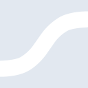
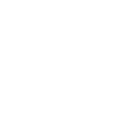

# statista

[← Back to main README](../../README.md)

<table><tr>
  <td></td>
  <td></td>
  <td></td>
</tr></table>

## 16 px

### black
```
https://georgegach.github.io/compatible-icons/simple-icons/compat/statista/16/black.png
```

### slate
```
https://georgegach.github.io/compatible-icons/simple-icons/compat/statista/16/slate.png
```

### white
```
https://georgegach.github.io/compatible-icons/simple-icons/compat/statista/16/white.png
```

## 64 px

### black
```
https://georgegach.github.io/compatible-icons/simple-icons/compat/statista/64/black.png
```

### slate
```
https://georgegach.github.io/compatible-icons/simple-icons/compat/statista/64/slate.png
```

### white
```
https://georgegach.github.io/compatible-icons/simple-icons/compat/statista/64/white.png
```

## 128 px

### black
```
https://georgegach.github.io/compatible-icons/simple-icons/compat/statista/128/black.png
```

### slate
```
https://georgegach.github.io/compatible-icons/simple-icons/compat/statista/128/slate.png
```

### white
```
https://georgegach.github.io/compatible-icons/simple-icons/compat/statista/128/white.png
```

## 512 px

### black
```
https://georgegach.github.io/compatible-icons/simple-icons/compat/statista/512/black.png
```

### slate
```
https://georgegach.github.io/compatible-icons/simple-icons/compat/statista/512/slate.png
```

### white
```
https://georgegach.github.io/compatible-icons/simple-icons/compat/statista/512/white.png
```

## 1024 px

### black
```
https://georgegach.github.io/compatible-icons/simple-icons/compat/statista/1024/black.png
```

### slate
```
https://georgegach.github.io/compatible-icons/simple-icons/compat/statista/1024/slate.png
```

### white
```
https://georgegach.github.io/compatible-icons/simple-icons/compat/statista/1024/white.png
```

## 16 px in base64

### black
```
data:image/png;base64,iVBORw0KGgoAAAANSUhEUgAAABAAAAAQCAYAAAAf8/9hAAAABmJLR0QA/wD/AP+gvaeTAAAA4klEQVQ4jZ3TP0oDQRSA8d+GVQMSBBEsrCxSmJsInsATCF5D8CT2VuIxTKGNUQu1EP+AoqghqxYZlwF3MqwPphne971582YKvGLR/+KtQIVOS/AdL5grW0DPuMMxjnARJCp8Z9YtdlPmnOAS/QTbyQmuMYiALvZxgnM8zBLcYyuC13CKcZQzSQnGOIjgHs4a8hoFX+GI3UhwmCj0R/AZ4JUI3sZTos2JcBEjDLGH+Qge4CYB14LUK9zA1Qy4FjTFTqZyLShDv0tYx6bp6FbDXjYKPJqOraf9r6xKLGC5JfgbHz8RVnz2+jczYgAAAABJRU5ErkJggg==
```

### slate
```
data:image/png;base64,iVBORw0KGgoAAAANSUhEUgAAABAAAAAQCAYAAAAf8/9hAAAABmJLR0QA/wD/AP+gvaeTAAABZ0lEQVQ4jZ2PT05TcRSFv/N7r6JpCtIQhJCKDIwR9uCIhJB0BU6d6CpMGDBw7gpYgoYY2AfGEFMtpJa0gf6RlNT33mEEqbUt1Du8537fzVG1fvEblOe/xpcx6NG0mHDPqGOUi6fA2jg7UxS+2NqX+N7PQudeAqOanO4+XS5+HM7uFBgqIbBVWiwe/5PZYbLAnEJULi0WjgEqFT+MZ9rvHdiWyFfrrfkJAjUtvVtdKhwBnDSbK1nSOjB6DuRsCAppGEP/ERysLs1+Bmg0GoUsiQ+F1oHc4OEogYWPkt7sm5tFL32wJ3gx6tNfFWz6IfhrlEabpTVdAZzUz19bfoVHPiMGLiRaNpdRxKd24/HOxob6AD9/dddN+gEzP6Yqsh0kZcPBj1r3ZVC6j3g2FkbpSLh61nobQno4Cb6tUKt1FpIomzOsCW0Ll22eAHN3wQBxouyboR+gYDvv+1CDAuQZWcVpQQCTXV0D/iCRc9zE0Y4AAAAASUVORK5CYII=
```

### white
```
data:image/png;base64,iVBORw0KGgoAAAANSUhEUgAAABAAAAAQCAYAAAAf8/9hAAAABmJLR0QA/wD/AP+gvaeTAAAA70lEQVQ4jZ2TMUoDURRFz4RRAxIEESysLCzMTgJZgSsQsg3BldhbicswhWlMtNAUYhQSFHXIeCwcwwfnZzLe8vHOee/B/4n6Cmzyv7wlag40aoLvwAxYS2tAU+ARuAQugBEwQ82tzljtlWpXENyqBxG2USW4V9sB0FRP1Sv1Rp0sEzyp3QDeU6/VLOiZxwSZehbALXVQ0lcq+CpWbAaC88igP4LPAt4J4CP1JXLmHHWiDtW+eqKuB3BbfYjAC0HpK1QP1bsl8I8gAh9XTF4I0uLeLWAf6ABdYLeoVSZRn4EMaFH/V+YpsAFs1wR/8/ENLG0HiGUyO18AAAAASUVORK5CYII=
```

