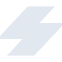

# stencil

[← Back to main README](../../README.md)

<table><tr>
  <td></td>
  <td></td>
  <td></td>
</tr></table>

## 16 px

### black
```
https://georgegach.github.io/compatible-icons/simple-icons/compat/stencil/16/black.png
```

### slate
```
https://georgegach.github.io/compatible-icons/simple-icons/compat/stencil/16/slate.png
```

### white
```
https://georgegach.github.io/compatible-icons/simple-icons/compat/stencil/16/white.png
```

## 64 px

### black
```
https://georgegach.github.io/compatible-icons/simple-icons/compat/stencil/64/black.png
```

### slate
```
https://georgegach.github.io/compatible-icons/simple-icons/compat/stencil/64/slate.png
```

### white
```
https://georgegach.github.io/compatible-icons/simple-icons/compat/stencil/64/white.png
```

## 128 px

### black
```
https://georgegach.github.io/compatible-icons/simple-icons/compat/stencil/128/black.png
```

### slate
```
https://georgegach.github.io/compatible-icons/simple-icons/compat/stencil/128/slate.png
```

### white
```
https://georgegach.github.io/compatible-icons/simple-icons/compat/stencil/128/white.png
```

## 512 px

### black
```
https://georgegach.github.io/compatible-icons/simple-icons/compat/stencil/512/black.png
```

### slate
```
https://georgegach.github.io/compatible-icons/simple-icons/compat/stencil/512/slate.png
```

### white
```
https://georgegach.github.io/compatible-icons/simple-icons/compat/stencil/512/white.png
```

## 1024 px

### black
```
https://georgegach.github.io/compatible-icons/simple-icons/compat/stencil/1024/black.png
```

### slate
```
https://georgegach.github.io/compatible-icons/simple-icons/compat/stencil/1024/slate.png
```

### white
```
https://georgegach.github.io/compatible-icons/simple-icons/compat/stencil/1024/white.png
```

## 16 px in base64

### black
```
data:image/png;base64,iVBORw0KGgoAAAANSUhEUgAAABAAAAAQCAYAAAAf8/9hAAAABmJLR0QA/wD/AP+gvaeTAAAA1UlEQVQ4jaXTsUqDUQwF4K+1rl18A8GnKQjO3cQHsJMObqJIJzepi3NHHXyVPkJVsKVFW1SqDrd/kRLvb+2BcAnJSQ65CWuikoltYhfVIDbD7fwNUcU93vC1ZFO0ylR18RKQhzjLkaGDUUAe4yrq9hNHOMVzULiHg1yBQxzPu/0FFdQLp4nHQHbOHrAHDfRXJD9hv5AxkQa0ivQLXBbOdpBwg52AvIUTtHMdrv3+jZ0yeecYBORXabmyaEnzWCa/S2sd3cRiD2rS4WwEOZ+4w0eZgn/hGwQRVmsYQm+6AAAAAElFTkSuQmCC
```

### slate
```
data:image/png;base64,iVBORw0KGgoAAAANSUhEUgAAABAAAAAQCAYAAAAf8/9hAAAABmJLR0QA/wD/AP+gvaeTAAABaElEQVQ4jaWSMUhbURiFv3N9FooQI0JMS5pO3RydXVwKBaeCFNdCVzu1td0KpUNBJxEXR92KLp27d+9qNNS8lOp7ClKQ3ONgCXkvKQQ84/nPd/jv5Yc7Sv8b/LAn57r5coyE8iwE9xq16oGkXjIKth1OuvlBjCxJ3CvO+GuzLqkHMFRgWydpvgcsDsFSJrzVrM9s9LcpF7S7+TbwFJgqwPhS0fvNevX9oF/4g9Zp9gbpo8SfEZv9RLws+/2Cdidfi/gtksuhkTKCWEkAjtKz1R5+J1PD4/FAqshqcnR69iww8QW7Ni4p9Nto/dHDylcdd86vIFwgxlzdCuhzoz69CZBYmmeAFQi8C+HJMMtsMB8aD27hf/miWmm2I3sFVCnA4hKz97hefTXoF+6g9Sv7JHhehgVXxPitDMPAJbY7568jXsO6X4zoGvG9OTfzogz3n2A7aXez5Rg1UQ6EQExr04cL0vWogjvrBkdyjQNaj1PpAAAAAElFTkSuQmCC
```

### white
```
data:image/png;base64,iVBORw0KGgoAAAANSUhEUgAAABAAAAAQCAYAAAAf8/9hAAAABmJLR0QA/wD/AP+gvaeTAAAA40lEQVQ4jaWTPUqDURBFz0Rt02QHgqsRBGs7cQFJpYWdKMHKTmJjnVILt+IS/AEVg0aMxGPxkUKc90LMbWfO5b55M7CkolRQ14AtoJWUp8BVRExLcEu9UT/9qw+1V4ykhjpU3xL4RT2uvkkdqK8JPFLPqzNQ94Ej4CnxvgX2igZqFzgArEb8zbZn8I76kMSu6V7dRt1U7xaEH9VdgFDHwGjB6P2IOJsZrCcNl8BGAneAw4g4LdqrF5VvHFSzqSfqcwK/q8N5cE8dJ/DEZq2zm2j2QF2lOZyVpOcbuI6Ir2qC/+oH7dBagaDMqtkAAAAASUVORK5CYII=
```

