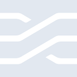

# stimulus

[← Back to main README](../../README.md)

<table><tr>
  <td></td>
  <td></td>
  <td></td>
</tr></table>

## 16 px

### black
```
https://georgegach.github.io/compatible-icons/simple-icons/compat/stimulus/16/black.png
```

### slate
```
https://georgegach.github.io/compatible-icons/simple-icons/compat/stimulus/16/slate.png
```

### white
```
https://georgegach.github.io/compatible-icons/simple-icons/compat/stimulus/16/white.png
```

## 64 px

### black
```
https://georgegach.github.io/compatible-icons/simple-icons/compat/stimulus/64/black.png
```

### slate
```
https://georgegach.github.io/compatible-icons/simple-icons/compat/stimulus/64/slate.png
```

### white
```
https://georgegach.github.io/compatible-icons/simple-icons/compat/stimulus/64/white.png
```

## 128 px

### black
```
https://georgegach.github.io/compatible-icons/simple-icons/compat/stimulus/128/black.png
```

### slate
```
https://georgegach.github.io/compatible-icons/simple-icons/compat/stimulus/128/slate.png
```

### white
```
https://georgegach.github.io/compatible-icons/simple-icons/compat/stimulus/128/white.png
```

## 512 px

### black
```
https://georgegach.github.io/compatible-icons/simple-icons/compat/stimulus/512/black.png
```

### slate
```
https://georgegach.github.io/compatible-icons/simple-icons/compat/stimulus/512/slate.png
```

### white
```
https://georgegach.github.io/compatible-icons/simple-icons/compat/stimulus/512/white.png
```

## 1024 px

### black
```
https://georgegach.github.io/compatible-icons/simple-icons/compat/stimulus/1024/black.png
```

### slate
```
https://georgegach.github.io/compatible-icons/simple-icons/compat/stimulus/1024/slate.png
```

### white
```
https://georgegach.github.io/compatible-icons/simple-icons/compat/stimulus/1024/white.png
```

## 16 px in base64

### black
```
data:image/png;base64,iVBORw0KGgoAAAANSUhEUgAAABAAAAAQCAYAAAAf8/9hAAAABmJLR0QA/wD/AP+gvaeTAAABI0lEQVQ4jaXTvy5EURDH8c/KxfofEQqLQqFViBcQiVfQi0R0EoUH0PIECpWGB5DoKdDoaDaCbEIkmyCxFqswN7nWklgnmeKcmd+Z7/zuuTk8o11zq5JDrUkxSHCU2ecwiFG01dW+4Ap39U3HM9GHPDZxE4U1XGMjch3oTyPBqU8foBpddvCOMo6xgE4cBF1K0CXTJRtVFDGLHmwFRaPaL5sKLrGGVizFRa8/iGsJVjJ+lLCPCZyEL92Ru8VZ5N9SQVLndAG7mMRQnD0ExSLOMYfhrKghWmAXsRzjrMV4ld88SKOEbfRiBhc+30FDD8q+f8YFPGIP03jCKuYxEkSQTzCVGec+ENejuBDnTxgLmnYMpIIcDjMX/Pkp//tnagnkZlflAxkEbHJjFtIGAAAAAElFTkSuQmCC
```

### slate
```
data:image/png;base64,iVBORw0KGgoAAAANSUhEUgAAABAAAAAQCAYAAAAf8/9hAAAABmJLR0QA/wD/AP+gvaeTAAABwElEQVQ4jZ2SMWtTYRiFn3Nzb5JGayjSVhojItLVQf0DLvoP7OAglA4ugugmbuLi4A9wF0R/QMW9IupScHASkkobq5hYq0nuvd9xMAlNWkV6tu/lPS/nO+eosdnpIpc4DKxedGgygFyKJb0aG9mzoDq4OLHdB5oS24CH0zjga8NHloSvUWemV6h8f4B9FbQw0PoJ62nePXY3jjcUwnR5dEDwDtQFSPpRqql208FPFCkY2lhvCnm+DIUKlfZLPF3XSIGOqLHVHsnZg8ywQc5KpZi+/pUnjxBXMLXJxWjyn4KGiO5tz1cXFYezP/N4HXz9IDJAbHRrRMeb/WJYTXpanG+13xqdEToKYPFZsA7Rqu18dGBcgGtJWnhm+RxobkDcieyPCtFKv5R/iHtcRkNz4W8eAOQWTWfh4ZeFmcfzrZ3b4BuGE3sjjg+kSlsEXvST7OaUCxfmWp33AU4Lkn0eINrDGLFT4WaWR8tJSH+U0vh5kC8Cu9h3hJYMJ5EGh1yODeeHsWbFP0VSuXM/JIUl7BoGid1gncq61Uuh+q0Up9Hxkdhmq7M2ZqM9a6sujVfZVl/aX+V/mfhfiLB6h2ab3m86iNKK0d5QfgAAAABJRU5ErkJggg==
```

### white
```
data:image/png;base64,iVBORw0KGgoAAAANSUhEUgAAABAAAAAQCAYAAAAf8/9hAAAABmJLR0QA/wD/AP+gvaeTAAABO0lEQVQ4jaXTP0qdURAF8N8LT6NRIyJaqElhYZsiZAMiuAV7EcROsHABtskKLKzSxAUE0muhaexMIyEJgiIIKvip8aTwPvwwvkCeB6a48/fMzJ1Gkks81xmqRpJ0GAya2K69GxjBK3Q/8L3CDxzjvmiSyZoMJulJ8iHJr9zjZ5L3xdabZKglTXzFZcl3Xap8xC1OsYN5vMCXwq7FoE8ex3WSgyQzSQaSrBcWf+FhgirJ9ySrSbqSLJZEN20KpYnl2qAO8RlT2MUk+ovtCHvF/ru+hTrG8QlvMFp0ZzjAAvYxi7H6FtrhptBfKu2slvaqf82ghcMkG0leJplO8i3JVbsZnD6yxnmcYxPvcIEVzGECXcW/p4m3tRmcoMJacR4v+gu8xrS7uxluBTSSbNUS/PdXfvIxPSuUO0X1ByQoZ4W+JZHkAAAAAElFTkSuQmCC
```

